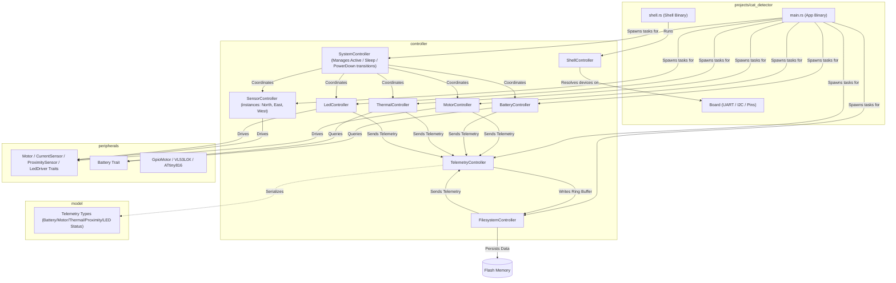

# Firmware Repository

This repository contains the Rust-based firmware for our hardware projects, using a modern, decoupled architecture designed for high testability on the host system.

Currently, the supported hardware target is the **Raspberry Pi Pico (RP2040)**, running an asynchronous RTOS-like framework using **Embassy**.

---

## Projects

*   **[Cat Detector](projects/cat_detector.md)**: A low-power water fountain and cat proximity detector system running on the Raspberry Pi Pico (RP2040).

---

## Getting Started

### Prerequisites

To build and run this firmware, you need the following tools installed on your host:

1.  **Rust Toolchain & Targets**:
    ```bash
    rustup target add thumbv6m-none-eabi
    ```
2.  **probe-rs** (for flashing, debugging, and RTT log reading):
    ```bash
    cargo install probe-rs-tools
    ```

### Running Tests (Host-Based Validation)

Our decoupled architecture allows you to validate all business logic and control loops directly on your host machine without flashing a microcontroller. We use `cargo-nextest` for faster, parallelized, and less noisy test execution:

```bash
# Run tests using cargo-nextest (highly recommended)
cargo nextest run

# Or fall back to standard cargo tests
cargo test
```

### Building and Flashing

To build and flash the firmware to an attached target device (RP2040):

```bash
# Build target-compatible crates
cargo build --target thumbv6m-none-eabi

# Flash the main application
cargo run --target thumbv6m-none-eabi --package cat_detector --bin cat_detector_app
```

For interactive diagnostic shell execution, host logging tools, flash extraction/decoding commands, and other diagnostic procedures, see [CONTRIBUTING.md](CONTRIBUTING.md).

### Python Script Verification & Conda Setup

For our target bringup scripts (`scripts/bringup.py`) and Rerun telemetry tools (`scripts/rerun-loader-csv`), we manage dependencies using Conda.

#### 1. Enlisting in the Conda Environment

Ensure you have Conda (Miniconda or Anaconda) installed on your system. Run the following command from the root of the repository to create the environment:

```bash
# Create the environment from the environment.yml configuration
conda env create -f environment.yml

# Activate the environment
conda activate firmware-env
```

#### 2. Running Python Unit Tests Locally

We use `pytest` for unit testing our Python helper scripts:

```bash
# Run all python script unit tests
pytest scripts/tests
```

---

## Workspace Architecture

The workspace is organized into target-agnostic crates for logic/simulation, target-independent platform libraries, and target-specific project deployments:

*   **[model/](model)**: Core platform-independent system models, state machines, protocols, and calculations (zero-dependency `#![no_std]`).
*   **[peripherals/](peripherals)**: Abstractions (traits) for peripheral wrappers and concrete implementations based on `embedded-hal` (e.g. `VL53L0X`, `ATtiny816`, `L9110s`, `INA219`, `MAX17048`, `BQ25185`), alongside mock implementations for host testing.
*   **[controller/](controller)**: Project-agnostic domain controllers and state machine orchestrators. Houses domain-specific CLI handlers that resolve dependencies via a generic `ShellDeviceResolver` trait.
*   **[platform/](platform)**: Target-independent firmware platform support and diagnostic utility libraries (e.g., panic handlers, stack scanning, RTT loggers, circular log buffers).
*   **[projects/](projects)**: Bare-metal microcontroller application projects (such as `cat_detector`). Deploys unified **Board Support Packages (BSPs)** that encapsulate all target/host driver and pin initialization.

### Architecture Diagram



---

## Crate Architecture & Module Roles

### Model Crate (`model`)
The `model` crate contains pure, target-agnostic domain models, status telemetry types, and hardware peripheral interfaces (traits). It has **no dependency** on hardware, Embassy, or I/O.

*   **Telemetry Models**:
    *   `BatteryStatus`: Enum tracking voltage (mV), temperature (mC), and battery state (e.g. `VolTempState` containing `BatteryState`).
    *   `BatteryState`: Enum representing the battery charge state: `Ok`, `Low`, `Charging`, or `Critical` (system runs but pump is disabled due to critical low charge).
    *   `MotorStatus`: Enum tracking speed percent, run status, and motor temperature (e.g. `SpeedRunTemp`).
    *   `ThermalStatus`: Enum tracking ambient system temperature and overheating flags (e.g. `TempOverheating`).
    *   `SystemStatus`: Enum representing the operating mode of the system (`Active` or `Sleep`).
    *   `FuelGaugeTelemetry`: Enum representing cell voltage and state-of-charge percentage (e.g. `VolSoc`).
    *   `ProximityTelemetry`: Enum containing the single range reading representing target state: `InRange(u16)` or `OutRange(u16)`.
    *   `SystemLedState`: Enum holding active NeoPixel color patterns based on battery state of charge:
        *   `BlinksRedOncePerThirtySeconds`: Critical low charge (SoC < critical threshold).
        *   `SolidOrange`: Low charge (SoC < 20%).
        *   `SolidYellow`: Medium charge (SoC between 21% and 79%).
        *   `SolidGreen`: High charge (SoC >= 80%).
        *   `SolidBlue`: Indicates low-power `Sleep` state.
        *   `BlinksRedFourTimes`: Indicates thermal critical alert state.
        *   `Off`: Indicates system locked / `PowerDown` state.

*   **Hardware Interfaces (Traits)**:
    *   `Motor`: Defines interfaces for motor driver control (`set_speed`, `stop`).
    *   `CurrentSensor`: Defines interfaces for reading current draw (`read_current_ma`). Used to monitor load torque for dry run and stall protection.
    *   `FuelGauge`: Defines interfaces for cell voltage (`read_voltage_mv`) and charge capacity percentage (`read_state_of_charge`).
    *   `PowerSensor`: Defines interfaces for current monitoring and voltage measurements (`read_voltage_mv` / `read_current_ma`), and allows controllers (e.g. `BatteryController`) to subscribe to power alerts via callbacks.
    *   `ProximitySensor`: Defines interfaces for range measurements (`read_distance_mm`).
    *   `TemperatureSensor`: Defines transactions for thermal monitoring (`read_temperature_milli_c`).
    *   `Charger`: Defines interfaces for controlling battery charging (`set_charging_enabled`) and checking charging status (`is_charging_input_present`).
    *   `LedDriver`: Defines interfaces for setting LED RGB indicator colors (`set_color`).

---

### Peripherals Crate (`peripherals`)
The `peripherals` crate implements the concrete, platform-independent drivers and wrappers using `embedded-hal` primitives. This abstraction allows easy mocking of peripherals for host-based testing.

*   **`GpioMotor`**: A concrete wrapper that implements `Motor` by toggling a digital output pin (`OutputPin`) high/low.

**Concrete Driver Implementations**:
*   `max17048::Max17048`: Implements `TemperatureSensor` and `FuelGauge` traits, scaling registers to VCELL mV and SOC %. [MAX17048 Datasheet](https://www.analog.com/media/en/technical-documentation/data-sheets/MAX17048-MAX17049.pdf)
*   `bq25185::Bq25185`: Implements `Charger` trait for linear charger and power path management. [BQ25185 Datasheet](https://www.ti.com/lit/ds/symlink/bq25185.pdf)
*   `ina219::Ina219`: Implements `CurrentSensor` and `PowerSensor` traits, calibrating shunt voltage calculations for current monitoring. [INA219 Datasheet](https://www.ti.com/lit/ds/symlink/ina219.pdf)
*   `vl53l0x::Vl53l0x`: Implements `ProximitySensor` trait, driving ranges and supporting dynamic address assignment at register `0x8A`. Supports GPIO interrupts (Low Level, High Level) utilizing programmed `SYSTEM_THRESH_LOW` and `SYSTEM_THRESH_HIGH` threshold registers (with parametric hysteresis), and a timing budget increased to 200ms. [VL53L0X Datasheet](https://www.st.com/resource/en/datasheet/vl53l0x.pdf) | [VL53L0X API Guide (UM2039)](https://www.st.com/resource/en/user_manual/um2039-world-smallest-timeofflight-ranging-and-gesture-detection-sensor-application-programming-interface-stmicroelectronics.pdf) | [VL53L0X Register Map](https://github.com/GrimbiXcode/VL53L0X-Register-Map)
*   `l9110s::L9110s`: Implements `Motor` trait for h-bridge motor driver control using two `OutputPin` channels. [L9110S Datasheet](https://www.elecrow.com/download/datasheet-l9110.pdf)
*   `attiny816::Attiny816`: Manages indicator NeoPixel outputs by writing RGB color packets over I2C, implementing the `LedDriver` interface. [ATtiny816 Datasheet](https://cdn-learn.adafruit.com/downloads/pdf/adafruit-neodriver-i2c-to-neopixel-driver.pdf)

---

### Controller Crate (`controller`)
The `controller` crate houses the active orchestrators and asynchronous loop runners. It consumes peripheral traits and updates domain models.

*   **`MotorController`**: Generalizes motor driver control and current sensor monitoring. Directly exposes the `read_torque_ma` method to read motor load torque (current draw in mA) from the current sensor, and shuts down the motor if safety thresholds are exceeded.
*   **`MotorStateMachine` (Struct)**: A deterministic state machine managed by `MotorController` handling states:
    *   `Off`: Motor is inactive.
    *   `RampUp`: Motor is starting up and ramping speed up.
    *   `On`: Motor is running continuously at target speed.
    *   `RampDown`: Motor is shutting down and ramping speed down.
    *   Transitions are driven by `MotorEvent` triggers (`PowerOn`, `PowerOff`, `RampComplete`).
*   **`BatteryController`**: Coordinates periodic voltage queries from the power system.
*   **`ThermalController`**: Periodically updates and monitors safety thresholds for thermal limits (overheating and critical temperature thresholds are parameterized, defaulting to 45°C and 60°C respectively, with a 2°C hysteresis to prevent rapid toggling). Replaces battery monitoring with temp sensor reads, and shuts down the system (sending a sleep/shutdown signal to `SystemController`) if critical thresholds are reached.
*   **`SensorController`**: Manages spatial telemetry for a *single* proximity (ToF) sensor (instantiated separately for North, East, and West). Dispatches proximity events upstream to the `SystemController` for central data fusion. The proximity detection threshold (`proximity_threshold_mm`) is passed as a constructor parameter. Supports two-point linear distance calibration using per-sensor `cal_near` and `cal_100` calibration points, mapping the raw sensor cover distance to `0` mm and the raw `100` mm distance target correctly.
*   **`LedController`**: Receives RGB indicators status updates from the `SystemController` and drives the underlying NeoPixel/ATtiny816 driver. Supports smooth fade-in and fade-out transitions when turning on/off, parameterized with `FADE_STEPS = 10` and `FADE_DELAY_MS = 20` (total 200ms fade transition).
*   **`FilesystemController`**: Implements flat file storage on the persistent flash partition. Uses `sequential-storage` to execute read/write/delete operations with zero heap allocation.
    *   *Profiling Wrapper (`ProfilingFlash`)*: Intercepts lower-level erase instructions to log execution durations and erase counts to prevent flash wear.
    *   *Calibration Storage (`vl53l0x_cal.cbor`)*: Stores the CBOR-serialized `TofCalibration` struct, which is loaded at boot by the main application to apply calibration to each sensor.

---

### Application & BSP Crate (`projects/cat_detector`)
The top-level application and Board Support Package (BSP) defines pin configurations, manages driver instantiation, spawns the controller tasks, and hosts the application-specific orchestrator:

*   **`Board Support Package` (`bsp_target.rs` / `bsp_host.rs`)**: Encapsulates all platform-specific initialization. In target mode, it unsticks the I2C bus, boots and dynamically re-addresses the VL53L0X proximity sensors to unique addresses (`0x30`, `0x31`, `0x32`), configures interrupt parameters, initializes the INA219 current sensor and ATtiny816 LED driver, and exposes a unified `Board` struct containing fully pre-configured driver handles. In host mode, it exposes identical mock drivers to run tests on the host.
*   **`SystemController`**: Coordinates low-power mode transitions (`Active` vs `Sleep`) by disabling/enabling/polling the other peripheral controllers and handling inactivity timeouts. It performs **sensor data fusion** across the three proximity controllers (North, East, West): if any sensor detects target proximity (less than `proximity_threshold_mm`) while the system is not locked, it wakes up the system, resets the inactivity timer, starts the motor, and updates the `LedController` state. It also supports dual long press gesture detection on East and West proximity sensors with a threshold of 20mm to control the system power and lock states.
*   **MPU Stack Guard**: Configures the ARM Cortex-M Memory Protection Unit (MPU) at boot to guard the stack. It programs Region 0 as `NoAccess` and `ExecuteNever` over a 256-byte area at `0x2003_C000`, defining a strict 16KB stack allocation limit (growing down from `0x2004_0000`). Any stack overflow immediately triggers a `HardFault` to halt execution safely rather than allowing silent data memory corruption.
    *   **Charger-Connected Safety Lock**: When a charger connection is detected, the system immediately transitions to `PowerDown` mode (locked) and displays the constant state of charge status color on the LED. When the charger is disconnected while remaining in `PowerDown` mode, the LED turns `Off`. The system remains locked in `PowerDown` mode for the entire duration the charger is connected.
    *   **Gesture Unlock**: To unlock the system and exit `PowerDown` mode after the charger has been disconnected, the user must perform a 2-finger (2F) long press gesture (continuous dual-sensor proximity on East and West sensors for 5 seconds). Once unlocked, the system wakes to `Active` mode and updates the LED to the state of charge color.
    *   **Dynamic Runloop Tick rate**: To ensure high responsiveness and recall rate for 2F long press gestures when proximity is active, the system runloop timeout automatically decreases from 1 second to 200 milliseconds (`0.2s`). Inactivity seconds and other 1-second timings are tracked via an internal millisecond accumulator (`tick_ms_accumulator`) to preserve correct timer intervals.
    *   *Active Duration & Safety Gating*: Once the system enters `Active` mode, a minimum 30-second active mode duration is enforced before it is permitted to return to `Sleep`. This duration is gated/overridden by safety and proximity rules:
        *   **Thermal Limits**: If the temperature exceeds the critical threshold, the system enters `Sleep` immediately to prevent thermal damage, overriding the 30-second delay.
        *   **Battery State of Charge**: If the battery drops below the critical threshold and is not charging, the system enters `Sleep` immediately to prevent deep discharge, overriding the 30-second delay. Implements a 2% state-of-charge hysteresis to prevent rapid state-toggling around the threshold. Validates at compile time and runtime that `critical_soc_threshold` < `LOW_BATTERY_SOC_THRESHOLD` < `MID_BATTERY_SOC_THRESHOLD` < `HIGH_BATTERY_SOC_THRESHOLD`.
        *   **Cat Proximity**: As long as a cat remains detected (distance < `proximity_threshold_mm`) on any of the ToF sensors, the inactivity timer is reset, preventing transition to `Sleep`.

---

## Hardware Peripheral Mapping & I2C Address Space

The system integrates with the following hardware nodes connected via the RP2040's I2C and GPIO banks:

| Component | I2C Address | Pico Connection | Software Binding | Role |
| :--- | :--- | :--- | :--- | :--- |
| **MAX17048 Fuel Gauge** | `0x36` | SDA (GP4) / SCL (GP5)<br>Alert (GP10) | `FuelGauge` & `TemperatureSensor` Traits / `BatteryController` | Monitored by the battery loop to update state of charge and dispatch alerts. |
| **BQ25185 Charger & Boost** | `0x6B` | SDA (GP4) / SCL (GP5) | `Bq25185` / `Charger` Trait | Tracks battery charging state and configures input current limits. |
| **INA219 Current Sensor** | `0x40` | SDA (GP4) / SCL (GP5) | `CurrentSensor` / I2C Bus | Monitors N20 motor current to detect dry running (torque drop) or stall conditions. |
| **VL53L0X Time-of-Flight Sensors** | `0x29` (boot)<br>*Dynamic re-addressing to `0x30`, `0x31`, `0x32`* | SDA (GP4) / SCL (GP5)<br>XSHUT Pins (GP2, GP3, GP4)<br>Interrupts (GP5, GP6, GP7) | `ProximitySensor` / `SensorController` | Used to calculate target approach and activate water flow via data fusion. |
| **ATtiny816 LED Driver** | `0x60` | SDA (GP4) / SCL (GP5) | `LedDriver` / `LedController` | Drives visual state-of-charge and error alerts on the RGB indicator. |
| **L9110S Motor Driver** | *Analog* | GP14, GP15 (PWM) | `GpioMotor` / `Motor` Driver | Toggled by the motor controller loop to regulate the N20 motor impeller speed. |

---

## Flash Layout & Persistence

Persistent files (such as calibration variables or telemetry logs) are stored in the final block partition of the RP2040's built-in 2MB flash memory:

*   **Firmware Image Space**: `0x10000000` to `0x101C0000` (1.75 MB - bounded by `memory.x` to prevent code overwrite).
*   **Filesystem Partition**: `0x1C0000` to `0x200000` (256 KB - starting at 1.75 MB offset, defined via Rust compile-time constants).

> [!IMPORTANT]
> The `FilesystemController` wraps the underlying raw flash in `ProfilingFlash`. This interceptor automatically monitors flash write health and logs exact erase telemetry.

### Diagnostics & Crash Logging (`platform::panic_handler`)
To capture system crash data reliably without relying on active runtime loops, a generalized **ARMv6m+ (Thumb) Panic Handler** module (`platform::panic_handler`) is integrated. It operates directly at the low-level panic/NMI boundary:
1.  **Stack Scanner**: Performs a heuristic stack scan on the Cortex-M0+ stack, extracting candidate return program counters (PCs) within the flash code segment.
2.  **Revision & Info Capture**: Retrieves the package version/revision hash and detailed panic information (file, line number, panic message).
3.  **Circular System Logs**: Captures the last 1024 bytes of diagnostic logs from a global, critical-section protected `CRASH_LOG_BUFFER`.
4.  **Rolling Flash Buffer**: Appends the crash logs to the persistent flash filesystem under a rolling sequence (`crash_0.log` through `crash_4.log`), updating a persistent index file `crash_idx` for analysis by offline host tools (such as `host_fs`).

---

## Design & Integration Patterns

For peripheral sharing and task integration, we adhere to the following architectural standards:
*   **The Actor / Message-Passing Pattern**: Our standard for core system integration. Shared peripherals run inside their own isolated tasks, and other components communicate via async channels (e.g. `embassy_sync::channel::Channel`).
*   **Interior Mutability & Shared References (`Rc` + `RefCell` or `Mutex`)**: Used strictly for the shell.
