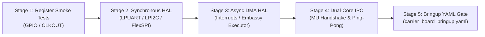

# Carrier Board 2.0 Firmware Architecture & Bringup Guide

This document specifies the firmware design, dual-core task execution model, memory partitions, and hardware bringup procedures for the **Carrier Board 2.0** architecture powered by the **NXP MCX N947** dual-core Arm Cortex-M33 microcontroller.

The source of truth for bringup verification steps is [`app/carrier_board_bringup.yaml`](file:///Users/daparker/gh/firmware/app/carrier_board_bringup.yaml).

---

## 1. System Overview & Silicon Architecture

The Carrier Board 2.0 is a modular hardware evaluation, sensor fusion, and telemetry workstation designed for ultra-low-power operation, long-range wireless communication, and real-time proximity sensing. The firmware executes in a bare-metal `no_std` Rust environment built on top of the **Embassy** asynchronous framework.

```
+-----------------------------------------------------------------------------------+
|                            CARRIER BOARD 2.0 FIRMWARE                             |
+-----------------------------------------------------------------------------------+
|  Core 0 (150 MHz Cortex-M33): Application, Network, Telemetry & UI                |
|  - Embassy Async Executor (Cooperative Multitasking)                              |
|  - Host FTDI Console Shell / Diagnostic Interface (FC1 UART0)                     |
|  - Wireless BLE Telemetry Stack (u-blox NINA-B312 UART @ 1 Mbps)                  |
|  - Power Path & Battery State of Charge Manager (BQ24074 & MAX17048)              |
|  - Status & Ambient LED Animations (TI LP5009 Logarithmic RGB Driver)             |
+-----------------------------------------------------------------------------------+
|  Core 1 (150 MHz Cortex-M33): Real-Time Sensor Fusion & Coprocessor               |
|  - High-Speed ProxFusion Capacitive Touch & Proximity Engine (Azoteq IQS7222A)    |
|  - Dual-Channel FlexSPI External Storage Pipeline (Winbond W25N01GV 1Gb NAND)     |
|  - PDM Class-D Audio Stream & Piezo Frequency Synthesis (MAX98357A & Sounder)     |
|  - PowerQuad Math Accelerator / DSP Filter Pipelines                              |
|  - eIQ Neutron NPU Neural Inference Engine (Shared Accelerator)                   |
+-----------------------------------------------------------------------------------+
```

### Key Silicon Components (Bill of Materials)

| Designator | Component / Part | Description | Interface / Bus | Key Firmware Role |
| :--- | :--- | :--- | :--- | :--- |
| **`U1`** | **NXP MCXN947VDF** | Dual-core Arm Cortex-M33 MCU + eIQ NPU | Host Controller | 150 MHz dual-core, 2MB dual-bank Flash, 512KB SRAM with ECC. |
| **`U8`** | **Winbond W25N01GV** | 1Gb (128MB) SLC Serial NAND Flash | FlexSPI Port A | Persistent CBOR telemetry queue, crash dump logs, calibration data, OTA staging. |
| **`U3`** | **TI BQ24074** | 1.5A Dynamic Power Path Li-Ion Charger | GPIO (`/CHG`, `/PGOOD`) | Autonomous charge management, input current limit, brownout avoidance. |
| **`U7`** | **ADI MAX17048** | 1-Cell Li+ ModelGauge Fuel Gauge | Core `I2C0` (`0x36`) | Precision voltage, state of charge (SoC), alert interrupt (`G4`). |
| **`U6`** | **TI LP5009** | 9-Channel Logarithmic RGB LED Driver | Core `I2C0` (`0x14`) | Low-power breathing, charge animations, offloading MCU core. |
| **`U9`** | **FTDI FT232RNQ** | High-Speed USB 2.0 to UART Serial Bridge | `FC1` UART0 (115200) | Diagnostic bringup shell, command dispatch, host logging proxy. |
| **`U2`** | **Azoteq IQS7222A**| ProxFusion Cap-Touch & Proximity IC | Touch `I2C1` (`0x44`)| 4-electrode sensing (3 mutual, 1 self-cap), `CAP_INT` (`C4`). |
| **`U4`** | **ADI MAX98357A** | 3.2W Class-D Mono Audio Amplifier | `PDM0` Audio (`B14`/`A14`)| Chime audio feedback, filterless Class-D drive. |
| **`U11`**| **u-blox NINA-B312**| Bluetooth Low Energy 5.0 Module | UART1 (1 Mb/s) | High-throughput telemetry packet streaming, pairing, OTA relay. |
| **`Q2`–`Q4`**| **TI TPS22918**| 5.5V, 2A Load Switches | GPIO (`L4`, `L5`, `M4`)| Power-gating Audio (`Q2`), Sensors (`Q3`), and Debug Bridge (`Q4`). |

---

## 2. Memory Map & Storage Layout

### Internal Microcontroller Memory (NXP MCX N947)

The NXP MCX N947 integrates **2,048 KB (2 MB) of dual-bank on-chip flash** and **512 KB of SRAM with ECC**.

```
0x0000_0000 +---------------------------------------+
            |  Primary Bootloader & Vector Table    |
            |  (64 KB Protected Boot Sector)        |
0x0001_0000 +---------------------------------------+
            |  Active Firmware Application Slot A   |
            |  (1,920 KB Single-Slot Partition)     |
            |  Supports Dual Cores, DSP, eIQ & Exp. |
0x001F_0000 +---------------------------------------+
            |  Non-Volatile System Keystore & Config|
            |  (64 KB Protected Secure Store)       |
0x0020_0000 +---------------------------------------+
```

### Detailed Flash Cost Breakdown (`.text` and `.data`)

To prove conclusively that the application fits comfortably within the internal flash budget while supporting both Cortex-M33 cores, DSP kernels, eIQ Neutron NPU inference, built-in peripherals, BLE communication, and future expansion scenarios (audio playback, camera gesture detection, location services), the following flash sizing analysis is established:

| Subsystem / Functional Module | Estimated `.text` (Code) | Estimated `.data` / `.rodata` | Total Flash Footprint | Description / Scope |
| :--- | :---: | :---: | :---: | :--- |
| **Core 0 Application & Embassy Executor** | 210 KB | 40 KB | **250 KB** | Cooperative async task runner, system state machine, timer scheduler, channel routing. |
| **Core 1 Coprocessor Runtime** | 150 KB | 30 KB | **180 KB** | Coprocessor bootstrap, real-time sensor loop, Azoteq IQS7222A touch sampling engine. |
| **DSP & PowerQuad Math Kernels** | 75 KB | 15 KB | **90 KB** | CMSIS-DSP FFT, biquad IIR/FIR filter cascades, frequency synthesis algorithms. |
| **eIQ Neutron NPU Runtime & Driver** | 100 KB | 20 KB | **120 KB** | NPU command stream builder, operator graph dispatcher, weight decompression loader. |
| **eIQ Quantized Model Weights (Internal)** | 0 KB | 280 KB | **280 KB** | 8-bit quantized gesture classification & keyword spotting weights in `.rodata`. |
| **Built-in Peripherals & Bus Drivers** | 68 KB | 12 KB | **80 KB** | FlexSPI NAND driver, LPI2C0/1 drivers, LPUART0/1 drivers, PDM audio, WUU/SPC drivers. |
| **BLE Server Stack (UART to NINA-B312)** | 48 KB | 12 KB | **60 KB** | Serial framing, AT command parser, binary telemetry protocol serialization. |
| **Expansion: Audio Playback Engine** | 38 KB | 7 KB | **45 KB** | WAV / ADPCM streaming decoder, ring buffer feeder to PDM Class-D output. |
| **Expansion: Camera Gesture Pipeline** | 115 KB | 25 KB | **140 KB** | 2D optical flow filter, image patch normalization, edge trigger detection. |
| **Expansion: Location Services Engine** | 45 KB | 10 KB | **55 KB** | NMEA-0183 / UBX sentence parsing, Kalman dead-reckoning filter, geodesic solver. |
| **Diagnostic Shell & Formatting** | 25 KB | 5 KB | **30 KB** | Command parser, bringup test routines, ASCII banner and status formatting. |
| **Total Estimated Footprint** | **874 KB** | **456 KB** | **1,330 KB** | **65% of 1,920 KB partition (590 KB headroom remaining).** |

### OTA Partitioning Evaluation: Single-Slot (NAND Staging) vs. Dual-Slot (Internal Flash)

Two firmware update partitioning strategies were evaluated for Carrier Board 2.0:

1. **Dual Internal Bootable Slots (Slot A + Slot B in Internal Flash)**:
   - *Layout*: 64 KB Bootloader + 960 KB Slot A + 960 KB Slot B + 64 KB Keystore.
   - *Limitation*: Restricts application image size strictly to $\le 960\text{ KB}$. As demonstrated in the cost breakdown above, a full system featuring dual cores, eIQ NPU models, DSP pipelines, and camera/audio expansion requires ~1,330 KB of flash. Splitting internal flash into two 960 KB partitions would choke out the machine learning models and gesture recognition capabilities.
2. **Single Internal Slot A + Direct External NAND Staging (Recommended Architecture)**:
   - *Layout*: 64 KB Bootloader + 1,920 KB Slot A (Single Active Partition) + 64 KB Keystore.
   - *OTA Staging*: The external 1 Gb (128 MB) Winbond W25N01GV serial SLC NAND flash contains a dedicated 16 MB staging partition (`0x0400_0000`). Incoming OTA firmware payloads are received chunk-by-chunk via BLE or USB, decrypted, and written to external NAND.
   - *Integrity Verification*: Upon completing the download, the application computes the SHA-256 hash and validates an Ed25519 digital signature across the NAND staging image.
   - *Bootloader Commit*: Once verified, the bootloader reboots, sets a staging flag, flashes the validated 1.92 MB image from NAND into internal Flash Slot A, verifies the CRC32, and marks the image active.
   - *Safety Fallback*: If the new image fails boot self-tests, the bootloader reverts by restoring a golden recovery image maintained in a reserved NAND block.
   - *Conclusion*: Eliminating internal Slot B doubles usable internal application flash from 960 KB to 1.92 MB, completely eliminating memory pressure for AI/ML workloads.

### Internal SRAM Constraints & Dual-Core Rust Architecture

The MCX N947 features **512 KB of total internal SRAM** organized into multiple contiguous blocks (SRAMX, SRAM0, SRAM1, SRAM2, SRAM3, SRAM4) with hardware ECC protection.

#### SRAM Allocation Budget with Neutron NPU and DSP

| SRAM Domain | Base Address | Size | Primary Function / Memory Consumer |
| :--- | :--- | :---: | :--- |
| **Core 0 System Heapless Arena** | `0x2000_0000` | 144 KB | Embassy executor task arena, networking buffers, BLE packet queues. |
| **Core 1 Sensor Fusion Arena** | `0x2002_4000` | 80 KB | ProxFusion high-rate sample buffers, touch filter states. |
| **Neutron NPU Tensor Arena** | `0x2003_8000` | 128 KB | Intermediate neural activation maps, feature tensor scratchpad. |
| **DSP & Audio Circular Buffers** | `0x2005_8000` | 48 KB | PDM audio double-buffers, 512-point FFT scratchpad. |
| **Inter-Core Shared IPC (SRAMX)**| `0x2006_4000` | 32 KB | Lock-free SPSC circular ring buffers and hardware mailbox registers. |
| **Stacks & Hardware Guard Pages** | `0x2006_C000` | 48 KB | Core 0 stack (24 KB), Core 1 stack (16 KB), MPU guard pages (8 KB). |
| **Reserved / Expansion Scratchpad**| `0x2007_8000` | 32 KB | Transient DMA bounce buffers and USB packet descriptors. |
| **Total SRAM Allocation** | | **512 KB** | **100% mapped, zero uncontrolled heap allocation.** |

#### Dual-Core Rust Architecture Options Evaluated

1. **Option 1: Asymmetric Multiprocessing (AMP) with Independent ELF Binaries**:
   - Core 0 and Core 1 are built as two separate Rust binaries (`carrier_board_app_core0.elf` and `carrier_board_coproc_core1.elf`).
   - Core 0 boots first, verifies Core 1 vector table in flash, configures clock gating, and releases Core 1 reset.
   - *Pros*: Complete test isolation, independent linker scripts, zero shared global state, eliminates Rust borrow-checker conflicts across cores.
   - *Cons*: Duplicate runtime boilerplate and symbol tables.
2. **Option 2: Unified Multi-Core Binary with Vector Redirection**:
   - Single ELF binary containing both `main()` and `core1_main()`.
   - Core 0 boot code initializes clocks and calls `cortex_m::asm::sev()` to release Core 1 to its designated entry vector.
   - *Pros*: Single build artifact, shared type definitions and constant pools.
   - *Cons*: Requires intricate linker section placement to ensure Core 1 code runs out of correct flash blocks without cache thrashing.
3. **Option 3: Embassy Multi-Executor AMP Architecture (Recommended)**:
   - Single workspace crate with separate binary targets or modular core tasks.
   - Core 0 runs the primary Embassy asynchronous executor managing high-level timers, network protocols, and the CLI shell.
   - Core 1 runs a deterministic real-time interrupt-driven executor for IQS7222A touch capture and audio synthesis.
   - Inter-core communication is mediated by lock-free Single-Producer Single-Consumer (SPSC) ring buffers located in shared SRAMX (`0x2006_4000`) and signaled via the MCX N947 Messaging Unit (MU) peripheral interrupts.

---

## 3. Telemetry, CLI & Logging Channels: High-Speed UART vs. RP2040 RTT

The Carrier Board 2.0 provides two high-speed physical/wireless UART options for telemetry and interactive command line control:

1. **FTDI FT232RNQ USB-to-UART Bridge (`FC1` UART0)**:
   - Connected via USB-C port `J3`. Operates at 115,200 baud up to 3.0 Mbps.
   - Gated by TPS22918 load switch `Q4` (`PWR_EN_DEBUG` on `M4`).
   - *Capabilities*: Full-duplex interactive diagnostic shell, high-bandwidth log streaming, and automated bringup script execution.
2. **u-blox NINA-B312 BLE UART (`FC2` UART1)**:
   - Dedicated 1 Mbps high-speed serial interconnect with hardware flow control (`RTS`/`CTS`).
   - *Capabilities*: Wireless telemetry streaming, over-the-air mobile app CLI diagnostics, and background field telemetry export without opening the physical enclosure.

### Tradeoff Evaluation: UART-Based CLI/Logging vs. RP2040 Segger RTT

| Evaluation Criterion | Segger RTT (RP2040 Architecture) | High-Speed UART (Carrier Board 2.0 Architecture) |
| :--- | :--- | :--- |
| **Hardware Requirement** | Requires dedicated SWD debug probe (J-Link, CMSIS-DAP, Pico Probe) physically connected. | Requires standard USB-C cable or wireless BLE connection; no hardware probe needed. |
| **Enclosure Compatibility** | Cannot be accessed once unit is packaged in sealed enclosure. | Fully accessible via external USB-C port or wirelessly through BLE antenna window. |
| **Throughput & Latency** | Ultra-high throughput (>2 MB/s), near-zero MCU overhead (~1 µs memory write). | 115.2 kbps to 1 Mbps (~100 KB/s). Sufficient for `defmt` structured binary logging. |
| **MCU Resource Overhead** | Requires RAM buffer in internal SRAM (`_SEGGER_RTT` control block). | Uses Flexcomm peripheral and dedicated eDMA channels; negligible CPU overhead. |
| **Production Utility** | Strictly a bench/lab development tool. | Production-grade customer telemetry, factory bringup, and field diagnostics. |

**Architectural Decision**: Carrier Board 2.0 utilizes **high-speed UART over FTDI and BLE as canonical primary diagnostic and logging interfaces**, employing `defmt` structured binary log encoding to minimize format-string overhead. SWD/RTT remains available as an optional low-level hardware debug fallback during initial silicon bringup.

---

## 4. Subsystem Power Consumption Breakdown

To ensure long battery life on a single Li-Ion cell (3.7V nominal), power consumption was analyzed across all cores, hardware accelerators, and board peripherals:

| Subsystem / Functional Block | Operating State | Voltage Rail | Current ($I_{active}$) | Power ($P_{active}$) | Power Gating / Management Strategy |
| :--- | :--- | :---: | :---: | :---: | :--- |
| **Core 0 (Cortex-M33)** | 150 MHz Active | `SYS_3V3` | 18.0 mA | 59.4 mW | Frequency scaling down to 12 MHz; WFI idle sleep. |
| **Core 1 (Cortex-M33)** | 150 MHz Active | `SYS_3V3` | 16.5 mA | 54.5 mW | Clock gated when no touch or audio events pending. |
| **eIQ Neutron NPU** | Inference Burst | `SYS_3V3` | 22.0 mA | 72.6 mW | Power-gated autonomously; active only during classification. |
| **PowerQuad / DSP** | Filter Burst | `SYS_3V3` | 8.5 mA | 28.1 mW | Dynamically clocked on demand for math operations. |
| **FlexSPI NAND Flash (`U8`)** | Active Read/Write | `SYS_3V3` | 15.0 mA | 49.5 mW | Standby current $\le 10\,\mu\text{A}$ between telemetry flushes. |
| **Class-D Audio Amp (`U4`)** | Playing Tone | `SW_3V3_AUDIO` | 18.0 mA | 59.4 mW | Hard power-gated via load switch `Q2` ($I_Q \le 0.01\,\mu\text{A}$). |
| **BLE Module (`U11`)** | TX @ +4 dBm | `SYS_3V3` | 9.5 mA | 31.4 mW | BLE sleep mode ($I_Q \le 1.5\,\mu\text{A}$) with wake on UART. |
| **RGB LED Driver (`U6`)** | 3 LEDs @ 5 mA | `SYS_3V3` | 15.0 mA | 49.5 mW | Low-power shutdown pin disabled when LEDs are dark. |
| **Touch Controller (`U2`)**| Sensing Active | `SW_3V3_SENSORS`| 1.8 mA | 5.9 mW | Low-power proximity scan ($15\,\mu\text{A}$) or gated via `Q3`. |
| **FTDI USB Bridge (`U9`)** | USB Connected | `SW_3V3_DEBUG` | 15.0 mA | 49.5 mW | Hard power-gated via `Q4` to eliminate parasitic draw. |
| **Fuel Gauge (`U7`)** | Active ADC | `SYS_3V3` | 0.05 mA | 0.17 mW | Sleep mode ($I_Q \le 0.5\,\mu\text{A}$) when VBUS unpowered. |
| **Peak Simultaneous Active**| **All Subsystems ON** | `SYS_3V3` | **139.35 mA** | **459.8 mW** | Transient maximum during active audio + inference + BLE TX. |
| **Typical Operating Mode** | **Core 0 + Touch + BLE**| `SYS_3V3` | **28.5 mA** | **94.1 mW** | Sustained operational consumption during normal sensing. |
| **Ultra-Low Power Standby**| **Deep Sleep / Standby**| `SYS_3V3` | **$\le 185\,\mu\text{A}$** | **$\le 0.61\text{ mW}$** | Both M33 in Deep Sleep, all load switches OFF, IQS7222A proximity wake. |

---

## 5. Custom Embassy HAL Implementation & Validation Plan

Because the NXP MCX N947 is a next-generation microcontroller with limited off-the-shelf Rust ecosystem support, a custom Embassy Hardware Abstraction Layer (`embassy-mcx`) is developed within the repository to drive the hardware.

### Architecture of `embassy-mcx`

The custom HAL implements canonical `embedded-hal` (blocking) and `embedded-hal-async` (asynchronous) traits:

1. **Peripheral Access Crate (PAC)**: Generated directly from NXP MCX N947 SVD files using `svd2rust` with strongly-typed register structs and safe bitfield accessors.
2. **Clock & Power Management (`clocks`)**: Configures the 48 MHz Fast Internal Reference Oscillator (FRO-48M), 144/150 MHz Phase-Locked Loop (PLL0), and peripheral clock dividers across the Clock Generation (CLKCON) module.
3. **GPIO & Pin Multiplexing (`gpio`)**: Implements `embedded_hal::digital::InputPin` and `OutputPin` over PORT0..PORT4 and GPIO0..GPIO4. Supports edge-triggered asynchronous pin interrupts using `embassy-sync`.
4. **Flexcomm Serial Drivers (`flexcomm`)**: Unified Flexcomm architecture supporting runtime configuration as LPUART (with eDMA ring buffers), LPI2C (Master/Slave with clock stretching), or LPSPI.
5. **FlexSPI Memory Controller (`flexspi`)**: Configurable Quad-SPI engine supporting direct Memory-Mapped IO (MMIO) read access and Command Lookup Table (LUT) execution for Winbond W25N01GV NAND flash commands.
6. **Inter-Core Messaging Unit (`mu`)**: Asynchronous multi-channel hardware mailbox driver enabling zero-copy SPSC buffer passing and cross-core interrupt signaling.

### Validation Plan for `embassy-mcx`

To validate that the custom Embassy HAL works reliably on silicon before deploying high-level application logic, a 5-stage validation gate is executed:



1. **Stage 1: Silicon Register Smoke Tests**:
   - Verify FRO-48M and PLL clock outputs on physical test point `CLKOUT` using an oscilloscope.
   - Toggle GPIO lines `L4`, `L5`, `M4` (load switch enables) and confirm active-high voltage transitions.
2. **Stage 2: Synchronous `embedded-hal` Validation**:
   - Execute blocking UART echo test over FTDI `FC1` UART0 at 115,200 baud.
   - Perform I2C bus scan confirming ACK responses from TI LP5009 (`0x14`), ADI MAX17048 (`0x36`), and Azoteq IQS7222A (`0x44`).
   - Issue FlexSPI JEDEC ID command to Winbond W25N01GV and assert returned bytes match `0xEF` and `0xAA21`.
3. **Stage 3: Asynchronous `embedded-hal-async` & DMA Validation**:
   - Verify eDMA-backed asynchronous UART reception and transmission under heavy logging load.
   - Run asynchronous I2C telemetry read tasks with Embassy timer delays.
4. **Stage 4: Dual-Core Bringup & Inter-Core IPC Benchmark**:
   - Core 0 initiates Core 1 startup; Core 1 transmits a greeting token back to Core 0 via the Messaging Unit (MU).
   - Measure round-trip ping-pong latency across the shared SRAMX ring buffer; verify zero data corruption.
5. **Stage 5: Full Bringup YAML Integration**:
   - Execute the 13 automated checks codified in [`app/carrier_board_bringup.yaml`](file:///Users/daparker/gh/firmware/app/carrier_board_bringup.yaml). Verification passes only when 100% of checks succeed.

---

## 6. Hardware Bringup & Verification Protocol

The authoritative source of truth for bringup verification is [`app/carrier_board_bringup.yaml`](file:///Users/daparker/gh/firmware/app/carrier_board_bringup.yaml). All hardware verification procedures must follow the step definitions established in that configuration.
