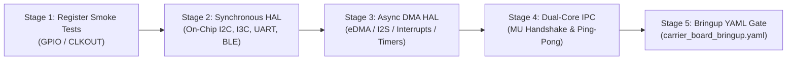

# Carrier Board 2.0 Firmware Architecture & Bringup Guide

This document specifies the firmware design, dual-core task execution model, memory partitions, and hardware bringup procedures for the **Carrier Board 2.0** architecture powered by the **NXP MCX N947** dual-core Arm Cortex-M33 microcontroller.

The source of truth for bringup verification steps is [`app/carrier_board_bringup.yaml`](file:///Users/daparker/gh/firmware/app/carrier_board_bringup.yaml).

---

## Table of Contents

- [1. System Overview & Silicon Architecture](#1-system-overview--silicon-architecture)
  - [Dual-Core Architecture & Task Distribution](#dual-core-architecture--task-distribution)
  - [Key Silicon Components (Bill of Materials)](#key-silicon-components-bill-of-materials)
  - [Application Controller Architecture](#application-controller-architecture)
  - [Modular Expansion Card Architecture & Cargo Features](#modular-expansion-card-architecture--cargo-features)
    - [1. Hardware Expansion Headers & Bus Interfaces](#1-hardware-expansion-headers--bus-interfaces)
    - [2. Cargo Feature Flags (`Cargo.toml`)](#2-cargo-feature-flags-cargotoml)
    - [3. Conditional Controller & Pipeline Compilation](#3-conditional-controller--pipeline-compilation)
    - [4. Hardware Card Identification & Auto-Detection](#4-hardware-card-identification--auto-detection)
- [2. Memory Map & Storage Layout](#2-memory-map--storage-layout)
  - [Internal Microcontroller Memory (NXP MCX N947)](#internal-microcontroller-memory-nxp-mcx-n947)
  - [Detailed Flash Cost Breakdown (`.text` and `.data`)](#detailed-flash-cost-breakdown-text-and-data)
  - [Firmware Partitioning & Flash Filesystems (`sequential-storage`)](#firmware-partitioning--flash-filesystems-sequential-storage)
    - [1. Internal Flash Partitions (2 MB NXP MCX N947 / `dev:builtin-flash`)](#1-internal-flash-partitions-2-mb-nxp-mcx-n947--devbuiltin-flash)
    - [2. External Serial SLC NAND Partitions (128 MB Winbond W25N01GV / `dev:ext-flash`)](#2-external-serial-slc-nand-partitions-128-mb-winbond-w25n01gv--devext-flash)
    - [3. Flash I/O Invariants & Guarantees](#3-flash-io-invariants--guarantees)
    - [4. Host Flash Tool (`tools/host_fs`) Storage Descriptor URI Model](#4-host-flash-tool-toolshost_fs-storage-descriptor-uri-model)
    - [5. Target Partition Table & `ProgramMetadata` Descriptor Structure](#5-target-partition-table--programmetadata-descriptor-structure)
  - [Application Software Framework for DSP & NPU (Rust ML Ecosystem)](#application-software-framework-for-dsp--npu-rust-ml-ecosystem)
    - [Framework Validation: Integration with Touch Sensor Gesture Processor](#framework-validation-integration-with-touch-sensor-gesture-processor)
  - [Design Hardening & Memory Protection (ARMv8-M MPU & Storage Security)](#design-hardening--memory-protection-armv8-m-mpu--storage-security)
  - [Secure Boot & Firmware Update Architecture](#secure-boot--firmware-update-architecture)
  - [Internal SRAM Allocation Budget (Including RTT & CLI Buffers)](#internal-sram-allocation-budget-including-rtt--cli-buffers)
  - [Dual-Core Rust Architecture: Embassy Multi-Executor AMP (Option 3)](#dual-core-rust-architecture-embassy-multi-executor-amp-option-3)
    - [Inter-Core Asynchronous IPC Protocol (`embassy-ipc-channel` & `minicbor`)](#inter-core-asynchronous-ipc-protocol-embassy-ipc-channel--minicbor)
    - [Resolution of RP2040 Core 1 SRAM Execution Limitation on MCX N947](#resolution-of-rp2040-core-1-sram-execution-limitation-on-mcx-n947)
- [3. Communication, Telemetry & Logging Strategy](#3-communication-telemetry--logging-strategy)
  - [Tradeoff Evaluation: Segger RTT vs. High-Speed UART Service Model](#tradeoff-evaluation-segger-rtt-vs-high-speed-uart-service-model)
  - [Host CLI (`tools/host_cli`) Production, Field Servicing & OTA Support](#host-cli-toolshost_cli-production-field-servicing--ota-support)
    - [1. Production Manufacturing & Factory Provisioning](#1-production-manufacturing--factory-provisioning)
    - [2. Structured Diagnostic Error Handling (`ServiceError`)](#2-structured-diagnostic-error-handling-serviceerror)
    - [3. Field Servicing & Diagnostic Health Monitoring](#3-field-servicing--diagnostic-health-monitoring)
    - [4. Over-the-Air (OTA) Firmware Deployment](#4-over-the-air-ota-firmware-deployment)
    - [5. External Model & Filter Updates (`dev:ext-flash` `models` Partition)](#5-external-model--filter-updates-devext-flash-models-partition)
- [4. Subsystem Power Consumption & Operating State Matrix](#4-subsystem-power-consumption--operating-state-matrix)
  - [Operating Power State Matrix](#operating-power-state-matrix)
  - [Per-Subsystem Power Measurements](#per-subsystem-power-measurements)
- [5. Custom Embassy HAL Implementation & Validation Plan](#5-custom-embassy-hal-implementation--validation-plan)
  - [Architecture of `embassy-mcx`](#architecture-of-embassy-mcx)
  - [On-Device Rust Test Frameworks & Post-Bringup UART Service Model](#on-device-rust-test-frameworks--post-bringup-uart-service-model)
  - [Validation Gate for `embassy-mcx`](#validation-gate-for-embassy-mcx)
- [6. User Interface, Audio Chimes, Boot Timings & System Controller Extensions](#6-user-interface-audio-chimes-boot-timings--system-controller-extensions)
  - [1. System Controller Architecture: Harmonized `Active`, `Sleep` & `PowerDown` States](#1-system-controller-architecture-harmonized-active-sleep--powerdown-states)
  - [2. User LED Indicator Matrix (TI LP5009 RGB LED)](#2-user-led-indicator-matrix-ti-lp5009-rgb-led)
  - [3. Speaker Audio Chimes](#3-speaker-audio-chimes)
  - [4. Boot Timing & Latency Budget](#4-boot-timing--latency-budget)
- [7. Hardware Bringup & Verification Protocol](#7-hardware-bringup--verification-protocol)

---

## 1. System Overview & Silicon Architecture

The Carrier Board 2.0 is a modular hardware evaluation, sensor fusion, and telemetry workstation designed for ultra-low-power operation, long-range wireless communication, and real-time proximity sensing. The firmware executes in a bare-metal `no_std` Rust environment built on top of the **Embassy** asynchronous framework.

### Dual-Core Architecture & Task Distribution

```
+-----------------------------------------------------------------------------------+
|                            CARRIER BOARD 2.0 FIRMWARE                             |
+-----------------------------------------------------------------------------------+
|  Core 0 (150 MHz Cortex-M33): System Orchestration, Storage, Network & Services   |
|  - Embassy Async Executor (Cooperative Multitasking)                              |
|  - Inter-Core Async IPC (embassy-ipc-channel over SRAMX + MU interrupts / CBOR)   |
|  - FlexSPI NAND Flash Storage Controller (Winbond W25N01GV 1Gb NAND Filesystem)   |
|  - Bidirectional Wireless BLE Service Stack (u-blox NINA-B312 UART @ 1 Mb/s)       |
|    * Telemetry Egress Streaming                                                   |
|    * BLE GATT Service Endpoint for Mobile/Host Client RPC & Configuration         |
|  - Host FTDI Console & High-Speed UART Service Channel (FC1 UART0 @ 115.2k - 1Mb/s)|
|  - Power Path & Battery State of Charge Manager (BQ24074 & MAX17048)              |
|  - Status & Ambient LED Animations (TI LP5009 Logarithmic RGB Driver)             |
|  - Background OTA Firmware Staging & Secure Boot Verification Pipeline            |
+-----------------------------------------------------------------------------------+
|  Core 1 (150 MHz Cortex-M33): Dedicated Real-Time Peripheral Coprocessor          |
|  - Deterministic Real-Time Task Runner                                            |
|  - Inter-Core Async IPC (embassy-ipc-channel over SRAMX + MU interrupts / CBOR)   |
|  - High-Speed ProxFusion Capacitive Touch & Proximity Engine (Azoteq IQS7222A)    |
|  - I2S & PDM Class-D Audio Stream & Frequency Synthesis (MAX98357A & Piezo Sounder)|
|  - Camera Gesture Pipeline & Image Preprocessing Interface                        |
|  - PowerQuad Math Accelerator / DSP Filter Pipelines (CMSIS-DSP)                  |
|  - eIQ Neutron NPU Neural Inference Engine (Accelerated ML Graph Execution)       |
+-----------------------------------------------------------------------------------+
```

### Key Silicon Components (Bill of Materials)

| Designator | Component / Part | Description | Interface / Bus | Key Firmware Role |
| :--- | :--- | :--- | :--- | :--- |
| **`U1`** | **NXP MCXN947VDF** | Dual-core Arm Cortex-M33 MCU + eIQ NPU | Host Controller | 150 MHz dual-core, 2MB dual-bank Flash, 512KB SRAM with ECC. |
| **`U8`** | **Winbond W25N01GV** | 1Gb (128MB) SLC Serial NAND Flash | FlexSPI Port A (Core 0)| Persistent CBOR telemetry queue, crash dump logs, calibration data, OTA staging. |
| **`U3`** | **TI BQ24074** | 1.5A Dynamic Power Path Li-Ion Charger | GPIO (`/CHG`, `/PGOOD`) | Autonomous charge management, input current limit, brownout avoidance. |
| **`U7`** | **ADI MAX17048** | 1-Cell Li+ ModelGauge Fuel Gauge | Core `I2C0` (`0x36`) | Precision voltage, state of charge (SoC), alert interrupt (`G4`). |
| **`U6`** | **TI LP5009** | 9-Channel Logarithmic RGB LED Driver | Core `I2C0` (`0x14`) | Low-power breathing, charge animations, offloading MCU core. |
| **`U9`** | **FTDI FT232RNQ** | High-Speed USB 2.0 to UART Serial Bridge | `FC1` UART0 (115.2k - 1 Mb/s)| Diagnostic bringup shell, 1Mb/s telemetry, UART service endpoint. |
| **`U2`** | **Azoteq IQS7222A**| ProxFusion Cap-Touch & Proximity IC | Touch `I2C1` (`0x44`)| Single-finger (1 finger) touch tracking, tap/slider gestures, and proximity sensing (`CAP_INT` on `C4`, Core 1). |
| **`U4`** | **ADI MAX98357A** | 3.2W I2S Class-D Mono Audio Amplifier | `I2S` Audio (`B14`/`A14`)| Chime audio feedback, filterless I2S Class-D drive on Core 1. |
| **`U11`**| **u-blox NINA-B312**| Bluetooth Low Energy 5.0 Module | UART1 (1 Mb/s) | Bidirectional BLE: Telemetry streaming & GATT service endpoint. |
| **`Q2`–`Q4`**| **TI TPS22918**| 5.5V, 2A Load Switches | GPIO (`L4`, `L5`, `M4`)| Power-gating Audio (`Q2`), Sensors (`Q3`), and Debug Bridge (`Q4`). |

### Application Controller Architecture

Carrier Board 2.0 adopts the project's decoupled domain controller design pattern (`controller` crate), utilizing Embassy async channels to coordinate system events across tasks and cores. The application initializes and runs the following controllers:

1. **`SystemController` (`controller::system_controller`)**:
   - Master orchestrator governing top-level operating states (`Active`, `Sleep`, `Standby`, `PowerDown`).
   - Coordinates inactivity timeouts, wake-up interrupts from touch or BLE, and inter-core task sequencing.
2. **`BatteryController` (`controller::battery_controller`)**:
   - Interfaces with the ADI MAX17048 fuel gauge (`I2C0` @ `0x36`) and TI BQ24074 charger status pins (`/CHG`, `/PGOOD`).
   - Computes state of charge (SoC), cell voltage, charging status, and publishes periodic battery telemetry frames.
3. **`LedController` (`controller::led_controller`)**:
   - Drives the TI LP5009 9-channel logarithmic $\text{I}^2\text{C}$ RGB LED driver (`I2C0` @ `0x14`).
   - Renders visual patterns for boot (`BOOTING`, `BOOT_FAILED`), wireless status (`BLE_PAIRING`, `BLE_CONNECTED`), runtime modes (`ACTIVE_RUNNING`, `CAMERA_ACTIVE`), thermal alerts (`OVERTEMP_ALERT`), and OTA updates (`OTA_PROGRAMMING`).
4. **`SensorController` (`controller::sensor_controller`)**:
   - Serves as the unified canonical controller for all current and future sensor peripherals (environmental, ambient light, IMU/inertial, optical/ToF, capacitive touch, proximity).
   - Manages the Azoteq IQS7222A capacitive touch and proximity sensor (`I2C1` @ `0x44` on Core 1).
   - **Hardware FIFO Buffering & Low-Power Coprocessor Scheduling**:
     - Azoteq IQS7222A capacitive touch sensing and motion sensor peripherals stream readings into internal on-chip hardware FIFOs (up to 32 samples deep).
     - Hardware pin interrupts (`CAP_INT` on `C4`) fire only when the hardware FIFO reaches a configurable watermark threshold (e.g. 75% full) or an inactivity flush timeout expires.
     - This permits Core 1 to remain in deep low-power sleep (WFI / power-down) during sampling intervals, waking only when a burst batch of samples is ready, drastically reducing active processor energy.
   - **On-Chip High-Resolution Timer (`CTIMER`) Microsecond Timestamp Integration**:
     - To ensure cycle-accurate sensor fusion without CPU polling, Core 1 integrates the MCX N947 on-chip 32-bit Standard Counter/Timer (`CTIMER0`..`CTIMER4`).
     - Upon waking from a FIFO watermark interrupt, Core 1 reads the running `CTIMER` microsecond timestamp counter. The inter-sample time step ($\Delta t$) is integrated backward across each sample in the FIFO batch using the known hardware sample clock rate and hardware timer delta:
       $$\Delta t_{batch} = t_{interrupt} - t_{previous\_batch}, \quad \Delta t_{sample} = \frac{\Delta t_{batch}}{N_{samples}}$$
   - **FIFO Buffering in the Sensor Fusion Pipeline**:
     - Batched, timestamped samples are staged directly into the **Core 1 Sensor Fusion Arena** (`0x2002_0000`, 64 KB).
     - The sensor fusion algorithms (Kalman filter state estimation, complementary attitude filters, and temporal trajectory smoothing) operate over contiguous vector slices of batched samples rather than sample-by-sample loops.
     - Integration equations use exact microsecond $\Delta t$ from `CTIMER`, eliminating phase jitter caused by variable interrupt latency, context switches, or inter-core IPC delivery delays.
   - Handles single-finger touch position detection, continuous tracking, gesture recognition, and proximity event emission over IPC.
5. **`SpeakerController` (`controller::speaker_controller`)**:
   - Drives the on-board piezo buzzer and ADI MAX98357A I2S Class-D audio amplifier (`U4` on Core 1).
   - Synthesizes acoustic alerts, status chimes, and decodes I2S audio playback streams.
6. **`BleController` (`controller::ble_controller`)**:
   - Serves as the primary communication and IPC gateway to the u-blox NINA-B312 BLE module over 1 Mb/s UART.
   - Coordinates BLE advertising, GATT service connection lifecycle, client RPC command routing, and wireless telemetry egress streaming.
7. **`FilesystemController` (`controller::filesystem_controller`)**:
   - Manages persistent storage on the Winbond W25N01GV 128 MB SLC NAND flash via FlexSPI DMA and `sequential-storage`.
   - Mounts and manages `telemetry` (queue), `crash_logs` (map), `ota_staging` (queue), `recovery` (read-only), and `models` (map) partitions.
8. **`TelemetryController` (`controller::telemetry_controller`)**:
   - High-throughput telemetry pipeline aggregating binary `defmt` structured logs and CBOR telemetry records.
   - Buffers records in shared SRAMX memory and schedules DMA transmissions over 1 Mb/s UART or BLE.
9. **`ShellController` (`controller::shell_controller`)**:
   - Implements the non-blocking interactive command-line interface over FTDI USB UART (`FC1`).
   - Processes diagnostic shell commands, bringup verification triggers, and binary service RPC frames for production testing.
10. **`ThermalController` (`controller::thermal_controller`)**:
    - Samples MCX N947 internal junction temperature sensors and external thermistor rails.
    - Enforces thermal safety throttling and generates thermal alert commands if temperature thresholds are breached.

### Modular Expansion Card Architecture & Cargo Features

To support diverse hardware configurations without bloating firmware binaries, Carrier Board 2.0 implements a modular expansion card system configured through **Cargo feature flags**:

#### 1. Hardware Expansion Headers & Bus Interfaces
The carrier board provides dedicated expansion headers routing isolated serial, bus, and power signals:
- **`J6` Header**: External $\text{I}^2\text{C}$ expansion clock (`I2C2_SCL` on `P1_9` / `FC4_P1`) and data (`I2C2_SDA` on `P1_8` / `FC4_P0`).
- **`J9` Header**: High-speed SPI peripheral expansion (`SPI0_SCK`, `SPI0_MOSI`, `SPI0_MISO`, `SPI0_CS_N` on `P4_12`–`P4_17` / `FC2`).
- **`J10` Header**: Peripheral expansion high-speed UART (`UART1_RXD` on `P1_4` / `FC5_P0`, `UART1_TXD` on `P1_5` / `FC5_P1`).
- **`Q1` MOSFET Load Switch**: Controlled by `PWR_EN` to power-gate expansion card peripherals during `Sleep` and `Standby`.

#### 2. Cargo Feature Flags (`Cargo.toml`)
Firmware targets select expansion card drivers and runtime controllers using conditional compilation:
```toml
[features]
default = ["expansion-audio", "expansion-camera"]

# Expansion Card 1: I2S Class-D Audio Streaming & Sound Synthesis
expansion-audio = []

# Expansion Card 2: 2D Optical Flow & Camera Gesture Vision Pipeline
expansion-camera = []

# Expansion Card 3: GNSS / Location Services Engine (NMEA/UBX over UART1)
expansion-location = []

# Expansion Card 4: Cellular / Satellite IoT Modem Controller
expansion-cellular = []
```

#### 3. Conditional Controller & Pipeline Compilation
- **`expansion-audio`**: Enables Core 1 I2S/SAI audio streaming task, WAV/ADPCM decompression engine, and speaker chime synthesis (+45 KB flash).
- **`expansion-camera`**: Compiles Core 1 camera DMA capture pipeline, 2D optical flow filter, image patch normalization, and eIQ Neutron NPU inference dispatch (+140 KB flash).
- **`expansion-location`**: Instantiates GNSS sentence parser task on `UART1` (`FC5`), Kalman dead-reckoning filter, and geodesic solver (+55 KB flash).
- **`expansion-cellular`**: Enables cellular modem AT command handler, PPP network adapter, and power-saving mode (eDRX / PSM) scheduler (+65 KB flash).

#### 4. Hardware Card Identification & Auto-Detection
During Stage 2 bringup, Core 0 queries the expansion $\text{I}^2\text{C}$ bus (`FC4`) at standard EEPROM address range (`0x50`–`0x57`):
- Each expansion card carries a 2 KB serial EEPROM (`dev:eeprom`) formatted using `sequential-storage` with a sequential, self-describing TLV (Type-Length-Value) architecture modeled directly on **USB descriptors**:
  - **`DeviceDescriptor`**: Identifies card vendor ID (VID), product ID (PID), hardware revision, card serial number, and descriptive ASCII string.
  - **`ConfigurationDescriptor`**: Declares aggregate power budget (max current in mA), required operating voltages, bus interface modes (I2C, SPI, I3C, I2S), and required clock frequencies.
  - **`InterfaceDescriptor`**: Declares specific peripheral interfaces exposed by the card (e.g., I2C endpoints, SPI chip selects, I2S channels, GPIO interrupt lines).
  - **`DriverDescriptor`**: Specifies compatible firmware driver identifier, minimum HAL crate API version, and device-specific initialization register payloads.
  - **`IntegrityDescriptor`**: Contains cryptographic Ed25519 signature and CRC-32 checksum ensuring descriptor authenticity and detecting EEPROM wear or bit flips.
- **Forward & Backward Compatibility**: Because descriptors follow a `sequential-storage` TLV model, newly introduced descriptor types are gracefully skipped by older firmware releases without parsing errors, and updated descriptors are appended atomically using `sequential-storage` wear leveling.
- **Non-Blocking Telemetry & Developer Experience**: Card auto-detection is strictly non-blocking and intended for telemetry, developer experience, and runtime diagnostic logging; **it does NOT gate, delay, or block system boot**. If an expansion EEPROM is unpopulated, unreadable, or missing, the system proceeds with standard boot without delay using default compile-time Cargo features.
- If a card is detected whose feature is disabled in the active firmware build, the system logs diagnostic telemetry via `defmt`; card auto-detection is strictly advisory and diagnostic, and **it does NOT alter, delay, or change system boot behavior or execution flow**.

---

## 2. Memory Map & Storage Layout

### Internal Microcontroller Memory (NXP MCX N947)

The NXP MCX N947 integrates **2,048 KB (2 MB) of dual-bank on-chip flash** and **512 KB of SRAM with ECC**.

```
0x0000_0000 +---------------------------------------+
            |  Primary Bootloader & Vector Table    |
            |  (64 KB Protected Boot Sector)        |
0x0001_0000 +---------------------------------------+
            |  Active Firmware Application Slot A   |
            |  (1,920 KB Single-Slot Partition)     |
            |  Supports Dual Cores, DSP, eIQ & Exp. |
0x001F_0000 +---------------------------------------+
            |  Non-Volatile System Keystore & Config|
            |  (64 KB Protected Secure Store)       |
0x0020_0000 +---------------------------------------+
```

### Detailed Flash Cost Breakdown (`.text` and `.data`)

To prove conclusively that the application fits comfortably within the internal flash budget while supporting both Cortex-M33 cores, DSP kernels, eIQ Neutron NPU inference, built-in peripherals, bidirectional BLE communication, and future expansion scenarios (audio playback, camera gesture detection, location services), the following flash sizing analysis is established:

| Subsystem / Functional Module | Estimated `.text` (Code) | Estimated `.data` / `.rodata` | Total Flash Footprint | Description / Scope |
| :--- | :---: | :---: | :---: | :--- |
| **Core 0 Application & Embassy Executor** | 210 KB | 40 KB | **250 KB** | Cooperative async task runner, system state machine, timer scheduler, channel routing. |
| **Core 1 Coprocessor Runtime** | 150 KB | 30 KB | **180 KB** | Coprocessor bootstrap, real-time sensor loop, Azoteq IQS7222A touch sampling engine. |
| **DSP & PowerQuad Math Kernels** | 75 KB | 15 KB | **90 KB** | CMSIS-DSP FFT, biquad IIR/FIR filter cascades, frequency synthesis algorithms. |
| **Inter-Core Async IPC (SRAMX + MU + minicbor)** | 18 KB | 4 KB | **22 KB** | Lock-free SPSC channel queues in shared SRAMX, MU doorbell interrupt driver, minicbor zero-copy serialization. |
| **eIQ Neutron NPU Runtime & Driver** | 100 KB | 20 KB | **120 KB** | NPU command stream builder, operator graph dispatcher, weight decompression loader. |
| **eIQ Quantized Model Weights (Internal)** | 0 KB | 280 KB | **280 KB** | 8-bit quantized gesture classification & keyword spotting weights in `.rodata`. |
| **Built-in Peripherals & Bus Drivers** | 75 KB | 15 KB | **90 KB** | FlexSPI NAND (Core 0), LPI2C0/1, I3C, LPUART0/1, PDM audio, WUU/SPC drivers. |
| **Bidirectional BLE Stack (NINA-B312)** | 55 KB | 15 KB | **70 KB** | Telemetry egress framing, GATT service endpoint dispatcher, client RPC handlers. |
| **Expansion: Audio Playback Engine** | 38 KB | 7 KB | **45 KB** | WAV / ADPCM streaming decoder, ring buffer feeder to PDM Class-D output. |
| **Expansion: Camera Gesture Pipeline** | 115 KB | 25 KB | **140 KB** | 2D optical flow filter, image patch normalization, edge trigger detection. |
| **Expansion: Location Services Engine** | 45 KB | 10 KB | **55 KB** | NMEA-0183 / UBX sentence parsing, Kalman dead-reckoning filter, geodesic solver. |
| **Diagnostic Shell, RTT & Formatting** | 30 KB | 10 KB | **40 KB** | Command parser, bringup test routines, ASCII banner, RTT formatting. |
| **Total Estimated Footprint** | **911 KB** | **471 KB** | **1,382 KB** | **72.0% of 1,920 KB partition (538 KB headroom remaining).** |

### Firmware Partitioning & Flash Filesystems (`sequential-storage`)

A strict architectural invariant of the Carrier Board 2.0 firmware is that **every firmware flash I/O operation outside of the primary ROM/bootloader stage MUST be governed by the `sequential-storage` crate**. Raw, unbounded, or ad-hoc flash sector writes are prohibited.

#### 1. Internal Flash Partitions (2 MB NXP MCX N947 / `dev:builtin-flash`)

| Partition Name | Memory Address Range | Size | Filesystem / Storage Driver | Description & Stored Data |
| :--- | :--- | :---: | :--- | :--- |
| **`bootloader`** | `0x0000_0000` – `0x0001_0000` | 64 KB | Read-Only Bare-Metal Code | Custom Second-Stage Bootloader (SSBL): Initial startup vector table, XIP pre-boot evaluation, and SRAM-relocatable flash programmer kernel (`flash_loader_ram`) for OTA staging. |
| **`slot_a`** | `0x0001_0000` – `0x001E_0000` | 1,856 KB | Read-Only Application Code | Primary active dual-core application firmware image (Core 0 + Core 1). |
| **`fs`** | `0x001E_0000` – `0x001F_0000` | 64 KB | `sequential_storage::map` | Internal non-volatile key-value store: device UUID, monotonic boot counters, and hardware flags. (Sensor calibration baselines are moved to external NAND). |
| **`keystore`** | `0x001F_0000` – `0x0020_0000` | 64 KB | Hardware Protected Keystore | Cryptographic public keys, anti-rollback monotonic counters, security credentials. |

#### 2. External Serial SLC NAND Partitions (128 MB Winbond W25N01GV / `dev:ext-flash`)

| Partition Name | NAND Address Range | Size | Filesystem / Storage Driver | Description & Stored Data |
| :--- | :--- | :---: | :--- | :--- |
| **`telemetry`** | `0x0000_0000` – `0x0200_0000` | 32 MB | `sequential_storage::queue` | High-throughput FIFO circular telemetry queue storing CBOR-encoded event frames with wear leveling. |
| **`crash_logs`** | `0x0200_0000` – `0x0400_0000` | 32 MB | `sequential_storage::map` | Diagnostic crash dump storage: CPU register snapshots, core task callstacks, and panic assertions. |
| **`ota_staging`** | `0x0400_0000` – `0x0600_0000` | 32 MB | `sequential_storage::queue` | Staging area for incoming firmware update chunks received over BLE or USB UART prior to verification. |
| **`recovery`** | `0x0600_0000` – `0x0700_0000` | 16 MB | Read-Only Recovery Image | Golden factory fallback firmware image restored if Slot A boot verification fails. |
| **`models`** | `0x0700_0000` – `0x0800_0000` | 16 MB | `sequential_storage::map` | External neural network weights (eIQ Neutron), sensor calibration baselines, audio chime samples, and gesture templates. Supports independent updates over BLE or USB UART without requiring an OTA reboot, allowing on-the-fly switching and hot-reloading of ML models directly in the Core 1 tensor arena. |

#### 3. Flash I/O Invariants & Guarantees

- **Key-Value Records**: All configuration objects and calibration baselines utilize `sequential_storage::map::store_item`, `fetch_item`, and `remove_item` with `sequential_storage::cache::NoCache`.
- **Time-Series Telemetry**: High-rate telemetry events are appended via `sequential_storage::queue::push` and drained during BLE / USB upload bursts using `sequential_storage::queue::iter` and `pop`.
- **Power-Loss Atomicity**: Incomplete or torn writes occurring during battery disconnect or brownout are cleanly discarded during the subsequent boot traversal without corrupting existing records.
- **Wear Leveling**: Flash write operations are distributed evenly across SLC NAND erase blocks, preventing premature block degradation.

#### 4. Host Flash Tool (`tools/host_fs`) Storage Descriptor URI Model

The repository's host filesystem utility (`tools/host_fs`) adopts a unified storage device descriptor URI model to reference physical storage targets:
- **`dev:builtin-flash`**: Identifies on-chip internal NOR flash (2 MB MCX N947).
- **`dev:ext-flash`**: Identifies off-chip external SLC NAND flash (128 MB Winbond W25N01GV over FlexSPI).
- **`dev:eeprom`**: Identifies non-volatile I2C EEPROMs (e.g., 2 KB modular expansion card EEPROM at `0x50`–`0x57` on `FC4`).

This descriptor model provides direct host-side Winbond W25N01GV SLC NAND and expansion card EEPROM image flashing, partition provisioning, and diagnostic extraction:

- **Full Image Provisioning**:
  ```bash
  cargo run -p host_fs -- flash --device dev:ext-flash --image target/nand_factory_image.bin
  ```
  Programs factory golden partitions (`recovery`, initial `models`, baseline `fs`) directly into SLC NAND via the FTDI high-speed bridge or external programmer.
- **Partition-Level Staging & Model Updates**:
  ```bash
  cargo run -p host_fs -- program --device dev:ext-flash --partition models --file models/gesture_v2.bin
  cargo run -p host_fs -- program --device dev:ext-flash --partition recovery --file target/out/carrier_board_golden.bin
  ```
- **Modular Expansion Card EEPROM Operations (`dev:eeprom`)**:
  `host_fs` supports direct programming, dumping, and verification of expansion card EEPROMs using the exact same workflow as flash targets:
  ```bash
  # Program expansion card USB-descriptor TLV image into EEPROM
  cargo run -p host_fs -- program --device dev:eeprom --file config/expansion_card_descriptor.bin

  # Dump EEPROM contents for backup or inspection
  cargo run -p host_fs -- dump --device dev:eeprom --file backups/card_eeprom_backup.bin

  # Verify EEPROM contents against reference binary image
  cargo run -p host_fs -- verify --device dev:eeprom --file config/expansion_card_descriptor.bin
  ```
- **Diagnostic Telemetry & Crash Dump Extraction**:
  ```bash
  cargo run -p host_fs -- dump --device dev:ext-flash --partition telemetry --output telemetry_run.bin
  cargo run -p host_fs -- dump --device dev:ext-flash --partition crash_logs --output crash_dump.bin
  ```
- **Host-Side `sequential-storage` Emulation**:
  `host_fs` incorporates a host-native driver for `sequential-storage` queues and maps, allowing developers to inspect, unpack, validate CRC32 checksums, and export records directly from raw NAND and EEPROM dumps while accounting for SLC NAND 128 KB erase blocks, EEPROM page sizes (typically 16–64 bytes), and bad block lookup tables.

#### 5. Target Partition Table & `ProgramMetadata` Descriptor Structure

To ensure that bootloaders, application runtimes, and host workstation tooling share a single authoritative source of truth for storage geometries without hardcoded addresses, every compiled firmware binary embeds an immutable `.program_metadata` ELF section containing the `ProgramMetadata` descriptor structure:

```rust
#[repr(C)]
pub struct ProgramMetadata {
    pub magic: [u8; 4],                        // b"PROG" (0x50, 0x52, 0x4F, 0x47)
    pub schema_version: u16,                   // Metadata schema version (e.g. 1)
    pub target_chip: [u8; 16],                 // Target silicon string (e.g. b"MCXN947\0...")
    pub git_commit: [u8; 20],                  // Git SHA-1 commit hash
    pub semver: [u8; 16],                      // Firmware semantic version string (e.g. b"2.0.0\0...")
    pub build_timestamp: u64,                  // POSIX epoch build timestamp (seconds)
    pub device_count: u8,                      // Number of registered storage devices
    pub partition_count: u8,                   // Number of active partition entries
    pub devices: [StorageDeviceDescriptor; 4], // Storage devices (dev:builtin-flash, dev:ext-flash, dev:eeprom)
    pub partitions: [PartitionDescriptor; 16], // Partition table entries
}

#[repr(C)]
pub struct StorageDeviceDescriptor {
    pub device_uri: [u8; 24],                  // Canonical URI (b"dev:builtin-flash", b"dev:ext-flash", b"dev:eeprom")
    pub bus_type: u8,                          // 0 = Internal Bus, 1 = FlexSPI, 2 = I2C/I3C
    pub total_size_bytes: u64,                 // Total addressable physical capacity
    pub erase_block_size: u32,                 // Block erase size (e.g. 8 KB NOR, 128 KB NAND, 64 B EEPROM)
    pub write_page_size: u32,                  // Minimum atomic write page size (e.g. 128 B, 2048 B, 16 B)
}

#[repr(C)]
pub struct PartitionDescriptor {
    pub name: [u8; 24],                        // Partition identifier (b"bootloader", b"slot_a", b"fs", b"telemetry", etc.)
    pub device_uri: [u8; 24],                  // Parent device URI string
    pub start_offset: u64,                     // Byte offset from start of physical device
    pub length_bytes: u64,                     // Partition capacity in bytes
    pub driver_type: u8,                       // 0 = Raw XIP, 1 = sequential_storage::map, 2 = sequential_storage::queue
    pub flags: u32,                            // Bitflags: 0x01=ReadOnly, 0x02=Executable, 0x04=WearLeveled, 0x08=Encrypted
}
```

- **Bootloader (SSBL) Integration**: The custom Second-Stage Bootloader fetches the `.program_metadata` header from internal flash on boot to determine active Slot A boundaries, keystore location, and NAND `ota_staging` offsets dynamically without requiring hardcoded flash addresses in bootloader C/Rust code.
- **Host Tooling Introspection (`host_fs` & `host_cli`)**: When connecting over USB UART or reading an ELF binary, host utilities parse `.program_metadata` directly. This enables host tools to discover the full partition layout across all storage media (`dev:builtin-flash`, `dev:ext-flash`, `dev:eeprom`) automatically, preventing flash configuration divergence between host and embedded targets.

### Application Software Framework for DSP & NPU (Rust ML Ecosystem)

To drive the eIQ Neutron NPU and PowerQuad DSP accelerator from Rust without relying on proprietary, opaque C runtimes, Carrier Board 2.0 targets modern high-level Rust tensor and machine learning frameworks:

1. **Burn (`burn-rs`)**:
   - Modern, flexible deep learning framework for Rust with a dynamic/static computation graph, automatic differentiation, and modular backends.
   - Supports `no_std` environments and features an ahead-of-time (AOT) code generation engine (`burn-import`) that compiles PyTorch/ONNX models directly into strongly-typed, memory-safe Rust structs with zero runtime dynamic allocations.
2. **Candle (Hugging Face)**:
   - Minimalist, performance-oriented ML framework for Rust. Offers a PyTorch-compatible API, lightweight tensor primitives, and native support for quantized GGUF and ONNX models.
3. **tract (Sonos)**:
   - Pure-Rust neural network inference engine supporting ONNX and TensorFlow models. Extensively proven in resource-constrained embedded devices, tract features static graph optimization, constant folding, and direct emission of Arm CMSIS-DSP kernel calls.
4. **JAX-like Functional AOT / JIT Compilation Model for Embedded Rust**:
   - The production software architecture adopts a **JAX-inspired functional compilation workflow**:
     - *Offline Model Definition & Training*: Networks are defined and trained on host workstations in PyTorch or JAX.
     - *Graph Lowering & Optimization*: The model is lowered to an intermediate representation (ONNX / StableHLO) where functional transformations (fused convolutions, quantization to INT8, activation pruning) are performed.
     - *Kernel Dispatch to MCX N947 Hardware*: The Rust code generation pipeline maps tensor operations directly to hardware acceleration blocks:
       - 2D Convolutions & Dense Matrix Multiplications $\to$ **eIQ Neutron NPU**.
       - FFTs, Biquad IIR/FIR Filters, Trigonometric & Coordinate Transformations $\to$ **PowerQuad DSP Accelerator**.
       - Element-wise operations and tensor reshapes $\to$ Zero-copy slice operations in internal SRAM.

#### Framework Validation: Integration with Touch Sensor Gesture Processor

To validate the Rust machine learning and tensor processing software framework on physical hardware, the framework integrates directly with the gesture processor for the on-board Azoteq IQS7222A capacitive touch sensor:

1. **High-Rate Touch Telemetry Ingestion**:
   - Core 1 samples raw capacitive delta values and tracking coordinates from the Azoteq IQS7222A touch controller over $\text{I}^2\text{C}$ (`FC2`) via asynchronous eDMA at a sustained 100 Hz rate.
   - Sensor frames are staged directly into lock-free ring buffers within the Core 1 Sensor Fusion Arena (`0x2002_8000`).

2. **Feature Extraction via PowerQuad DSP**:
   - The temporal coordinate sequence passes through biquad smoothing filters and baseline tracking routines accelerated by the MCX N947 PowerQuad DSP coprocessor.
   - A sliding 32-sample temporal window is assembled into a zero-copy $32 \times 3$ normalized feature matrix (X-coordinate, Y-coordinate, touch delta intensity).

3. **Inference Execution via Framework (`tract` / `Burn`)**:
   - A compact 1D temporal convolutional gesture classification model (trained offline in PyTorch/JAX and lowered via `burn-import` or `tract` into `no_std` Rust structs) executes inference on Core 1.
   - Quantized INT8 weights execute with zero heap allocation, utilizing the eIQ Neutron NPU and PowerQuad matrix primitives.
   - The model accurately distinguishes user gestures: Single Tap, Double Tap, Drag/Swipe (Up/Down/Left/Right), Long Press Hold, and Proximity Hover.

4. **Event Dispatch & Inter-Core Routing**:
   - Upon gesture recognition with confidence $\ge 0.85$, Core 1 emits a typed `GestureEvent` struct across the `embassy-ipc-channel` to Core 0.
   - Core 0 routes the event to `BleController` for GATT client notification and triggers acoustic confirmation on the audio amplifier.
   - This physical loop provides complete end-to-end hardware validation of the software development framework, graph lowering pipeline, and embedded inference dispatch.

### Design Hardening & Memory Protection (ARMv8-M MPU & Storage Security)

Security and execution integrity are enforced across both hardware and firmware layers:

1. **ARMv8-M Memory Protection Unit (MPU)**:
   - Both Cortex-M33 cores incorporate a hardware MPU supporting up to 16 configurable regions per core.
   - *Privilege Separation*: The Embassy async executor runs in privileged Handler mode, while user tasks and peripheral service handlers execute in unprivileged Thread mode.
   - *Null Page Guard*: Region 0 covers `0x0000_0000`–`0x0000_03FF` (first 1 KB of address space), configured with `NO_ACCESS` for both privileged and unprivileged execution modes. Any null pointer dereference (`*ptr = ...` where `ptr == NULL`) instantly trips a hardware `MemManage` fault rather than silently executing or reading vector table headers.
   - *Execute Never (`XN`)*: All SRAM regions (including shared SRAMX and tensor arenas) are marked strictly `XN` (Execute Never) to prevent code injection attacks.
   - *Hardware Stack Limit Registers (`MSPLIM` / `PSPLIM`)*: The ARMv8-M architecture introduces dedicated Main Stack Pointer Limit (`MSPLIM`) and Process Stack Pointer Limit (`PSPLIM`) registers. The Cortex-M33 hardware compares the active stack pointer against these limit registers on every `PUSH` and `SUB SP` instruction with zero CPU cycle overhead, immediately triggering a `UsageFault` or `MemManage` fault if the stack pointer drops below the allocated boundary.
   - *Defense-in-Depth via MPU Stack Guard Pages*: While `MSPLIM` and `PSPLIM` catch stack pointer decrements from deeply nested function calls or recursive frames, they cannot trap out-of-bounds array writes, buffer overflows that write *downward* or *upward* without modifying SP itself, or peripheral eDMA transfers targeting stack boundaries. Unmapped 1 KB MPU guard pages directly beneath each core's execution stack (`0x2006_C000`) provide defense-in-depth against arbitrary pointer corruptions and DMA overruns.
2. **Internal Flash Protection**:
   - The MCX N947 Flash Access Control (FAC) registers and Code Security registers configure execute-only regions and lock out unauthorized SWD readback in production lifecycle states (OEM Closed / Production Secure).
3. **External NAND Storage Hardening (Winbond W25N01GV)**:
   - *Block Locking*: Hardware Block Lock registers (`SR-1` BP0..BP3) are asserted to write-protect critical firmware staging and golden recovery blocks against accidental or malicious overwrite.
   - *Hardware Write Protect (`/WP`)*: The physical `/WP` pin is held low during normal operation, only unasserted by the bootloader during authorized OTA update staging.
   - *Cryptographic Envelope Encryption*: Sensitive telemetry data, crash dumps, and customer credentials stored in external NAND are encrypted using the on-chip hardware AES-128/256 engine. Encryption keys are securely stored in the internal hardware Keystore (`0x001F_0000`) and are never exposed off-chip.

### Secure Boot & Firmware Update Architecture

Firmware updates are governed by a cryptographic Root of Trust (RoT):

1. **Hardware Root of Trust**:
   - The MCX N947 ROM bootloader verifies the initial boot sector using OEM public key hashes permanently programmed into on-chip eFuse (CMPA - Customer Manufacturing Programmable Area).
2. **Ed25519 Digital Signatures**:
   - Every candidate firmware update payload is signed with an offline private key. The on-device bootloader validates the Ed25519 signature and SHA-256 hash before committing any image to Flash Slot A.
3. **Anti-Rollback Protection**:
   - A monotonic anti-rollback counter is tracked in eFuse. The bootloader rejects any signed update payload bearing a security version lower than the current hardware counter.
4. **Custom Second-Stage Bootloader (SSBL) & Dual-Mode OTA Execution**:
   - The firmware architecture incorporates a **customizable Second-Stage Bootloader (SSBL)** residing in the dedicated 64 KB partition (`0x0000_0000`–`0x0001_0000`), authenticated by the ROM RoT.
   - **SSBL Implementation & Embassy Integration**: The SSBL is compiled as a specialized, compact asynchronous Embassy application (`embassy-executor`) integrating:
     - The `embassy-mcx` FlexSPI NAND driver communicating with the external Winbond W25N01GV flash chip over DMA.
     - The `sequential-storage` crate drivers (`queue` iterator for `ota_staging` chunk assembly and `map` for `keystore`/`fs` configuration).
     - Cryptographic verification kernels (Ed25519 digital signature validation and SHA-256 hash checks).
   - > [!IMPORTANT]
     > **Embassy Framework Invariant**: All executable firmware code in the repository—including the Second-Stage Bootloader (SSBL), hardware bringup diagnostic runners, real-time coprocessor loops, and the primary application—MUST be implemented using the Embassy asynchronous framework. Bare-metal while-loops, raw busy-spins, or blocking C runtime constructs are strictly prohibited.
   - To support flexible OTA update workflows, the SSBL provides two distinct operational execution modes:
     - **Pre-Application XIP Execution**: Prior to launching the primary application, the SSBL boots directly from internal flash in Execute-in-Place (XIP) mode. It inspects boot flags in `keystore`/`fs`, checks the integrity of the external Winbond W25N01GV NAND `ota_staging` partition, and verifies whether a valid staged update image or rollback request is pending. If no update is requested, it directly hands off control to the Slot A application vector table (`0x0001_0000`). If boot validation fails, the SSBL sets the user RGB LED to **SSBL Boot Failure State (`BOOT_FAILED`: Rapid Red strobe @ 4 Hz)** before falling back to the golden recovery image.
     - **SRAM-Resident Flashing Kernel (`flash_loader_ram`)**: When an OTA commit is initiated (either detected by the SSBL at boot or kicked off by the active application upon completing chunk download over BLE/USB), internal flash Slot A cannot be safely erased and rewritten while actively executing code from the same physical flash controller. The SSBL or application relocates a self-contained, position-independent flash programming kernel (`flash_loader_ram`, ~8 KB) into the Reserved SRAM buffer (`0x2007_C000`).
     - *MPU Reconfiguration*: The privileged supervisor temporarily updates the MPU configuration for the `0x2007_C000` region from `Execute-Never (XN)` to `Privileged Execution (RX)` with interrupts disabled (`CPSID I`).
     - *Visual State Signaling*: While programming is underway in SRAM, the kernel configures the LP5009 user RGB LED to the dedicated **OTA Programming UI State (`OTA_PROGRAMMING`: Magenta breathing @ 2 Hz)**.
     - *NAND-to-Flash Streaming*: Running entirely out of SRAM, `flash_loader_ram` streams the verified binary blocks from the NAND `ota_staging` partition over FlexSPI DMA, erases Slot A sectors, programs the internal flash, calculates the hardware CRC32 to guarantee image integrity, updates the monotonic anti-rollback counter, and executes an atomic system reset (`NVIC_SystemReset()`).
5. **Single-Slot NAND Staging Workflow**:
   ```mermaid
   flowchart TD
       A["Incoming OTA Payload via BLE/USB"] --> B["Stage in 32MB NAND Partition (0x0400_0000)"]
       B --> C["Validate Ed25519 Signature & SHA-256 Hash"]
       C --> D{"Signature Valid & Version >= Rollback Counter?"}
       D -- No --> E["Set User LED to BOOT_FAILED (Rapid Red Strobe @ 4Hz) & Erase Staging Partition"]
       D -- Yes --> F["Reboot or Enter OTA Mode"]
       F --> G{"Execution Mode Selection"}
       G -- XIP Boot --> H["Custom SSBL Evaluates Pending OTA in XIP Flash"]
       G -- In-App Trigger --> I["Relocate flash_loader_ram Kernel into SRAM (0x2007_C000)"]
       H --> I
       I --> J["Set User LED to OTA_PROGRAMMING (Magenta Breathing @ 2Hz)"]
       J --> K["Program Slot A from NAND via FlexSPI DMA while Running in SRAM"]
       K --> L["Verify Slot A Flash CRC32 & Update Monotonic Counter"]
       L --> M["Trigger NVIC_SystemReset() -> Boot Verified Slot A"]
   ```

### Internal SRAM Allocation Budget (Including RTT & CLI Buffers)

The MCX N947 features **512 KB of total internal SRAM** with ECC protection. To clearly evaluate committed baseline usage against headroom available for future modular expansion cards and dynamic feature expansion, the SRAM budget is partitioned into three functional tiers:

| SRAM Domain / Functional Tier | Base Address | Size | Memory Classification | Primary Function / Scope |
| :--- | :--- | :---: | :---: | :--- |
| **Core 0 System Heapless Arena** | `0x2000_0000` | 96 KB | Base System | Embassy executor task arena, networking buffers, BLE packet queues. |
| **Segger RTT & defmt Logging Buffers**| `0x2001_8000` | 24 KB | Base System | RTT control block (`_SEGGER_RTT`), Up/Down channel ring buffers, defmt queue. |
| **CLI & Interactive Console Buffers** | `0x2001_E000` | 8 KB | Base System | Command history ring buffer, tokenizer scratchpad, VT100 terminal escape line buffers. |
| **Core 1 Sensor Fusion Arena** | `0x2002_0000` | 64 KB | Base System | ProxFusion high-rate sample buffers, Azoteq IQS7222A touch filter states. |
| **Inter-Core Shared IPC (SRAMX)**| `0x2003_0000` | 32 KB | Base System | Lock-free SPSC circular ring buffers and hardware mailbox registers. |
| **Stacks & Hardware Guard Pages** | `0x2003_8000` | 48 KB | Base System | Core 0 stack (24 KB), Core 1 stack (16 KB), MPU guard pages (8 KB). |
| **Reserved / DMA Bounce Buffers** | `0x2004_4000` | 16 KB | Base System | Transient eDMA scatter-gather descriptors, USB packet staging, and `flash_loader_ram`. |
| **Expansion: Audio Streaming & DSP**| `0x2004_8000` | 32 KB | Active Expansion | PDM Class-D double-buffers, 512-point FFT scratchpad (`expansion-audio`). |
| **Expansion: Neutron NPU Tensor Arena**| `0x2005_0000` | 128 KB | Active Expansion | Activation maps and scratchpad (`expansion-camera`). Model weights hot-reloadable from NAND. |
| **Expansion Headroom & Future Growth** | `0x2007_0000` | 64 KB | **Available Headroom** | **Uncommitted SRAM reserved for future modular expansion cards and dynamic growth.** |
| **Total Physical SRAM** | | **512 KB** | **100% Accounted** | **Zero uncontrolled heap allocation.** |

#### SRAM Usage vs. Expansion Headroom Analysis

- **Base System Committed SRAM**: **288 KB (56.25%)**
- **Active Expansion Modules (`audio` + `camera/NPU`)**: **160 KB (31.25%)**
- **Total Committed SRAM Usage**: **448 KB (87.50% of 512 KB)**
- **Available SRAM for Future Expansions**: **64 KB (12.50% headroom remaining)**

### Dual-Core Rust Architecture: Embassy Multi-Executor AMP (Option 3)

The architecture establishes **Embassy Multi-Executor Asymmetric Multiprocessing (AMP)**:

- **Core 0**: Runs the primary Embassy asynchronous executor. Handles system timers, power rail scheduling, FlexSPI NAND filesystem access, battery fuel gauge monitoring, and bidirectional BLE communication.
- **Core 1**: Dedicated real-time peripheral coprocessor running a deterministic Embassy executor. Drives Azoteq IQS7222A touch capture, PDM Class-D audio streaming, and camera gesture preprocessing.

#### Inter-Core Asynchronous IPC Protocol (`embassy-ipc-channel` & `minicbor`)

Inter-core communication is mediated by a specialized, zero-allocation asynchronous IPC framework (`embassy-ipc-channel` / `controller::ipc`):

- **BLE Services vs. Inter-Core IPC Demarcation**:
  The u-blox NINA-B312 BLE module connects directly to Core 0 via high-speed UART (`FC5` / UART1 @ 1 Mb/s). Core 0 runs `BleController`, which manages BLE connection states, GATT services, client attribute reads/writes, and telemetry notifications. `embassy-ipc-channel` is strictly the *internal* inter-core communication layer between Core 0 and Core 1 over shared SRAMX and hardware Messaging Unit (MU). When a remote BLE peer writes to a GATT characteristic controlling coprocessor features (e.g. audio chime trigger or gesture calibration), `BleController` on Core 0 decodes the GATT packet and forwards an internal message across the core boundary via `embassy-ipc-channel`. In reverse, real-time sensor events from Core 1 travel over IPC to Core 0, which pushes them out as BLE GATT notifications.
- **Shared Memory SPSC Queues**:
  Lock-free `heapless::spsc::Queue` circular ring buffers are allocated in shared ECC SRAMX (`0x2006_8000`, 32 KB). Separate uni-directional channels are maintained for Core 0 &rarr; Core 1 (audio commands, ML inference triggers) and Core 1 &rarr; Core 0 (touch coordinates, gesture events, inference results).
- **Hardware Messaging Unit (MU) Signaling**:
  Doorbell interrupts utilize the NXP MCX N947 hardware Messaging Unit (`MU0_MUA` / `MU0_MUB`). When Core 0 pushes a request into the ring buffer, it sets the MU flag register, instantly triggering an interrupt on Core 1 that wakes the Embassy task awaiting `signal.wait()`. No polling or busy-spins occur.
- **Dual Transport Protocol: Direct Struct Copying & CBOR Serialization**:
  The IPC channel supports two transmission modes:
  - *Direct Plain Old Data (POD) Struct Copying*: For latency-critical internal inter-core events where schemas are static and both cores are compiled from the identical firmware crate (e.g. raw capacitive touch coordinates, DSP FFT bins, audio buffer pointers, status flags), types deriving `Copy`, `Clone`, and memory-safe byte traits (`zerocopy::FromBytes`, `zerocopy::IntoBytes` or `bytemuck::Pod`) are copied directly into the shared SRAMX ring buffer without serialization/deserialization overhead.
  - *CBOR Serialization (`minicbor`)*: Used for extensible, schema-versioned payloads, complex nested structures, or commands crossing trust or communication boundaries (such as host RPC, external BLE packets, and persistent flash storage).
- **Architectural Rationale**:
  Building a dedicated Embassy channel wrapper rather than importing heavyweight third-party runtimes ensures zero runtime heap allocation, deterministic timing, minimal flash overhead (22 KB total), and full interoperability with Embassy async futures.

#### Resolution of RP2040 Core 1 SRAM Execution Limitation on MCX N947

A critical limitation in prior RP2040-based architectures was the requirement that **Core 1 executable code had to be copied entirely into SRAM (`ram_text`)**:

- **Root Cause on RP2040**:
  The RP2040 features a single external QSPI flash controller shared across both cores. When Core 0 and Core 1 accessed flash concurrently, bus arbitration delays and cache eviction caused unacceptable latency spikes. Furthermore, our implementation of multi-megabyte Perfetto timeline tracing required cycle-accurate logging on Core 1; any flash access stall distorted trace timestamps and caused event buffer overruns. Consequently, RP2040 forced Core 1 `.text` into SRAM, consuming 48–64 KB of RAM.
- **Architectural Resolution on NXP MCX N947**:
  The Carrier Board 2.0 silicon architecture resolves this limitation natively, allowing **Core 1 to execute in-place directly from internal Flash Slot A (XIP)** with zero performance degradation:
  1. *Dual Independent 64-Bit Flash Read Ports*: The MCX N947 integrates 2 MB of dual-bank internal flash with dual independent 64-bit read ports. Core 0 and Core 1 fetch instructions independently through separate bus ports with zero cross-core flash read contention.
  2. *Dedicated Instruction Caches (ICache) & Data Cache (DCache) Roadmap*: Each Cortex-M33 core integrates both a 16 KB Instruction Cache (I-Cache) and a 16 KB Data Cache (D-Cache). During initial bringup, the 16 KB I-Cache is enabled for optimal XIP flash throughput, while the D-Cache is bypassed to simplify cache coherency with asynchronous eDMA transfers and shared SRAMX IPC. D-Cache activation is planned on the architectural roadmap for data-intensive DSP and tensor processing; when enabled, standardized cache maintenance primitives (`SCB_CleanDCache`, `SCB_InvalidateDCache`, `SCB_CleanInvalidateDCache`) will be wrapped around DMA descriptor buffers, and shared SRAMX (`0x2006_8000`) will be designated non-cacheable via MPU attributes.
  3. *Multi-Layer AHB Crossbar*: Instructions are fetched across dedicated C-AHB (Code AHB) buses, completely isolated from peripheral and DMA transfers occurring on S-AHB (System AHB).
  4. *Zero-Flash Perfetto Tracing*: On MCX N947, Perfetto trace events from both cores write directly into the dedicated 24 KB ECC SRAM logging arena (`0x2002_0000`). Tracing never issues flash reads or writes, eliminating any risk of tracing-induced flash bus stalls.
  5. *SRAM Conservation*: Executing Core 1 natively via XIP preserves 100% of the 512 KB internal SRAM budget for neural network activation tensors (128 KB Neutron arena), audio circular buffers (48 KB), and sensor fusion filters.

---

## 3. Communication, Telemetry & Logging Strategy

Carrier Board 2.0 maintains a dual-channel strategy tailored for development vs. production deployment:

```
+-----------------------------------------------------------------------------------+
|                     CARRIER BOARD 2.0 COMMUNICATION CHANNELS                      |
+-----------------------------------------------------------------------------------+
|  DEVELOPMENT & BENCH CHANNEL: Segger RTT (over SWD Probe)                         |
|  - Required for Perfetto multi-core timeline tracing (multi-MB/s throughput).     |
|  - Interactive developer bringup CLI console.                                     |
|  - Zero peripheral pin overhead; active during lab bringing and silicon bringup.  |
+-----------------------------------------------------------------------------------+
|  PRODUCTION & FIELD CHANNELS: High-Speed UART & Wireless BLE                      |
|  - FTDI USB-C Bridge (FC1 UART0 @ 115.2k - 1 Mb/s) & NINA-B312 BLE UART (1 Mb/s). |
|  - Telemetry Egress: defmt binary structured logs & CBOR telemetry frames.        |
|  - Structured Service Model: Binary RPC service endpoint for post-bringup testing |
|    (Stage 2+ hardware tests), remote device configuration, and OTA update staging.|
+-----------------------------------------------------------------------------------+
```

### Tradeoff Evaluation: Segger RTT vs. High-Speed UART Service Model

| Feature | Segger RTT (Development) | High-Speed UART / BLE (Production Service Model) |
| :--- | :--- | :--- |
| **Hardware Required** | External SWD debug probe (J-Link, CMSIS-DAP) physically wired. | Standard USB-C cable or wireless Bluetooth connection; zero probes. |
| **Perfetto Tracing** | **Supported** (High-bandwidth zero-copy memory ring buffer). | Not recommended for high-rate timeline tracing due to UART baud ceiling. |
| **CLI / Shell** | **Interactive CLI Shell** for low-level developer commands. | Structured **Service RPC Protocol** (framed CBOR commands/responses). |
| **Field Telemetry** | Not possible in standalone/enclosed devices. | **Fully Supported** wirelessly via BLE and over external USB-C port. |
| **Enclosure Access** | None (requires open enclosure). | Accessible via external connectors and RF window. |

### Host CLI (`tools/host_cli`) Production, Field Servicing & OTA Support

The repository's host command-line utility (`tools/host_cli`) is extended to serve as the unified workstation interface for production manufacturing, field diagnostic servicing, and Over-the-Air (OTA) firmware deployment over USB UART or BLE:

#### 1. Production Manufacturing & Factory Provisioning
During factory assembly and end-of-line testing, `host_cli` automates silicon and peripheral qualification without requiring external JTAG/SWD debug probes:
- **Comprehensive Hardware Qualification**:
  ```bash
  cargo run -p host_cli -- qualify --target /dev/tty.usbmodem101 --baud 1000000 --format json --junit-xml target/mfg_test_results.xml
  ```
  Dispatches structured Stage 2+ diagnostic commands over the high-speed UART service model. Queries I2C bus device ACKs (LP5009, MAX17048, IQS7222A), exercises I3C DAA enumeration, performs Winbond W25N01GV NAND block-read qualification, tests NINA-B312 AT communication, and verifies internal LDO voltage rails against ADC tolerance windows.
- **Factory Device Provisioning**:
  ```bash
  cargo run -p host_cli -- provision --serial "CB2-2026-00421" --hw-rev "rev2.0" --board-cert certs/device.crt --format jsonl
  ```
  Injects unique device serial numbers, cryptographic board identity certificates, and hardware configuration directly into the secure `keystore` and `fs` partitions via CBOR RPC frames, and seeds initial sensor baselines onto `dev:ext-flash`.
- **Host-Side Structured Logging & MES Integration**:
  To support enterprise Manufacturing Execution Systems (MES), automated test racks, and quality databases:
  - **Structured Log Formats (`--format json`, `--format jsonl`)**: Emits timestamped, machine-readable JSON/JSONL records for every executed qualification step, capturing DUT UUID, measured analog values, upper/lower specification limits (USL/LSL), test durations, and step verdicts.
  - **Automated Test Reporting (`--junit-xml <path>`)**: Emits standardized JUnit XML test results for CI/CD test runners and factory automation servers, integrating directly with automated pass/fail gating.
- **Interactive Terminal Status Display / Station HUD**:
  For factory floor operators and test engineers, `host_cli` features a rich interactive terminal status display / HUD built with `indicatif` progress spinners and ANSI tables:
  - Real-time display showing Factory Station ID, DUT Serial Number, Silicon Hardware UUID, and NINA-B312 Bluetooth MAC.
  - Active step progress indicator with measured vs. expected parametric values (e.g. `SYS_3V3 Rail: 3.308 V [3.150 V – 3.450 V] PASS`, `IQS7222A ProxFusion ACK [0x44] PASS`, `FlexSPI NAND JEDEC ID [0xEF, 0xAA21] PASS`).
  - High-visibility colorized completion banner (`PROVISIONING_PASSED` / `PROVISIONING_FAILED`) with cycle time breakdown and operator prompts.
- **Factory Shipping Mode Transition (`host_cli ship-mode`)**:
  ```bash
  cargo run -p host_cli -- ship-mode --target /dev/tty.usbmodem101
  ```
  Commands the target board into the unpowered `Off` state (TI BQ24074 battery power-path disconnect / ship mode), reducing quiescent current to $< 1.0\,\mu\text{A}$ for extended shelf storage. The device enclosure remains permanently sealed and ultrasonically welded; connecting an external USB-C cable asserts `/PGOOD` and wakes the unit into `Active` state without requiring enclosure disassembly.

#### 2. Structured Diagnostic Error Handling (`ServiceError`)

Because production qualification, sensor calibration, and flash operations encompass multi-step state machines across both cores, a simple numeric return code is inadequate for diagnosing hardware and protocol failures. The UART and BLE service model mandates a rich, structured error framing format:

```rust
#[derive(Clone, Debug, minicbor::Encode, minicbor::Decode)]
pub struct ServiceError {
    #[n(0)] pub domain: ServiceDomain,          // Subsystem domain (Power, Flash, Sensor, Keystore, IPC, BLE, Transport)
    #[n(1)] pub opcode: u16,                    // Request opcode that encountered the fault
    #[n(2)] pub error_code: u16,                // Subsystem-specific failure enumeration
    #[n(3)] pub core_id: u8,                    // Core where error originated (0 = System, 1 = Coprocessor)
    #[n(4)] pub fault_address: Option<u32>,     // Memory or flash address involved in error (if applicable)
    #[n(5)] pub context: [u32; 4],              // Diagnostic context / CPU fault registers (e.g. CFSR, MMFAR, I2C ERR)
    #[n(6)] pub message: heapless::String<64>,  // Human-readable diagnostic context string
}
```

Whenever a command fails, the firmware responds with a framed `ServiceError` payload. `host_cli` decodes and pretty-prints this record, displaying the failed core ID, context registers, fault address, and ASCII message to enable instant triage without attaching a hardware probe.

#### 3. Field Servicing & Diagnostic Health Monitoring
For deployed units in the field or in RMA diagnostic centers:
- **Live Binary Telemetry Streaming & Perfetto Decode**:
  ```bash
  cargo run -p host_cli -- telemetry --stream --target /dev/tty.usbmodem101
  cargo run -p host_cli -- telemetry --ble --device "CB2-BLE-421" --output field_trace.pftrace
  ```
  Connects via USB-C or wireless BLE GATT service endpoint, captures high-rate `defmt` structured logs and CBOR telemetry frames, and pipes execution events directly into Chrome Perfetto timeline traces.
- **Crash Log Extraction & Post-Mortem Analysis**:
  ```bash
  cargo run -p host_cli -- crash-dump --extract --output crash_log.json
  ```
  Drains the 32 MB SLC NAND `crash_logs` partition, decompresses ARMv8-M fault register states (CFSR, HFSR, MMFAR, BFAR), formats panics, and reconstructs active task callstacks across both Cortex-M33 cores.

#### 4. Over-the-Air (OTA) Firmware Deployment
`host_cli` serves as the primary deployment tool for authenticated firmware updates:
- **Signed Firmware Package Upload**:
  ```bash
  cargo run -p host_cli -- ota push --image target/firmware_signed.bin --key release_ed25519.priv --transport usb
  cargo run -p host_cli -- ota push --image target/firmware_signed.bin --transport ble --device "CB2-BLE-421"
  ```
- **Chunked Transfer Protocol & NAND Staging**:
  Transfers firmware in 4 KB CBOR-framed chunks with sliding-window flow control. Firmware blocks are streamed directly into the 32 MB NAND `ota_staging` partition via `sequential_storage::queue`.
- **Pre-Activation Validation & Trigger**:
  Upon transfer completion, `host_cli` instructs the firmware to verify the SHA-256 digest and Ed25519 cryptographic signature. Once verified, `host_cli` signals the target to transition into `OTA_PROGRAMMING` mode, where SSBL / `flash_loader_ram` performs in-SRAM flash programming and atomic reboot.

#### 5. External Model & Filter Updates (`dev:ext-flash` `models` Partition)

Unlike core application firmware (which updates Slot A on `dev:builtin-flash` via in-SRAM `flash_loader_ram`), neural network weights (eIQ Neutron), camera gesture templates, and DSP filter coefficients are stored in the 16 MB `models` partition on external SLC NAND (`dev:ext-flash`).

`host_cli` provides specialized subcommands to push updated model graphs or filter profiles over USB UART or wirelessly over BLE without re-flashing the full application:

```bash
# Push model update over USB UART
cargo run -p host_cli -- model-update --device dev:ext-flash --model-type gesture --file models/gesture_v2.bin --version 2

# Push model update over BLE (Zero-Downtime, No OTA Reboot)
cargo run -p host_cli -- model-update --transport ble --device "CB2-BLE-421" --model-type gesture --file models/gesture_v2.bin --version 2

# Push DSP audio filter update
cargo run -p host_cli -- filter-update --device dev:ext-flash --filter-type audio_biquad --file filters/bandpass_v1.bin
```

- **In-Place Partition Update**: Model and filter payloads are written directly into the `models` partition using `sequential_storage::map::store_item`.
- **Zero-Downtime Reload via BLE**: Models and filter coefficients can be updated directly over BLE without performing a full firmware OTA reboot. Once the cryptographic signature is verified, Core 1 reloads the new weights into the Neutron NPU Tensor Arena (`0x2003_C000`) dynamically while Core 0 continues running, ensuring zero service disruption.

---

## 4. Subsystem Power Consumption & Operating State Matrix

### <a id="operating-power-state-matrix"></a>Operating Power State Matrix

The table below delineates active hardware blocks, operational frequencies, and aggregate power consumption across the defined operating states:

| Operating State | Core 0 State | Core 1 State | NPU / DSP State | Peripherals Active | Target Current | Target Power | Primary Use Case |
| :--- | :--- | :--- | :--- | :--- | :---: | :---: | :--- |
| **State 0: PowerDown / Deep Standby** | Deep Sleep (WFI) | Deep Sleep (WFI) | Power-gated (OFF) | Fuel gauge, IQS7222A proximity scan | **$\le 185\,\mu\text{A}$** | $\le 0.61\text{ mW}$ | Long-term battery shelf life; wake on touch/RTC. |
| **State 1: Low-Power Sensing** | 12 MHz Low-Freq | WFI Idle Sleep | Power-gated (OFF) | IQS7222A active touch, LP5009 idle | **3.8 mA** | 12.5 mW | User proximity detected; awaiting interaction. |
| **State 2: Normal Active** | 150 MHz Active | 150 MHz Active | Standby | FlexSPI read, BLE connected, RGB breathe | **28.5 mA** | 94.1 mW | Normal interactive sensing, UI display, telemetry. |
| **State 3: Peak Burst** | 150 MHz Active | 150 MHz Active | NPU & DSP Active | Flash write, Class-D audio, BLE TX | **139.35 mA** | 459.8 mW | Gesture classification burst, audio chime, telemetry flush. |

### <a id="per-subsystem-power-measurements"></a>Per-Subsystem Power Measurements

Measurements below quantify the individual current and power contributions corresponding to the states defined in the [Operating Power State Matrix](#operating-power-state-matrix):

| Subsystem / Functional Block | Operating State | Voltage Rail | Current ($I_{active}$) | Power ($P_{active}$) | Active in State | Power Gating / Management Strategy |
| :--- | :--- | :---: | :---: | :---: | :---: | :--- |
| **Core 0 (Cortex-M33)** | 150 MHz Active | `SYS_3V3` | 18.0 mA | 59.4 mW | State 2, 3 | Frequency scaling down to 12 MHz; WFI idle sleep. |
| **Core 1 (Cortex-M33)** | 150 MHz Active | `SYS_3V3` | 16.5 mA | 54.5 mW | State 2, 3 | Clock gated when no touch or audio events pending. |
| **eIQ Neutron NPU** | Inference Burst | `SYS_3V3` | 22.0 mA | 72.6 mW | State 3 | Power-gated autonomously; active only during classification. |
| **PowerQuad / DSP** | Filter Burst | `SYS_3V3` | 8.5 mA | 28.1 mW | State 3 | Dynamically clocked on demand for math operations. |
| **FlexSPI NAND Flash (`U8`)** | Active Read/Write | `SYS_3V3` | 15.0 mA | 49.5 mW | State 2, 3 | Standby current $\le 10\,\mu\text{A}$ between telemetry flushes. |
| **Class-D Audio Amp (`U4`)** | Playing Tone | `SW_3V3_AUDIO` | 18.0 mA | 59.4 mW | State 3 | Hard power-gated via load switch `Q2` ($I_Q \le 0.01\,\mu\text{A}$). |
| **BLE Module (`U11`)** | TX @ +4 dBm | `SYS_3V3` | 9.5 mA | 31.4 mW | State 2, 3 | BLE sleep mode ($I_Q \le 1.5\,\mu\text{A}$) with wake on UART. |
| **RGB LED Driver (`U6`)** | 3 LEDs @ 5 mA | `SYS_3V3` | 15.0 mA | 49.5 mW | State 2, 3 | Low-power shutdown pin disabled when LEDs are dark. |
| **Touch Controller (`U2`)**| Sensing Active | `SW_3V3_SENSORS`| 1.8 mA | 5.9 mW | State 1, 2, 3 | Low-power proximity scan ($15\,\mu\text{A}$) or gated via `Q3`. |
| **FTDI USB Bridge (`U9`)** | USB Connected | `SW_3V3_DEBUG` | 15.0 mA | 49.5 mW | State 2, 3 | Hard power-gated via `Q4` to eliminate parasitic draw. |
| **Fuel Gauge (`U7`)** | Active ADC | `SYS_3V3` | 0.05 mA | 0.17 mW | State 0, 1, 2, 3 | Sleep mode ($I_Q \le 0.5\,\mu\text{A}$) when VBUS unpowered. |

---

## 5. Custom Embassy HAL Implementation & Validation Plan

Because the NXP MCX N947 is a next-generation microcontroller, a custom Embassy Hardware Abstraction Layer (`embassy-mcx`) is developed within the repository to drive the hardware.

### Architecture of `embassy-mcx`

The custom HAL implements canonical `embedded-hal` (blocking) and `embedded-hal-async` (asynchronous) traits across all core peripherals:

1. **Peripheral Access Crate (PAC)**: Generated directly from NXP MCX N947 SVD files using `svd2rust` with strongly-typed register structs and safe bitfield accessors.
2. **Clock & Power Management (`clocks`)**: Configures the 48 MHz Fast Internal Reference Oscillator (FRO-48M), 144/150 MHz Phase-Locked Loop (PLL0), and peripheral clock dividers across the Clock Generation (CLKCON) module.
3. **GPIO & Pin Multiplexing (`gpio`)**: Implements `embedded_hal::digital::InputPin` and `OutputPin` over PORT0..PORT4 and GPIO0..GPIO4 with edge-triggered asynchronous pin interrupts.
4. **Flexcomm Serial Drivers (`flexcomm`)**: Unified Flexcomm architecture supporting runtime configuration as LPUART (with eDMA ring buffers up to 1 Mb/s), LPI2C (Master/Slave with clock stretching), or LPSPI.
5. **High-Speed I3C Controller Driver (`i3c`)**: High-speed I3C bus driver supporting Single Data Rate (SDR up to 12.5 Mbps), Dynamic Address Assignment (DAA), In-Band Interrupts (IBI), and Hot-Join enumeration.
6. **FlexSPI Memory Controller (`flexspi`)**: Configurable Quad-SPI engine allocated to Core 0 supporting MMIO read access and Command Lookup Table (LUT) execution for Winbond W25N01GV NAND flash.
7. **Timers, Watchdog & RTC**:
   - **High-Resolution Timer (`timer`)**: Microsecond-precision timing using CTIMER / MRT peripherals.
   - **Windowed Watchdog (`wwdt`)**: Watchdog timer driver with reset status query (`RSTCTL` / `CMC`) to inspect reset cause on boot (watchdog timeout vs brownout vs software reset).
   - **Real-Time Clock (`rtc`)**: 32.768 kHz battery-backed RTC driver providing calendar timestamps and low-power BLE wake scheduling.
8. **Inter-Core Messaging Unit (`mu`)**: Asynchronous multi-channel hardware mailbox driver enabling zero-copy SPSC buffer passing and cross-core interrupt signaling.
9. **$\text{I}^2\text{S}$ / SAI Digital Audio Interface (`i2s`)**: Synchronous Audio Interface driver configured on Flexcomm / SAI supporting $\text{I}^2\text{S}$ master mode (16-bit / 44.1 kHz and 48 kHz stereo/mono), bit clock (BCLK), word select (WCLK/LRCLK), and circular eDMA double-buffering to drive the ADI MAX98357A Class-D amplifier.

### On-Device Rust Test Frameworks & Post-Bringup UART Service Model

For firmware validation across hardware lifecycle phases:

1. **Bringup Phase (SWD / RTT Available)**:
   - Uses `defmt-test` and interactive RTT CLI shell to execute low-level register and hardware smoke tests directly from host test runners (`probe-rs test`).
2. **Post-Bringup & Production Phase (Only USB UART or BLE UART Available)**:
   - Once units are packaged in enclosures, SWD/RTT is no longer accessible.
   - The **UART/BLE Diagnostic Service Model** implements a framed binary RPC protocol supporting on-device hardware verification (Stage 2 and later tests: I2C/I3C scans, NAND flash verification, fuel gauge reading, touch calibration, and loopback checks). Host test scripts dispatch test commands over USB UART or BLE and assert structured test verdict responses.

### Validation Gate for `embassy-mcx`

The 5-stage validation gate verifies both external board components and internal on-chip peripheral cores:



1. **Stage 1: Silicon Register Smoke Tests**:
   - Verify FRO-48M and PLL clock outputs on physical test point `CLKOUT` using an oscilloscope.
   - Toggle GPIO lines `L4`, `L5`, `M4` (load switch enables) and confirm active-high voltage transitions.
2. **Stage 2: Synchronous `embedded-hal` Validation (On-Chip Peripheral Cores)**:
   - Validate on-chip peripheral controllers:
     - **UART**: Blocking loopback and echo test over FTDI `FC1` UART0 at 115.2 kbps and 1 Mb/s.
     - **I2C**: Bus scan confirming ACK responses from TI LP5009 (`0x14`), ADI MAX17048 (`0x36`), and Azoteq IQS7222A (`0x44`).
     - **I3C**: Bus enumeration, DAA assignment, and SDR communication.
     - **BLE**: AT command query to u-blox NINA-B312 over 1 Mb/s UART.
     - **FlexSPI**: JEDEC ID command to Winbond W25N01GV (confirm `0xEF` and `0xAA21`).
3. **Stage 3: Asynchronous `embedded-hal-async` & DMA Validation**:
   - Verify eDMA-backed asynchronous UART reception and transmission under heavy logging load.
   - Run asynchronous I2C/I3C telemetry read tasks with Embassy timer delays.
   - Validate $\text{I}^2\text{S}$ / SAI asynchronous eDMA streaming: Output continuous 1 kHz tone buffers to MAX98357A, measuring BCLK and WCLK frequency accuracy and asserting zero DMA buffer underruns.
   - Verify WWDT watchdog reset cause logging and RTC timestamp increments.
4. **Stage 4: Dual-Core Bringup & Inter-Core IPC Benchmark**:
   - Core 0 initiates Core 1 startup; Core 1 transmits a greeting token back to Core 0 via the Messaging Unit (MU).
   - Measure round-trip ping-pong latency across the shared SRAMX ring buffer; verify zero data corruption.
5. **Stage 5: Full Bringup YAML Integration**:
   - Execute all automated checks codified in [`app/carrier_board_bringup.yaml`](file:///Users/daparker/gh/firmware/app/carrier_board_bringup.yaml). Verification passes only when 100% of checks succeed.

---

## 6. User Interface, Audio Chimes, Boot Timings & System Controller Extensions

### 1. System Controller Architecture: Harmonized `Active`, `Sleep` & `PowerDown` States

Carrier Board 2.0 adopts the proven, event-driven `SystemController` architecture from the RP2040 cat fountain platform (`controller::system_controller` / `platform::system::SystemManager`). To guarantee cross-target software portability and unified state machine semantics, Carrier Board 2.0 harmonizes its power state definitions with the canonical `model::types::SystemStatus` enumeration: **`Active`**, **`Sleep`**, and **`PowerDown`**.

In earlier draft notes, the software low-power quiescent state was informally called `Standby`; this is now formally harmonized as the canonical `PowerDown` state. In addition, the system architecture supports transitioning to the **`Off` (Ship Mode)** state for factory provisioning and long-term shelf storage, with the essential architectural guarantee that this state can be exited without opening the enclosure:

| System State (`SystemStatus`) | Core 0 State | Core 1 State | Power Rails & Load Switches | Wake Latency | Target Current | Primary Use Case |
| :--- | :--- | :--- | :--- | :---: | :---: | :--- |
| **`Active` (`SystemStatus::Active`)** | 150 MHz Active | 150 MHz Active | All rails ON (`SYS_3V3`, `SW_3V3_*`) | Immediate | 28.5 – 139.3 mA | User interaction, audio streaming, camera gesture processing. |
| **`Sleep` (`SystemStatus::Sleep`)** | 12 MHz Low-Freq | WFI Idle Sleep | Sensing rail ON (`SW_3V3_SENSORS`), Audio/Debug OFF | $\approx 250\,\mu\text{s}$ | 3.8 mA | Proximity detection active, ready for instant responsiveness. |
| **`PowerDown` (`SystemStatus::PowerDown`)** *(Standby)* | Deep Sleep (WFI) | Deep Sleep (WFI) | All switchable rails hard-gated via `Q2`, `Q3`, `Q4` | $\le \mathbf{2.5\text{ ms}}$ | $\mathbf{\le 185\,\mu\text{A}}$ | Canonical software low-power quiescent state for long-term battery shelf life; wakes on touch interrupt, BLE assertion, or charger attach. |
| **`Off` (Ship Mode / Hardware State)** | Powered Off | Powered Off | Battery power-path cutoff / ship mode active; internal LDOs shutdown; all rails OFF | $\approx 40\text{ ms}$ (Cold) | $< 1.0\,\mu\text{A}$ | Factory provisioning ship mode or physical battery disconnect. Exited via USB connector insertion without opening enclosure. |

- **State Transition Semantics**: Inactivity timeout ($T_{sleep} = 30\text{ s}$) transitions the device from `Active` to `Sleep`. If no touch or BLE activity occurs for an extended duration ($T_{powerdown} = 5\text{ min}$), the `SystemController` issues commands to transition into `PowerDown` (Standby): power-gating all non-essential peripherals via load switches `Q2`–`Q4`, disabling high-frequency oscillators, configuring the Azoteq IQS7222A touch controller into low-power wake scan mode ($15\,\mu\text{A}$), and putting both Cortex-M33 cores into Deep Sleep.
- **Factory Provisioning Transition to `Off` (Ship Mode)**:
  - During factory provisioning at the end of the manufacturing line, the test fixture issues a final command (`ship-mode` / `power-off`) over the high-speed UART service endpoint.
  - The `BatteryController` / `SystemController` commands the power management circuit (asserting electronic battery isolation on the TI BQ24074 or battery cutoff FET) to enter deep **Ship Mode** (`Off`), shutting down all internal LDOs and rail switches.
  - In this state, quiescent leakage is suppressed to $< 1.0\,\mu\text{A}$, preventing battery drain during global container transit and warehouse storage for 12+ months.
- **Enclosure-Preserving Wake via USB**:
  - The carrier board and enclosure remain permanently sealed and ultrasonically welded; **no enclosure disassembly or internal jumper access is required** to wake the device from `Off`.
  - Exiting the `Off` state is triggered simply by plugging in an external USB-C connector (`J3`).
  - Connecting 5V VBUS prompts the TI BQ24074 dynamic power path controller to assert `/PGOOD` (`CHG_PGOOD_WAKE` pulling low on MCX N947 `VBAT_WAKEUP_b` / `M10`), immediately releasing the battery isolation FET, energizing `SYS_3V3`, and executing a clean cold boot ($\approx 40\text{ ms}$) directly into `Active` state.
- **RP2040 Target Harmonization**: Both RP2040 and MCX N947 run the exact same `controller::system_controller` dispatch logic against `model::types::SystemStatus` (`Active, Sleep, PowerDown`), eliminating divergent target state behaviors and preserving identical telemetry and IPC state events across all firmware builds.

### 2. User LED Indicator Matrix (TI LP5009 RGB LED)

The TI LP5009 9-channel $\text{I}^2\text{C}$ RGB LED driver provides high-resolution 12-bit PWM dimming across all device lifecycle phases and operational states:

| System & Feature State | LED Pattern / Color | Frequency / Cadence | Subsystem / Driver Responsible | Meaning & Visual Indication |
| :--- | :--- | :---: | :--- | :--- |
| **`BOOTING`** | Cyan Pulsing | 1.0 Hz (Breathing) | SSBL / Early HAL | Device undergoing cold boot and hardware integrity checks. |
| **`BOOT_FAILED`** | Solid Red | Continuous | SSBL / ROM Trap | SSBL signature check failure, corrupt image, or boot fault. |
| **`ACTIVE_RUNNING`** | Solid Cyan | Continuous | System Controller | Normal operational state; sensors and audio subsystems ready. |
| **`BLE_PAIRING`** | Fast Blue Blink | 2.0 Hz (50% Duty) | BLE Controller / NINA-B312 | BLE advertising active; awaiting host client connection. |
| **`BLE_CONNECTED`** | Solid Cyan Pulse | Single 500 ms pulse | BLE Controller / NINA-B312 | Secure BLE connection successfully negotiated. |
| **`CAMERA_ACTIVE`** | Blinking Amber | 1.0 Hz (50% Duty) | Core 1 Vision Pipeline | Camera sensor streaming; gesture preprocessing running. |
| **`BATTERY_CHARGING`** | Solid Amber | 1.0 Hz (Breathing) | BatteryController / BQ24074 | External USB power detected and battery actively charging. |
| **`BATTERY_FULL`** | Solid Green | Continuous | BatteryController / BQ24074 | External power connected and battery fully charged (100% SOC). |
| **`BATTERY_LOW`** | Solid Yellow | Continuous | BatteryController | Battery SOC drops below 15% threshold; recharge prompt. |
| **`BATTERY_CRITICAL`** | Blinking Red | 1.0 Hz (50% Duty) | BatteryController | Battery SOC drops below 5% threshold; imminent safe shutdown. |
| **`OVERTEMP_ALERT`** | Alternating Red/Amber Pulsing | 2.0 Hz (Breathing) | ThermalController | Critical thermal threshold exceeded (> 75°C junction); coprocessor throttled. |
| **`OTA_PROGRAMMING`** | Magenta Breathing | 2.0 Hz (Breathing) | `flash_loader_ram` | Internal Flash Slot A being programmed from NAND in SRAM. |
| **`RECOVERY_MODE`** | Yellow Strobe | 2.0 Hz (50% Duty) | SSBL Fallback Handler | Restoring factory golden recovery image into Slot A. |
| **`POWER_DOWN` / `STANDBY`** | Off (Dark) | 0 Hz | System Controller | LED driver disabled (`EN` pin low) for $\le 185\,\mu\text{A}$ target. |

### 3. Speaker Audio Chimes

Audio feedback is synthesized or streamed by Core 1 via PDM to the on-board Class-D amplifier (`U4`), producing clear acoustic indications:

| Audio Event | Acoustic Profile & Frequencies | Duration | Volume / Level | Functional Trigger |
| :--- | :--- | :---: | :---: | :--- |
| **Boot Up Sound** | Ascending two-tone chime ($523\text{ Hz} \to 659\text{ Hz}$) | 120 ms | Nominal (65 dBA) | Emitted when primary application vector table boots successfully. |
| **BLE Connected Chime** | Crisp ascending chirp ($880\text{ Hz} \to 1046\text{ Hz}$) | 80 ms | Nominal (65 dBA) | BLE link encryption and GATT handshake complete. |
| **BLE Disconnected Chime** | Falling soft chirp ($1046\text{ Hz} \to 587\text{ Hz}$) | 80 ms | Soft (55 dBA) | BLE link terminated or peer out of range. |
| **Gesture Confirmed Tone** | Crisp harmonic tone ($784\text{ Hz}$, $G_5$) | 60 ms | Soft (60 dBA) | Touch proximity or vision gesture event recognized. |
| **Low Battery / Overtemp Alert** | Repeating double beep ($440\text{ Hz} \times 2$) | 100 ms cadence | Audible (70 dBA) | Battery State of Charge drops below 10% threshold or junction temperature exceeds safe thermal limit. |

### 4. Boot Timing & Latency Budget

To deliver instantaneous user responsiveness while guaranteeing cryptographic integrity, the boot sequence is strictly budgeted:

| Boot Phase / Execution Stage | Execution Domain | Target Budget | Worst-Case Bound | Description & Verification Milestone |
| :--- | :--- | :---: | :---: | :--- |
| **1. ROM Boot & Clocks** | NXP ROM RoT | 8.5 ms | 12.0 ms | FRO-48M startup, ROM RoT integrity check, SSBL vector fetch. |
| **2. SSBL Execution** | Custom SSBL (Flash XIP) | 18.0 ms | 22.0 ms | Hardware crypto engine init, Ed25519 signature check of Slot A. |
| **3. Application Init** | Slot A App (Flash XIP) | 4.5 ms | 6.0 ms | Cortex-M33 vector table relocation, Embassy executor startup. |
| **4. Peripheral Bringup** | Core 0 & Core 1 Drivers | 8.5 ms | 10.0 ms | $\text{I}^2\text{C}$ bus scan, LP5009 init, IQS7222A baseline calibration. |
| **Total Cold Boot Time** | **Reset &rarr; Active Running** | **$\mathbf{39.5\text{ ms}}$** | **$\mathbf{50.0\text{ ms}}$** | **Cold boot ready for user input in under $50\text{ ms}$.** |
| **PowerDown / Standby Wake Latency** | **PowerDown &rarr; Active** | **$\mathbf{1.8\text{ ms}}$** | **$\mathbf{2.5\text{ ms}}$** | **Instantaneous capacitive touch response from PowerDown (Standby) mode.** |
| **OTA Flash Cycle** | **In-SRAM NAND &rarr; Flash** | **$\mathbf{4.2\text{ s}}$** | **$\mathbf{6.0\text{ s}}$** | **Complete 512 KB internal flash erase, program & CRC32 check.** |

---

## 7. Hardware Bringup & Verification Protocol

The authoritative source of truth for bringup verification is [`app/carrier_board_bringup.yaml`](file:///Users/daparker/gh/firmware/app/carrier_board_bringup.yaml). All hardware verification procedures must follow the step definitions established in that configuration.

