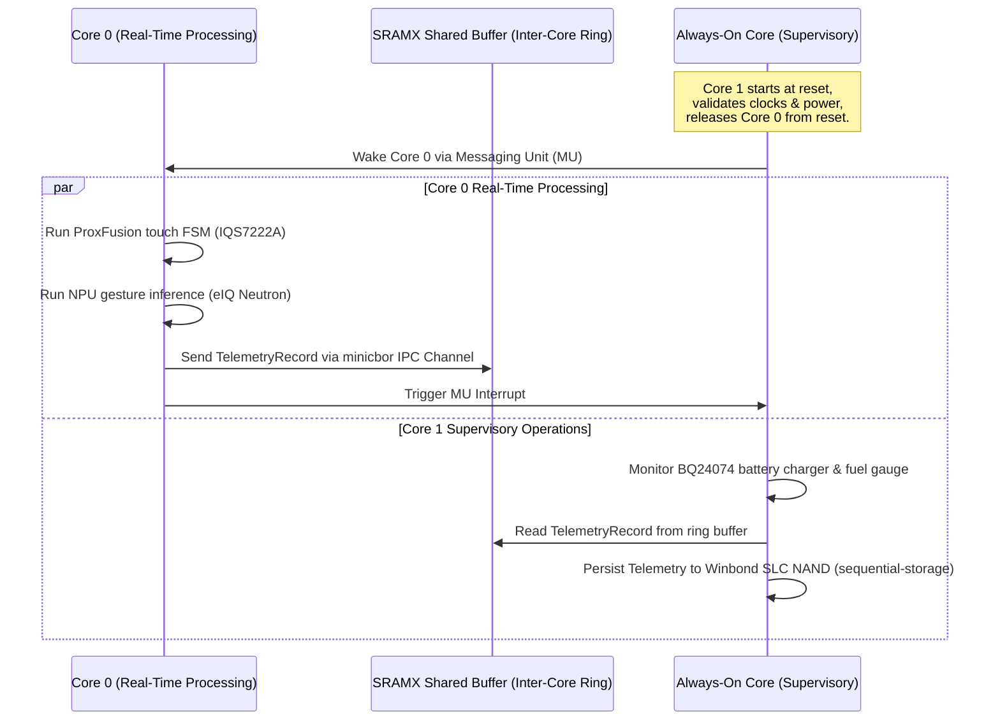

# Carrier Board 2.0 (NXP MCX N947) Firmware Architecture Guide

This document specifies the dual-core firmware architecture, inter-core IPC protocol, storage partition layouts, peripheral integration models, and security boundaries for the **Carrier Board 2.0** powered by the **NXP MCX N947** dual-core Arm Cortex-M33 microcontroller.

For top-level repository standards, see the [Unified Firmware Architecture Guide](firmware_architecture.md). For hardware bringup steps and test scripts, see [`app/carrier_board.md`](../app/carrier_board.md) and [`app/carrier_board_bringup.yaml`](../app/carrier_board_bringup.yaml).

---

## 1. System Overview & Silicon Architecture

The Carrier Board 2.0 is an ultra-low-power, dual-core sensing and telemetry workstation designed for real-time proximity detection, machine-learning gesture recognition, bidirectional BLE communication, and multi-day battery life.

### Dual-Core Asymmetric Multiprocessing (AMP) Task Allocation

```
+-----------------------------------------------------------------------------------+
|                            CARRIER BOARD 2.0 FIRMWARE                             |
+-----------------------------------------------------------------------------------+
|  Real-Time Processing Core (Core 0, 150 MHz Cortex-M33): Sensing, ML & BLE       |
|  - Embassy Async Executor (Deterministic Real-Time Scheduling)                    |
|  - Inter-Core Async IPC (embassy-ipc-channel over SRAMX + MU interrupts / CBOR)   |
|  - ProxFusion Capacitive Touch & Proximity Engine (Azoteq IQS7222A @ 10-30 Hz FIFO)|
|  - I2S & PDM Class-D Audio Stream & Chime Engine (MAX98357A / SpeakerController)  |
|  - PowerQuad Math Accelerator / DSP Filter Pipelines (CMSIS-DSP)                  |
|  - eIQ Neutron NPU Neural Inference Engine (Accelerated Gesture ML Graph)         |
|  - Bidirectional Wireless BLE Service Stack (u-blox NINA-B312 UART @ 1 Mb/s)       |
|    * Telemetry Egress Streaming                                                   |
|    * BLE GATT Service Endpoint for Mobile/Host Client RPC & Configuration         |
|  - Host FTDI Console & High-Speed UART Service Channel (FC1 UART0 @ 115.2k - 1Mb/s)|
|  - Status & Ambient LED Animations (TI LP5009 Logarithmic RGB Driver)             |
+-----------------------------------------------------------------------------------+
|  Always-On Core (Core 1, 150 MHz Cortex-M33): System Lifecycle, Power & Flash     |
|  - System Lifecycle Orchestration & Power State Machine (Active, Sleep, PowerDown)|
|  - Inter-Core Async IPC (embassy-ipc-channel over SRAMX + MU interrupts / CBOR)   |
|  - FlexSPI NAND Flash Storage Controller (Winbond W25N01GV 1Gb NAND Filesystem,   |
|    sequential-storage, wear leveling; isolates flash erase latency from Core 0)   |
|  - Dual-Stage Wakeup Unit (WUU) Digital Filter & Standby Supervision              |
|  - Power Path & Battery State of Charge Manager (BQ24074 & MAX17048)              |
|  - Background OTA Firmware Staging & Secure Boot Verification Pipeline            |
+-----------------------------------------------------------------------------------+
```

### Key Silicon Components (Bill of Materials)
- **NXP MCX N947 / N946**: Dual-core Arm Cortex-M33 (Core 0 & Core 1 @ 150 MHz), 2 MB dual-bank flash, 416 KB SRAM, PowerQuad DSP accelerator, and eIQ Neutron NPU.
- **Winbond W25N01GV (128 MB SLC NAND Flash)**: External high-density storage accessed via FlexSPI Port A on Core 1 for wear-leveled flash logs, ML models, and OTA staging.
- **TI BQ24074**: 1.5A USB Li-ion battery charger with dynamic power-path management (PPM).
- **Maxim Integrated MAX17048**: I2C Fuel gauge tracking single-cell Li-ion battery voltage and state of charge (SoC).
- **TI LP5009**: 9-channel ultra-low-power logarithmic RGB LED driver for ambient and status indicators.
- **Azoteq IQS7222A**: ProxFusion capacitive touch and proximity sensor controller (10–30 Hz FIFO reporting).
- **u-blox NINA-B312**: Bluetooth Low Energy (BLE 5.0) module connected via high-speed UART (up to 1 Mb/s).
- **Maxim Integrated MAX98357A**: Class-D audio amplifier driving the system chime speaker over I2S.

---

## 2. Memory Map & Storage Layout

### Internal Flash Memory (`dev:builtin-flash`)
The 2 MB internal dual-bank NOR flash is organized into fixed partitions:
- **`bootloader` (128 KB)**: Second-Stage Bootloader (SSBL) with secure boot verification.
- **`app` (1792 KB)**: Primary executable firmware image running under XIP.
- **`metadata` (128 KB)**: Cryptographic manifests, hardware revision data, and `ProgramMetadata`.

### External SLC NAND Flash (`dev:ext-flash`)
The 128 MB Winbond W25N01GV NAND flash is managed by Core 1 using `sequential-storage`:
- **`firmware_staging` (16 MB)**: Background OTA firmware image downloads and rollback backups.
- **`models` (32 MB)**: Quantized neural network weights for eIQ Neutron NPU gesture models.
- **`telemetry_logs` (64 MB)**: Circular wear-leveled telemetry records and sensor recordings.
- **`crash_dumps` (8 MB)**: Diagnostic panic dumps, stack frames, and crash logs.
- **`scratch` (8 MB)**: Transient working space for file transfer and decompression.

### ProgramMetadata Descriptor Structure

To ensure that bootloaders, application runtimes, and host workstation tooling share a single authoritative source of truth for storage geometries without hardcoded addresses, every compiled firmware binary embeds an immutable `.program_metadata` ELF section:

```rust
#[repr(u8)]
#[derive(Copy, Clone, Eq, PartialEq, defmt::Format)]
pub enum StorageDeviceId {
    BuiltinFlash = 0x01,
    ExtFlash = 0x02,
}

#[repr(u8)]
#[derive(Copy, Clone, Eq, PartialEq, defmt::Format)]
pub enum PartitionId {
    Bootloader = 0x01,
    App = 0x02,
    Metadata = 0x03,
    Keystore = 0x04,
    Telemetry = 0x05,
    CrashLogs = 0x06,
    OtaStaging = 0x07,
    Recovery = 0x08,
    Models = 0x09,
}

#[repr(C)]
pub struct ProgramMetadata {
    pub magic: [u8; 4],                        // b"PROG"
    pub schema_version: u16,                   // Metadata schema version
    pub target_chip: [u8; 16],                 // Target silicon string (e.g. b"MCXN947\0...")
    pub git_commit: [u8; 20],                  // Git SHA-1 commit hash
    pub semver: [u8; 16],                      // Semantic version string
    pub build_timestamp: u64,                  // POSIX epoch build timestamp
    pub device_count: u8,                      // Registered storage devices
    pub partition_count: u8,                   // Active partition entries
    pub devices: [StorageDeviceDescriptor; 2], // BuiltinFlash, ExtFlash
    pub partitions: [PartitionDescriptor; 16], // Partition table entries
}
```

- **SSBL Pre-Role Handoff**: The custom Second-Stage Bootloader executes on Core 0 before runtime roles are established, reading `.program_metadata` to verify active application partitions and stage OTA updates.
- **Host Introspection**: `tools/host_fs` and `tools/host_cli` parse `.program_metadata` directly from ELF binaries or over high-speed UART to automatically discover the partition layout.

### Application Software Framework for DSP & NPU (Rust ML Ecosystem)

To drive the eIQ Neutron NPU and PowerQuad DSP accelerator from Rust without relying on opaque C runtimes, Carrier Board 2.0 targets modern high-level Rust tensor frameworks:
- **Burn (`burn-rs`)**: Static computation graphs and ahead-of-time (AOT) code generation (`burn-import`) compiling models into memory-safe Rust structs with zero runtime heap allocations.
- **Candle (Hugging Face)**: Lightweight tensor primitives and quantized model execution.
- **tract (Sonos)**: Embedded neural network inference engine with static graph optimization and CMSIS-DSP kernel calls.
- **JAX-Inspired Functional AOT Compilation**: Networks trained offline in PyTorch or JAX are lowered to optimized INT8 intermediate representations, with 2D convolutions mapped to the eIQ Neutron NPU and biquad filters mapped to PowerQuad.

### ARMv8-M Memory Protection Unit (MPU) Hardening
- **Region 0 (Null Page Guard)**: `0x0000_0000`–`0x0000_00FF` marked `NoAccess` and `ExecuteNever` (XN) to trap null pointer dereferences immediately.
- **Hardware Stack Limits (`MSPLIM` / `PSPLIM`)**: Hardware stack pointer limit registers prevent stack overflow into heap or static data.
- **SRAM Execution Prevention**: SRAM regions marked `ExecuteNever` (XN) to prevent code injection attacks.

---

## 3. Dual-Core Rust Architecture: Embassy Multi-Executor AMP

The system implements Asymmetric Multiprocessing (AMP) with an independent Embassy executor on each core:



### Resolution of RP2040 Core 1 SRAM Limitation
Unlike the RP2040 (where Core 1 code execution from flash suffers bus contention with Core 0), the NXP MCX N947 features **independent flash controllers and dual instruction caches (I-Cache & D-Cache)**. Both cores execute directly from internal flash via XIP with zero performance penalty.

### Inter-Core Asynchronous IPC Protocol
Inter-core communication uses `embassy-ipc-channel` allocated in shared `SRAMX`:
- **Direct Plain Old Data (POD) Copying**: High-frequency control words use fixed-size structs copied directly via atomics.
- **CBOR Serialization (`minicbor`)**: Variable-length telemetry packets are serialized with `minicbor` to enforce schema backward compatibility and bounded memory usage.

---

## 4. Communication, Telemetry & Logging Strategy

### High-Speed UART Service Model & Console
- **Console Interface**: High-speed UART over FTDI USB-to-UART bridge (Flexcomm 1 / UART0) operating at 115.2 kbps to 1 Mbps.
- **Structured Tracing**: Native `defmt` structured logging and binary trace streaming compatible with host-side Perfetto trace visualization.

### BLE GATT Service Endpoint & Latency Profiles
The u-blox NINA-B312 BLE module connects over high-speed UART at 1 Mb/s, exposing a custom BLE GATT service endpoint for host client RPC, telemetry streaming, and configuration:

| Scenario | Connection Interval | Slave Latency | PHY | Net Application Throughput | Target Power Profile |
| :--- | :--- | :--- | :--- | :--- | :--- |
| **`Active` (Interactive / Telemetry)** | 15.0 – 30.0 ms | 0 | LE 2M PHY | 55.0 – 75.0 kB/s | High responsiveness, active streaming |
| **`Sleep` (Low-Power Sensing)** | 100.0 – 200.0 ms | 4 | LE 1M PHY | 4.0 – 8.0 kB/s | Background heartbeat |
| **`PowerDown` (Deep Standby)** | Disabled | N/A | Off | 0 kB/s | Sub-15 µA standby |
| **`OTA` (Firmware & Model Updates)** | 7.5 – 15.0 ms | 0 | LE 2M PHY | 40.0 – 60.0 kB/s | Maximum sustained throughput |

---

## 5. Subsystem Power Consumption & Operating State Matrix

The carrier board implements four power states aligned with the unified system lifecycle:

```
+-----------------------------------------------------------------------------------+
| State 0: Deep Standby (Sub-15 µA)                                                 |
| - Core 0 in deep power-down; Core 1 in WUU-monitored deep sleep.                  |
| - Winbond NAND in deep power-down; BLE disabled; IQS7222A in ultra-low-power mode.|
+-----------------------------------------------------------------------------------+
        | (Wake Event: Touch Proximity / Charger Connect / WUU Wake)
        v
+-----------------------------------------------------------------------------------+
| State 1: Standby Sensing (250 – 500 µA)                                           |
| - Core 1 supervising WUU filter; Core 0 clock-gated.                              |
| - IQS7222A touch scanning at 10 Hz; BLE advertising in low-duty cycle.            |
+-----------------------------------------------------------------------------------+
        | (Pet Proximity Detected / User Touch Interaction)
        v
+-----------------------------------------------------------------------------------+
| State 2: Active Low-Power (8.0 – 15.0 mA)                                         |
| - Core 0 and Core 1 active @ 150 MHz; IQS7222A scanning @ 30 Hz FIFO.             |
| - Audio amplifier active; LP5009 LED animations enabled.                          |
+-----------------------------------------------------------------------------------+
        | (Burst Operation: NPU Inference / OTA Transfer / NAND Flash Write)
        v
+-----------------------------------------------------------------------------------+
| State 3: Peak Burst (35.0 – 65.0 mA)                                              |
| - Neutron NPU accelerator engaged; FlexSPI NAND block program/erase active.       |
| - BLE transmitting at max power (LE 2M PHY).                                      |
+-----------------------------------------------------------------------------------+
```

---

## 6. User Interface, Audio Chimes & Gesture Recognition

### 1-Finger (1F) Capacitive Touch Gestures
The Azoteq IQS7222A ProxFusion controller samples the flex tail touchpad at 10–30 Hz FIFO rates, decoded by the gesture state machine:
- **`SingleTap`**: Cycle operational modes or acknowledge status alerts. Accompanied by a short high-pitch chirp.
- **`DoubleTap`**: Toggle secondary features.
- **`SwipeForward` / `SwipeBack`**: Adjust volume, speed, or menu navigation with directional chime feedback.
- **`LongPress` (1.5s)**: Power state toggle.
- **`ExtraLongPress` (5.0s)**: Factory reset / provisioning trigger.
- **`Touchpad Proximity Detection`**: Pre-warms the UI and DSP pipeline prior to physical contact, transitioning the system directly to `Active`.

### Audio Chimes (MAX98357A Class-D Speaker)
Audio chimes are synthesized directly in software by `SpeakerController` and streamed via I2S:
- `POWER_ON`: Ascending triad chime.
- `GESTURE_CONFIRM`: Short pleasant click/chirp.
- `BATTERY_LOW` / `BATTERY_CRITICAL`: Descending warning tone.
- `OVERTEMP_ALERT`: High-priority dual-tone alert.

### System Indicators (TI LP5009 RGB LED)
- `BATTERY_CHARGING`: Pulsing green breathe animation.
- `BATTERY_LOW`: Solid orange indicator.
- `BATTERY_CRITICAL`: Blinking red warning.
- `BLE_PAIRING`: Breathing cyan animation.

---

## 7. Modular Expansion Card Architecture

The carrier board features expansion headers supporting modular plugin boards (e.g. camera, microphone array, environmental sensors):
- **Cargo Feature Gating**: Supported modules are conditionally compiled via Cargo feature flags (`expansion-audio`, `expansion-camera`).
- **Fault Isolation**: Disconnected or damaged cards do not panic firmware; the driver reports `ERR_EXPANSION_NOT_FOUND` via `ServiceError` and disables the corresponding task safely.

---

## 8. Custom Embassy HAL (`embassy-mcx`) & Hardware Verification

The board support layer integrates a custom Embassy HAL (`embassy-mcx`) providing async drivers for MCX N947 peripherals:
- **I3C / I2C Bus Controllers**: Low-power sensor communication with async DMA transfers.
- **FlexSPI NAND Driver**: Async DMA block reads and writes to Winbond W25N01GV SLC NAND.
- **CTIMER & Async Timers**: Microsecond-accurate timestamping for sensor fusion and task scheduling.
- **Watchdog (WWDT) & RTC**: Hardware supervisory watchdog and low-power calendar timekeeping.
- **On-Device Testing**: Comprehensive test execution using `defmt-test` and post-bringup UART test runners.

