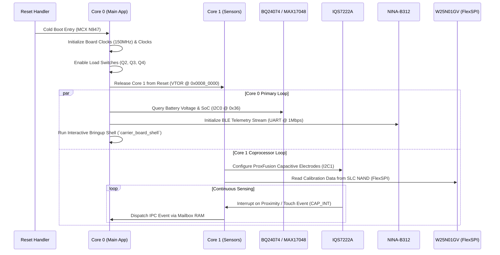

# Carrier Board 2.0 Firmware Architecture & Bringup Guide

This document specifies the firmware design, dual-core task execution model, memory partitions, and hardware bringup procedures for the **Carrier Board 2.0** architecture powered by the **NXP MCX N947** dual-core Arm Cortex-M33 microcontroller.

---

## 1. System Overview & Silicon Architecture

The Carrier Board 2.0 is a modular hardware evaluation, sensor fusion, and telemetry workstation designed for ultra-low-power operation, long-range wireless communication, and real-time proximity sensing. The firmware executes in a bare-metal `no_std` Rust environment built on top of the **Embassy** asynchronous framework.

```
+-----------------------------------------------------------------------------------+
|                            CARRIER BOARD 2.0 FIRMWARE                             |
+-----------------------------------------------------------------------------------+
|  Core 0 (150 MHz Cortex-M33): Application, Network, Telemetry & UI                |
|  - Embassy Async Executor (Cooperative Multitasking)                              |
|  - Host FTDI Console Shell / Diagnostic Interface (FC1 UART0)                     |
|  - Wireless BLE Telemetry Stack (u-blox NINA-B312 UART @ 1 Mbps)                  |
|  - Power Path & Battery State of Charge Manager (BQ24074 & MAX17048)              |
|  - Status & Ambient LED Animations (TI LP5009 Logarithmic RGB Driver)             |
+-----------------------------------------------------------------------------------+
|  Core 1 (150 MHz Cortex-M33): Real-Time Sensor Fusion & Coprocessor               |
|  - High-Speed ProxFusion Capacitive Touch & Proximity Engine (Azoteq IQS7222A)    |
|  - Dual-Channel FlexSPI External Storage Pipeline (Winbond W25N01GV 1Gb NAND)     |
|  - PDM Class-D Audio Stream & Piezo Frequency Synthesis (MAX98357A & Sounder)     |
+-----------------------------------------------------------------------------------+
```

### Key Silicon Components (Bill of Materials)

| Designator | Component / Part | Description | Interface / Bus | Key Firmware Role |
| :--- | :--- | :--- | :--- | :--- |
| **`U1`** | **NXP MCXN947VDF** | Dual-core Arm Cortex-M33 MCU + eIQ NPU | Host Controller | 150 MHz dual-core, 2MB dual-bank Flash, 512KB SRAM with ECC. |
| **`U8`** | **Winbond W25N01GV** | 1Gb (128MB) SLC Serial NAND Flash | FlexSPI Port A | Persistent CBOR telemetry queue, crash dump logs, calibration data. |
| **`U3`** | **TI BQ24074** | 1.5A Dynamic Power Path Li-Ion Charger | GPIO (`/CHG`, `/PGOOD`) | Autonomous charge management, input current limit, brownout avoidance. |
| **`U7`** | **ADI MAX17048** | 1-Cell Li+ ModelGauge Fuel Gauge | Core `I2C0` (`0x36`) | Precision voltage, state of charge (SoC), alert interrupt (`G4`). |
| **`U6`** | **TI LP5009** | 9-Channel Logarithmic RGB LED Driver | Core `I2C0` (`0x14`) | Low-power breathing, charge animations, offloading MCU core. |
| **`U9`** | **FTDI FT232RNQ** | High-Speed USB 2.0 to UART Serial Bridge | `FC1` UART0 (115200) | Diagnostic bringup shell, command dispatch, RTT logging proxy. |
| **`U2`** | **Azoteq IQS7222A**| ProxFusion Cap-Touch & Proximity IC | Touch `I2C1` (`0x44`)| 4-electrode sensing (3 mutual, 1 self-cap), `CAP_INT` (`C4`). |
| **`U4`** | **ADI MAX98357A** | 3.2W Class-D Mono Audio Amplifier | `PDM0` Audio (`B14`/`A14`)| Chime audio feedback, filterless Class-D drive. |
| **`U11`**| **u-blox NINA-B312**| Bluetooth Low Energy 5.0 Module | UART1 (1 Mb/s) | High-throughput telemetry packet streaming, pairing, OTA relay. |
| **`Q2`–`Q4`**| **TI TPS22918**| 5.5V, 2A Load Switches | GPIO (`L4`, `L5`, `M4`)| Power-gating Audio (`Q2`), Sensors (`Q3`), and Debug Bridge (`Q4`). |

---

## 2. Memory Map & Storage Layout

### Internal Microcontroller Memory (NXP MCX N947)

```
0x0000_0000 +---------------------------------------+
            |  Bootloader & Vector Table (64 KB)    |
0x0001_0000 +---------------------------------------+
            |  Active Firmware Application Slot A   |
            |  (960 KB Primary Partition)           |
0x0010_0000 +---------------------------------------+
            |  Staging / Update Firmware Slot B     |
            |  (960 KB Background OTA Partition)    |
0x001F_0000 +---------------------------------------+
            |  Boot Configuration & Metadata (64 KB)|
0x0020_0000 +---------------------------------------+
```

### Internal SRAM Layout (512 KB Total with ECC)

* **`0x2000_0000` - `0x2004_0000` (256 KB)**: Core 0 System RAM, Task Arenas, Static Channel Buffers.
* **`0x2004_0000` - `0x2007_0000` (192 KB)**: Core 1 Coprocessor RAM & DSP Circular Buffers.
* **`0x2007_0000` - `0x2007_C000` (48 KB)**: Shared Inter-Core Message Mailbox & Hardware Spinlocks.
* **`0x2007_C000` - `0x2008_0000` (16 KB)**: Reserved Core 0 & Core 1 Stack Overflow Guard Pages.

### External SLC NAND Flash Partitioning (Winbond W25N01GV - 128 MB)

1. **Telemetry Queue (`0x0000_0000` - `0x0400_0000`, 64 MB)**: Circular sequential storage recording timestamped CBOR telemetry records.
2. **Filesystem Partition (`0x0400_0000` - `0x0600_0000`, 32 MB)**: Wear-leveled parameter and calibration storage.
3. **Crash & Panic Logs (`0x0600_0000` - `0x0640_0000`, 4 MB)**: Non-volatile core dumps, register states, and backtraces.
4. **Reserved Expansion (`0x0640_0000` - `0x0800_0000`, 28 MB)**: Future audio assets and neural model weights.

---

## 3. Pinout & Bus Interconnect Map (Table 93 Verified)

### Power Gating & Control Pins
* `PWR_EN_AUDIO` (`L4`): Drives gate of `Q2` (TPS22918) supplying `SW_3V3_AUDIO`. Default-high pull-up.
* `PWR_EN_SENSORS` (`L5`): Drives gate of `Q3` (TPS22918) supplying `SW_3V3_SENSORS`. Default-high pull-up.
* `PWR_EN_DEBUG` (`M4`): Drives gate of `Q4` (TPS22918) supplying `SW_3V3_DEBUG`. Eliminates parasitic back-feed.
* `CHG_STAT` (`G5`): Active-low open-drain charge status from TI BQ24074 (routed to `WUU0_IN15` for low-power wakeup).
* `CHG_PGOOD` (`M10`): Power-good indicator from TI BQ24074 (routed to `VBAT_WAKEUP`).

### Serial Communication Busses
* **Core I2C0 Bus**:
  * `I2C0_SDA`: Ball `A10`
  * `I2C0_SCL`: Ball `B10`
  * Slaves: TI LP5009 (`0x14`), ADI MAX17048 (`0x36`). 400 kHz fast mode with 2.2k pull-up resistors.
* **Touch I2C1 Bus**:
  * `I2C1_SDA`: Ball `C5`
  * `I2C1_SCL`: Ball `C6`
  * Slave: Azoteq IQS7222A (`0x44`). Interrupt on `CAP_INT` (`C4`).
* **Console Port (FC1 UART0)**:
  * `UART0_TX`: Ball `B6`
  * `UART0_RX`: Ball `A6`
  * `UART0_RTS`: Ball `F10`
  * `UART0_CTS`: Ball `E10`
  * Connected to FTDI FT232RNQ (`U9`) for serial logging and interactive diagnostic shell.
* **BTLE High-Speed UART**:
  * Connected to u-blox NINA-B312 (`U11`) at 1,000,000 baud with hardware RTS/CTS flow control.

---

## 4. Control Flow & Dual-Core Task Execution



---

## 5. Power States & Operating Tiers

1. **Active Mode (~65 mA)**: Both Cortex-M33 cores active at 150 MHz, FlexSPI NAND R/W active, audio driving piezo/speaker, BLE transmitting, RGB status LED illuminated.
2. **Sleep Mode (~35 mA)**: Core 0 active at 150 MHz, audio amplifier disabled (`PWR_EN_AUDIO` low), IQS7222A in low-power proximity scan mode.
3. **Standby Mode (~220 µA)**: Deep Sleep with SRAM retention, Core 1 halted, Core 0 in WFI awaiting `CAP_INT` (`C4`) or `CHG_STAT` (`G5`), debug bridge powered down (`PWR_EN_DEBUG` low).
4. **Deep Power Down (~7 µA)**: Ultra-low-leakage shipping state, all load switches off, wakeup only via USB-C plug-in (`CHG_PGOOD`) or tactile reset.

---

## 6. Step-by-Step Bringup & Verification Checklist

To validate newly manufactured Carrier Board 2.0 units, execute the following hardware verification checklist in sequence:

### Phase 1: Power Rails & Load Switch Verification
* Measure `SYS_3V3` on test point `TP4`. Must measure $3.30\text{V} \pm 2\%$.
* Verify `SW_3V3_AUDIO`, `SW_3V3_SENSORS`, and `SW_3V3_DEBUG` turn ON with active-high drive on `L4`, `L5`, `M4`.
* Confirm quiescent current in Standby Mode is $\le 250\,\mu\text{A}$.

### Phase 2: Diagnostic Bringup Shell Execution
* Connect USB-C cable to `J3` and attach host terminal (115200 baud, 8N1).
* Execute the carrier board bringup shell:
  ```bash
  cargo run --package carrier_board --bin carrier_board_shell
  ```
* Verify the canonical "Hello, World! Carrier Board 2.0" banner and component self-test report `[PASS]`.

### Phase 3: I2C Bus Scan & Peripheral Enumeration
* Scan Core `I2C0`: Confirm response from `0x14` (TI LP5009) and `0x36` (ADI MAX17048).
* Scan Touch `I2C1`: Confirm response from `0x44` (Azoteq IQS7222A).

### Phase 4: High-Speed FlexSPI Flash Identification
* Issue JEDEC ID command over FlexSPI Port A.
* Confirm device returns Manufacturer ID `0xEF` (Winbond) and Device ID `0xAA21` (W25N01GV).

### Phase 5: Wireless BLE Communication
* Send test ping command to u-blox NINA-B312 over 1Mb/s UART.
* Verify BLE advertising packets are detectable on receiver smartphone or diagnostic gateway.

### Phase 6: Capacitive Touch Calibration
* Stream raw count and delta measurements from electrodes `CR0`..`CR7`.
* Verify hand proximity detection at $\ge 50\text{ mm}$ distance and physical touch transition.
