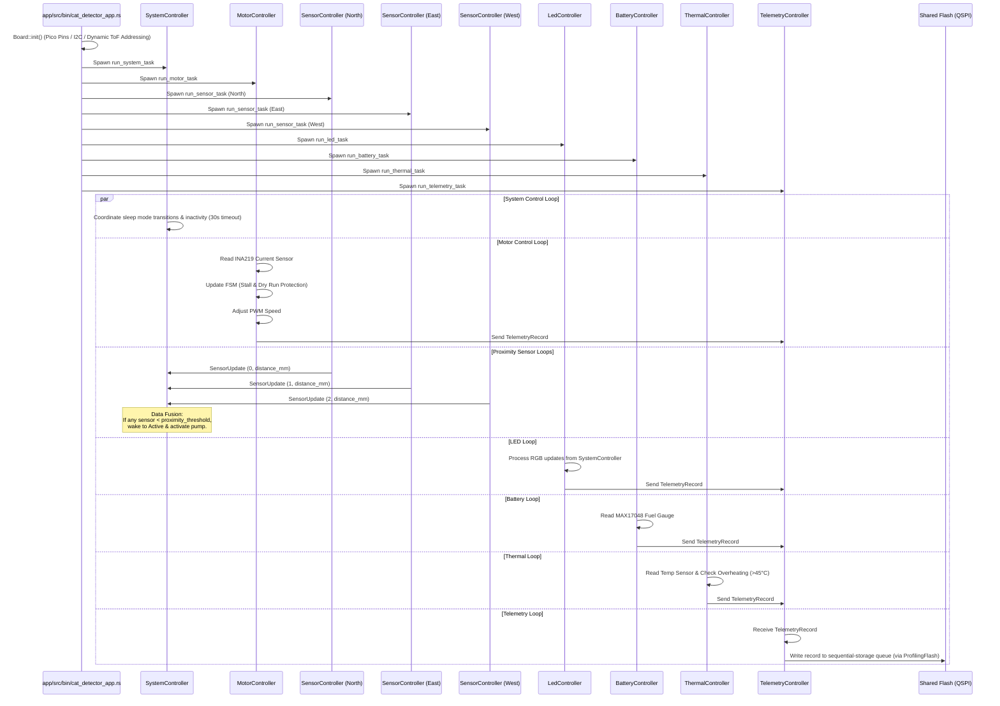

# Cat Fountain (RP2040) Firmware Architecture Guide

This document specifies the firmware design, task execution model, sensor data fusion algorithms, peripheral mappings, and memory protection mechanisms for the **Cat Fountain / Cat Detector** system running on the **Raspberry Pi Pico (RP2040)**.

For top-level workspace principles, see the [Unified Firmware Architecture Guide](firmware_architecture.md). For target hardware bringup and validation checklists, see [`app/cat_detector.md`](../app/cat_detector.md).

---

## 1. System Overview & Hardware Architecture

The Cat Fountain is an autonomous, battery-operated pet water fountain that detects pet approach, activates a water pump, provides visual battery and status feedback, and monitors pump motor torque to prevent dry running or impeller stalls.

```
+-----------------------------------------------------------------------------------+
|                        CAT FOUNTAIN FIRMWARE (RP2040)                             |
+-----------------------------------------------------------------------------------+
|  Core 0: Primary Embassy Asynchronous Executor                                    |
|  - SystemController: Lifecycle orchestration & 3-way ToF sensor data fusion       |
|  - MotorController: Impeller PWM speed control & INA219 torque load monitoring    |
|  - SensorController (North, East, West): VL53L0X ToF range reading & calibration  |
|  - LedController: ATtiny816 RGB NeoPixel status indicator & fade transitions      |
|  - BatteryController & ThermalController: Fuel gauge & safety thermal guards      |
|  - TelemetryController: System telemetry collection & ring buffer serialization   |
|  - FilesystemController: sequential-storage flash persistence & ProfilingFlash    |
+-----------------------------------------------------------------------------------+
|  Hardware Peripherals & Interfaces                                                |
|  - I2C0 (GP4/GP5): Shared bus for MAX17048, INA219, 3x VL53L0X, and ATtiny816     |
|  - PWM (GP14/GP15): L9110S dual-channel H-Bridge N20 pump motor driver            |
|  - GPIO Bank: XSHUT control pins (GP2, GP3, GP4) and ToF interrupts (GP5..GP7)   |
|  - QSPI Flash: 2 MB NOR Flash (1.75 MB Firmware, 256 KB Flash Filesystem)         |
+-----------------------------------------------------------------------------------+
```

---

## 2. Control Flow & Embassy Task Execution

At boot, `projects/app/src/bin/cat_detector_app.rs` initializes board peripherals via `Board::init()` and spawns cooperative Embassy tasks:



---

## 3. Domain Controllers & State Machines

### 3.1. System Controller (`SystemController`)
- **Lifecycle Coordination**: Orchestrates transitions between `Active`, `Sleep`, and `PowerDown` modes.
- **Sensor Data Fusion**: Merges distance readings across three spatial ToF sensors (North, East, West). When any sensor detects an object closer than `proximity_threshold_mm` (defaulting to 300mm), the controller resets the inactivity counter, transitions to `Active`, and signals `MotorController` to run the pump.
- **Minimum Active Duration**: Once awakened, the system remains in `Active` mode for a minimum of 30 seconds before allowing transition back to `Sleep`. This is overridden immediately by safety trip conditions (critical battery SoC or thermal limit exceeded).
- **Dynamic Runloop Scaling**: During proximity detection, the main loop timeout scales down from 1.0 second to 200 milliseconds (`0.2s`) to ensure immediate gesture response without timer drift, using a millisecond accumulator (`tick_ms_accumulator`).
- **Charger Safety Lock & Gesture Unlock**:
  - Connecting the charger forces the system into `PowerDown` mode (locked) and displays constant battery charge status.
  - After charger disconnection, the system requires a 2-Finger (2F) Long Press gesture (simultaneous proximity < 20mm on East and West sensors for 5 seconds) to unlock and transition to `Active`.

### 3.2. Motor Controller (`MotorController` & `MotorStateMachine`)
The motor controller drives the pump impeller using an N20 DC motor and reads motor load current via the INA219 sensor (`read_torque_ma`):
- **Deterministic FSM States**:
  - `Off`: Motor stopped.
  - `RampUp`: Gradual acceleration to prevent water splashing and current spikes.
  - `On`: Continuous operation at calibrated target speed.
  - `RampDown`: Controlled deceleration.
- **Dry-Run & Stall Protection**: Shuts down the pump if current drops below minimum fluid load (dry run) or exceeds stall thresholds.

### 3.3. Proximity Sensors (`SensorController`)
- Manages an individual VL53L0X Time-of-Flight sensor.
- Supports two-point linear distance calibration using per-sensor `cal_near` and `cal_100` calibration points, mapping cover glass offsets accurately to 0 mm and 100 mm.

### 3.4. LED Controller (`LedController`)
- Drives an ATtiny816 I2C-to-NeoPixel bridge.
- Provides smooth 200ms logarithmic fade transitions (`FADE_STEPS = 10`, `FADE_DELAY_MS = 20`).
- Encodes system states:
  - `SolidBlue`: Low-power `Sleep` state.
  - `SolidGreen` / `SolidYellow` / `SolidOrange`: High (>=80%), Medium (21–79%), and Low (<20%) SoC.
  - `BlinksRedOncePerThirtySeconds`: Critical low battery.
  - `BlinksRedFourTimes`: Thermal critical alarm.
  - `Off`: Locked `PowerDown` state.

---

## 4. Hardware Peripheral Mapping & I2C Address Space

The RP2040 interfaces with peripherals across the I2C0 bus and GPIO banks:

| Component | Bus / Address | Pin Assignment | Driver Binding | Functional Role |
| :--- | :--- | :--- | :--- | :--- |
| **MAX17048 Fuel Gauge** | I2C0 `0x36` | SDA (GP4) / SCL (GP5)<br>Alert (GP10) | `FuelGauge`, `TemperatureSensor` | Cell voltage (mV), state of charge (%), charge status. |
| **INA219 Current Sensor** | I2C0 `0x40` | SDA (GP4) / SCL (GP5) | `CurrentSensor`, `PowerSensor` | Pump motor current (mA) and stall detection. |
| **VL53L0X ToF (North)** | I2C0 `0x30` | XSHUT (GP2), INT (GP5) | `ProximitySensor` | Center pet approach detection. |
| **VL53L0X ToF (East)** | I2C0 `0x31` | XSHUT (GP3), INT (GP6) | `ProximitySensor` | Right pet approach & 2F gesture detection. |
| **VL53L0X ToF (West)** | I2C0 `0x32` | XSHUT (GP4), INT (GP7) | `ProximitySensor` | Left pet approach & 2F gesture detection. |
| **ATtiny816 LED Bridge** | I2C0 `0x60` | SDA (GP4) / SCL (GP5) | `LedDriver` | RGB NeoPixel status indicator. |
| **L9110S Motor Driver** | PWM | GP14, GP15 | `GpioMotor` | Impeller speed regulation. |

> [!NOTE]
> All three VL53L0X sensors boot with the default address `0x29`. During `Board::init()`, the BSP asserts XSHUT on all sensors, then de-asserts them sequentially to dynamically program unique runtime I2C addresses (`0x30`, `0x31`, `0x32`) via register `0x8A`.

---

## 5. Memory Map, Flash Layout & Safety Protections

### 5.1. Flash Partitions (2 MB QSPI Flash)
The external QSPI NOR flash is partitioned into firmware code and flat persistent filesystem zones:
- **`0x1000_0000` – `0x101B_FFFF` (1.75 MB)**: Firmware executable code (guarded by `memory.x`).
- **`0x101C_0000` – `0x101F_FFFF` (256 KB)**: Flat flash filesystem using `sequential-storage` with wear leveling:
  - `vl53l0x_cal.cbor`: Calibration parameters loaded at boot.
  - `crash_0.log` .. `crash_4.log`: Rolling diagnostic crash dump files.
  - `crash_idx`: Index tracking the most recent crash log slot.

### 5.2. MPU Stack Guard
The ARM Cortex-M0+ Memory Protection Unit (MPU) guards against stack overflows:
- **Region 0**: `0x2003_C000` – `0x2003_C0FF` (256 bytes) configured as `NoAccess` and `ExecuteNever` (XN).
- Sets a hard 16 KB stack boundary (growing downward from `0x2004_0000`). Stack overflow attempts trigger an immediate `HardFault`, preventing silent memory corruption.

### 5.3. Diagnostics & Crash Logging (`platform::panic_handler`)
During an unexpected panic or NMI:
1. **Stack Scanner**: Scans the active stack frame and extracts candidate program counters (PCs) within executable flash space.
2. **Crash Capture**: Records package version, source file, line number, and panic message.
3. **Circular Log Snapshot**: Captures the last 1024 bytes from the atomic `CRASH_LOG_BUFFER`.
4. **Flash Egress**: Appends the crash entry to the persistent filesystem for offline retrieval via `tools/host_fs`.
