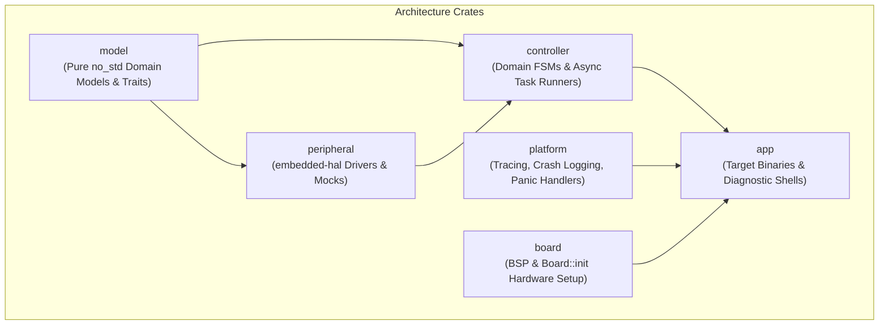

# Unified Firmware Architecture Guide

This document defines the top-level firmware architecture, modular design principles, and cross-platform concurrency patterns for all firmware targets in this repository.

---

## 1. Architectural Philosophy & Core Invariants

The firmware is designed around three architectural pillars:
1. **Target Decoupling & Universal Portability**: Domain models, state machines, calculations, and peripheral logic are strictly isolated from microcontroller silicon specifics. Firmware code compiles target-agnostically across all supported microcontrollers and host simulation environments.
2. **Asynchronous Concurrency with Embassy**: Embedded execution relies on the `no_std` **Embassy** asynchronous runtime, leveraging cooperative multitasking, zero-allocation futures, and async timers rather than blocking busy-wait loops.
3. **Actor / Message-Passing Pattern**: Peripheral drivers and hardware domains run within isolated Embassy tasks. Inter-task coordination is achieved via asynchronous channels (`embassy_sync::channel::Channel`) rather than shared mutable state or global static variables.

---

## 2. Workspace Crate Demarcation

The repository workspace divides responsibilities across specialized, decoupled layers:

| Crate | Role | Target Dependency | Concurrency & I/O Model |
| :--- | :--- | :--- | :--- |
| **[`model`](../model)** | Pure business logic, system telemetry enums, state models, and trait contracts. | Pure `#![no_std]`, Zero external hardware deps. | Synchronous, purely functional, zero I/O. |
| **[`peripheral`](../peripheral)** | Concrete sensor and actuator drivers implemented against `embedded-hal` interfaces. | Portable `embedded-hal` traits. Mock implementations for host testing. | Non-blocking driver calls, async I2C/SPI transactions. |
| **[`controller`](../controller)** | Domain state machine orchestrators and active task loops. | Hardware-agnostic. Consumes peripheral traits and model enums. | Asynchronous Embassy tasks and message-passing channels. |
| **[`platform`](../platform)** | Platform support utilities: structured logging, stack scanning, panic handlers. | Target-agnostic ARM Cortex-M and host utilities. | Synchronous panic capture, atomic ring buffers. |
| **[`board`](../board)** | Board Support Packages (BSPs). Encapsulates pinouts, clocks, and peripheral bus setup. | Target-specific silicon bindings (RP2040, NXP MCX N947). | Hardware initialization routines (`Board::init`). |
| **[`app`](../app)** | Application binaries (`main`), diagnostic shells, and bringup runners. | Target-specific deployment configurations. | Spawns Embassy executors and runs task loops. |

---

## 3. Supported Hardware Targets & Dedicated Architecture Guides

The workspace currently targets two distinct hardware platforms, each documented in its own dedicated architecture guide:

### Target A: Cat Fountain / Cat Detector (RP2040)
- **Microcontroller**: Raspberry Pi Pico (RP2040, dual-core Arm Cortex-M0+ @ 133 MHz).
- **Domain**: Low-power pet proximity sensing, dual-sensor gesture detection, current-monitored pump impeller control, and flash telemetry logging.
- **Detailed Architecture**: [Cat Fountain Firmware Architecture Guide](cat_fountain_architecture.md)
- **Bringup Guide**: [`app/cat_detector.md`](../app/cat_detector.md) and [`app/cat_fountain.md`](../app/cat_fountain.md)

### Target B: Carrier Board 2.0 (NXP MCX N947)
- **Microcontroller**: NXP MCX N947 (dual-core Arm Cortex-M33 @ 150 MHz with PowerQuad DSP and eIQ Neutron NPU).
- **Domain**: Dual-core Asymmetric Multiprocessing (AMP), Always-On Core 1 supervisory controller, Real-Time Processing Core 0 ML/DSP/BLE pipeline, SLC NAND flash filesystem, and capacitive touch gesture recognition.
- **Detailed Architecture**: [Carrier Board 2.0 Firmware Architecture Guide](carrier_board_architecture.md)
- **Bringup Guide**: [`app/carrier_board.md`](../app/carrier_board.md)

---

## 4. Cross-Subsystem Design Patterns & Rules

All firmware in this repository adheres to modular subsystem guides maintained in [`docs/`](../docs):

1. **[Microcontroller Decoupling & BSPs](mcu_decoupling.md)**: Target isolation via `Board::init`, target-independent driver wrappers, and frequency-independent timer delays.
2. **[Peripheral Sharing & Concurrency](peripheral_sharing.md)**: Actor pattern with async channels for production systems; interior mutability (`Rc<RefCell<...>>`) restricted to diagnostic shells.
3. **[Domain Controller Design & Codegen](controller_design.md)**: Controller isolation using `#[controller_context]`, Rinja template generation, and direct platform operations for CLI commands.
4. **[Logging, Tracing & Host Tools](logging_tracing.md)**: Zero-cost `defmt` structured logging, consolidated `crate::tracing` facade, and host CLI diagnostics (`tools/host_cli` and `tools/host_fs`).
5. **[Hardware-Firmware Co-Design](hardware_firmware_codesign.md)**: Bare-metal `no_std` Rust specifications, open-source driver requirements, and register map qualifications.
