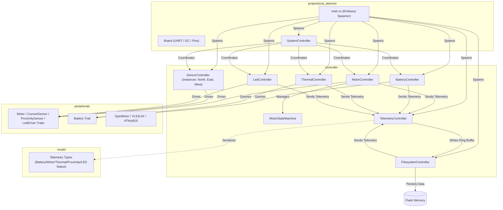
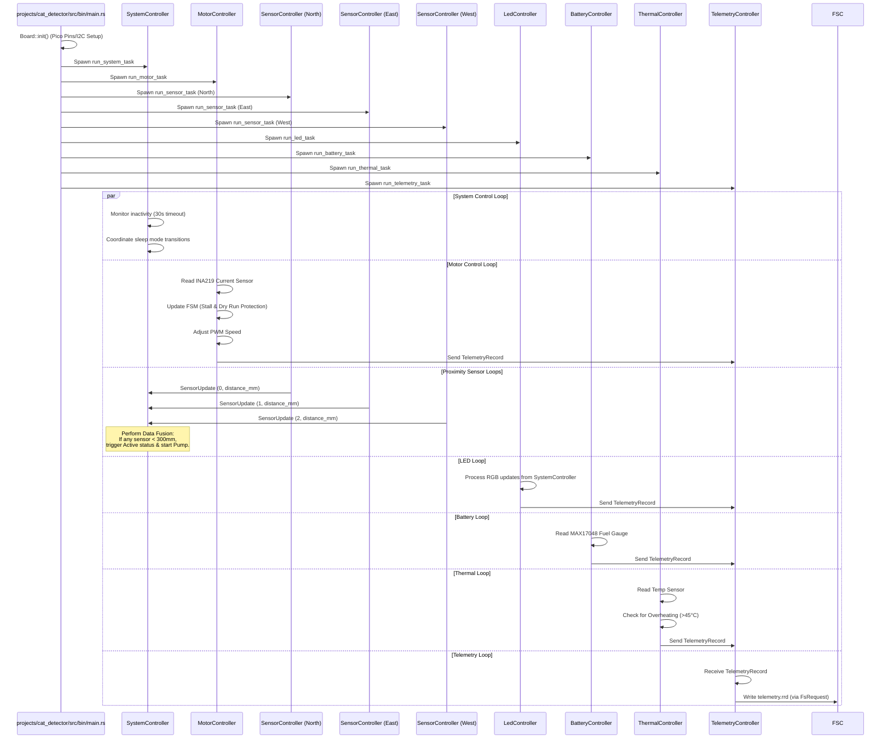

# Cat Detector Firmware Design Document

This document outlines the firmware design, modular architecture, and hardware integration maps for the **Cat Detector** water fountain system, deployed on the Raspberry Pi Pico (RP2040) using a target-agnostic, async-enabled Rust architecture.

---

## 1. System Overview

The Cat Detector firmware is a `no_std` embedded application built on the **Embassy** asynchronous framework. The design separates domain models, platform-independent drivers, and high-level controllers to enable testability on host architectures and efficient execution on the target hardware.



---

## 2. Crate Architecture & Module Roles

### 2.1. Model Crate (`model`)
The `model` crate contains pure, target-agnostic domain models, status telemetry types, and hardware peripheral interfaces (traits). It has **no dependency** on hardware, Embassy, or I/O.

*   **Telemetry Models**:
    *   `BatteryStatus`: Enum tracking voltage (mV), temperature (mC), and battery state (e.g. `VolTempState` containing `BatteryState`).
    *   `BatteryState`: Enum representing the battery charge state: `Ok`, `Low`, `Charging`, or `Critical` (system runs but pump is disabled due to critical low charge).
    *   `MotorStatus`: Enum tracking speed percent, run status, and motor temperature (e.g. `SpeedRunTemp`).
    *   `ThermalStatus`: Enum tracking ambient system temperature and overheating flags (e.g. `TempOverheating`).
    *   `SystemStatus`: Enum representing the operating mode of the system (`Active` or `Sleep`).
    *   `FuelGaugeTelemetry`: Enum representing cell voltage and state-of-charge percentage (e.g. `VolSoc`).
    *   `ProximityTelemetry`: Enum containing the single range reading representing target state: `InRange(u16)` or `OutRange(u16)`.
    *   `SystemLedState`: Enum holding active NeoPixel color patterns based on battery state of charge:
        *   `BlinksRedOncePerThirtySeconds`: Critical low charge (SoC < critical threshold).
        *   `SolidOrange`: Low charge (SoC < 20%).
        *   `SolidYellow`: Medium charge (SoC between 21% and 79%).
        *   `SolidGreen`: High charge (SoC >= 80%).
        *   `SolidBlue`: Indicates low-power `Sleep` state.
        *   `BlinksRedFourTimes`: Indicates thermal critical alert state.
        *   `Off`: Indicates system locked / `PowerDown` state.

*   **Hardware Interfaces (Traits)**:
    *   `Motor`: Defines interfaces for motor driver control (`set_speed`, `stop`).
    *   `CurrentSensor`: Defines interfaces for reading current draw (`read_current_ma`). Used to monitor load torque for dry run and stall protection.
    *   `FuelGauge`: Defines interfaces for cell voltage (`read_voltage_mv`) and charge capacity percentage (`read_state_of_charge`).
    *   `PowerSensor`: Defines interfaces for current monitoring and voltage measurements (`read_voltage_mv` / `read_current_ma`), and allows controllers (e.g. `BatteryController`) to subscribe to power alerts via callbacks.
    *   `ProximitySensor`: Defines interfaces for range measurements (`read_distance_mm`).
    *   `TemperatureSensor`: Defines transactions for thermal monitoring (`read_temperature_milli_c`).
    *   `Charger`: Defines interfaces for controlling battery charging (`set_charging_enabled`) and checking charging status (`is_charging_input_present`).
    *   `LedDriver`: Defines interfaces for setting LED RGB indicator colors (`set_color`).

---

### 2.2. Peripherals Crate (`peripherals`)
The `peripherals` crate implements the concrete, platform-independent drivers and wrappers using `embedded-hal` primitives. This abstraction allows easy mocking of peripherals for host-based testing.

*   **`GpioMotor`**: A concrete wrapper that implements `Motor` by toggling a digital output pin (`OutputPin`) high/low.

**Concrete Driver Implementations**:
*   `max17048::Max17048`: Implements `TemperatureSensor` and `FuelGauge` traits, scaling registers to VCELL mV and SOC %. [MAX17048 Datasheet](https://www.analog.com/media/en/technical-documentation/data-sheets/MAX17048-MAX17049.pdf)
*   `bq25185::Bq25185`: Implements `Charger` trait for linear charger and power path management. [BQ25185 Datasheet](https://www.ti.com/lit/ds/symlink/bq25185.pdf)
*   `ina219::Ina219`: Implements `CurrentSensor` and `PowerSensor` traits, calibrating shunt voltage calculations for current monitoring. [INA219 Datasheet](https://www.ti.com/lit/ds/symlink/ina219.pdf)
*   `vl53l0x::Vl53l0x`: Implements `ProximitySensor` trait, driving ranges and supporting dynamic address assignment at register `0x8A`. Supports GPIO interrupts (Low Level, High Level) utilizing programmed `SYSTEM_THRESH_LOW` and `SYSTEM_THRESH_HIGH` threshold registers (with parametric hysteresis), and a timing budget increased to 200ms. [VL53L0X Datasheet](https://www.st.com/resource/en/datasheet/vl53l0x.pdf) | [VL53L0X API Guide (UM2039)](https://www.st.com/resource/en/user_manual/um2039-world-smallest-timeofflight-ranging-and-gesture-detection-sensor-application-programming-interface-stmicroelectronics.pdf) | [VL53L0X Register Map](https://github.com/GrimbiXcode/VL53L0X-Register-Map)
*   `l9110s::L9110s`: Implements `Motor` trait for h-bridge motor driver control using two `OutputPin` channels. [L9110S Datasheet](https://www.elecrow.com/download/datasheet-l9110.pdf)
*   `attiny816::Attiny816`: Manages indicator NeoPixel outputs by writing RGB color packets over I2C, implementing the `LedDriver` interface. [ATtiny816 Datasheet](https://cdn-learn.adafruit.com/downloads/pdf/adafruit-neodriver-i2c-to-neopixel-driver.pdf)

---

### 2.3. Controller Crate (`controller`)
The `controller` crate houses the active orchestrators and asynchronous loop runners. It consumes peripheral traits and updates domain models.

*   **`MotorController`**: Generalizes motor driver control and current sensor monitoring. Directly exposes the `read_torque_ma` method to read motor load torque (current draw in mA) from the current sensor, and shuts down the motor if safety thresholds are exceeded.
*   **`MotorStateMachine` (Struct)**: A deterministic state machine managed by `MotorController` handling states:
    *   `Off`: Motor is inactive.
    *   `RampUp`: Motor is starting up and ramping speed up.
    *   `On`: Motor is running continuously at target speed.
    *   `RampDown`: Motor is shutting down and ramping speed down.
    *   Transitions are driven by `MotorEvent` triggers (`PowerOn`, `PowerOff`, `RampComplete`).
*   **`BatteryController`**: Coordinates periodic voltage queries from the power system.
*   **`ThermalController`**: Periodically updates and monitors safety thresholds for thermal limits (overheating and critical temperature thresholds are parameterized, defaulting to 45°C and 60°C respectively, with a 2°C hysteresis to prevent rapid toggling). Replaces battery monitoring with temp sensor reads, and shuts down the system (sending a sleep/shutdown signal to `SystemController`) if critical thresholds are reached.
*   **`SensorController`**: Manages spatial telemetry for a *single* proximity (ToF) sensor (instantiated separately for North, East, and West). Dispatches proximity events upstream to the `SystemController` for central data fusion. The proximity detection threshold (`proximity_threshold_mm`) is passed as a constructor parameter. Supports two-point linear distance calibration using per-sensor `cal_near` and `cal_100` calibration points, mapping the raw sensor cover distance to `0` mm and the raw `100` mm distance target correctly.
*   **`LedController`**: Receives RGB indicators status updates from the `SystemController` and drives the underlying NeoPixel/ATtiny816 driver. Supports smooth fade-in and fade-out transitions when turning on/off, parameterized with `FADE_STEPS = 10` and `FADE_DELAY_MS = 20` (total 200ms fade transition).
*   **`FilesystemController`**: Implements flat file storage on the persistent flash partition. Uses `sequential-storage` to execute read/write/delete operations with zero heap allocation.
    *   *Profiling Wrapper (`ProfilingFlash`)*: Intercepts lower-level erase instructions to log execution durations and erase counts to prevent flash wear.
    *   *Calibration Storage (`vl53l0x_cal.cbor`)*: Stores the CBOR-serialized `TofCalibration` struct, which is loaded at boot by the main application to apply calibration to each sensor.

---

### 2.4. Application & BSP Crate (`projects/cat_detector`)
The top-level application and Board Support Package (BSP) defines pin configurations, spawns the controller tasks, and hosts the application-specific orchestrator:

*   **`SystemController`**: Coordinates low-power mode transitions (`Active` vs `Sleep`) by disabling/enabling/polling the other peripheral controllers and handling inactivity timeouts. It performs **sensor data fusion** across the three proximity controllers (North, East, West): if any sensor detects target proximity (less than `proximity_threshold_mm`) while the system is not locked, it wakes up the system, resets the inactivity timer, starts the motor, and updates the `LedController` state. It also supports dual long press gesture detection on East and West proximity sensors with a threshold of 20mm to control the system power and lock states.
*   **MPU Stack Guard**: Configures the ARM Cortex-M Memory Protection Unit (MPU) at boot to guard the stack. It programs Region 0 as `NoAccess` and `ExecuteNever` over a 256-byte area at `0x2003_C000`, defining a strict 16KB stack allocation limit (growing down from `0x2004_0000`). Any stack overflow immediately triggers a `HardFault` to halt execution safely rather than allowing silent data memory corruption.
    *   **Charger-Connected Safety Lock**: When a charger connection is detected, the system immediately transitions to `PowerDown` mode (locked) and displays the constant state of charge status color on the LED. When the charger is disconnected while remaining in `PowerDown` mode, the LED turns `Off`. The system remains locked in `PowerDown` mode for the entire duration the charger is connected.
    *   **Gesture Unlock**: To unlock the system and exit `PowerDown` mode after the charger has been disconnected, the user must perform a 2-finger (2F) long press gesture (continuous dual-sensor proximity on East and West sensors for 5 seconds). Once unlocked, the system wakes to `Active` mode and updates the LED to the state of charge color.
    *   **Dynamic Runloop Tick rate**: To ensure high responsiveness and recall rate for 2F long press gestures when proximity is active, the system runloop timeout automatically decreases from 1 second to 200 milliseconds (`0.2s`). Inactivity seconds and other 1-second timings are tracked via an internal millisecond accumulator (`tick_ms_accumulator`) to preserve correct timer intervals.
    *   *Active Duration & Safety Gating*: Once the system enters `Active` mode, a minimum 30-second active mode duration is enforced before it is permitted to return to `Sleep`. This duration is gated/overridden by safety and proximity rules:
        *   **Thermal Limits**: If the temperature exceeds the critical threshold, the system enters `Sleep` immediately to prevent thermal damage, overriding the 30-second delay.
        *   **Battery State of Charge**: If the battery drops below the critical threshold and is not charging, the system enters `Sleep` immediately to prevent deep discharge, overriding the 30-second delay. Implements a 2% state-of-charge hysteresis to prevent rapid state-toggling around the threshold. Validates at compile time and runtime that `critical_soc_threshold` < `LOW_BATTERY_SOC_THRESHOLD` < `MID_BATTERY_SOC_THRESHOLD` < `HIGH_BATTERY_SOC_THRESHOLD`.
        *   **Cat Proximity**: As long as a cat remains detected (distance < `proximity_threshold_mm`) on any of the ToF sensors, the inactivity timer is reset, preventing transition to `Sleep`.

---

## 3. Hardware Peripheral Mapping & I2C Address Space

The Cat Detector firmware integrates with the following hardware nodes connected via the RP2040's I2C and GPIO banks:

| Component | I2C Address | Pico Connection | Software Binding | Role |
| :--- | :--- | :--- | :--- | :--- |
| **MAX17048 Fuel Gauge** | `0x36` | SDA (GP4) / SCL (GP5)<br>Alert (GP10) | `FuelGauge` & `TemperatureSensor` Traits / `BatteryController` | Monitored by the battery loop to update state of charge and dispatch alerts. |
| **BQ25185 Charger & Boost** | `0x6B` | SDA (GP4) / SCL (GP5) | `Bq25185` / `Charger` Trait | Tracks battery charging state and configures input current limits. |
| **INA219 Current Sensor** | `0x40` | SDA (GP4) / SCL (GP5) | `CurrentSensor` / I2C Bus | Monitors N20 motor current to detect dry running (torque drop) or stall conditions. |
| **VL53L0X Time-of-Flight Sensors** | `0x29` (boot)<br>*Dynamic re-addressing to `0x30`, `0x31`, `0x32`* | SDA (GP4) / SCL (GP5)<br>XSHUT Pins (GP2, GP3, GP4)<br>Interrupts (GP5, GP6, GP7) | `ProximitySensor` / `SensorController` | Used to calculate target approach and activate water flow via data fusion. |
| **ATtiny816 LED Driver** | `0x60` | SDA (GP4) / SCL (GP5) | `LedDriver` / `LedController` | Drives visual state-of-charge and error alerts on the RGB indicator. |
| **L9110S Motor Driver** | *Analog* | GP14, GP15 (PWM) | `GpioMotor` / `Motor` Driver | Toggled by the motor controller loop to regulate the N20 motor impeller speed. |

---

## 4. Flash Layout & Persistence

Persistent files (such as calibration variables or telemetry logs) are stored in the final block partition of the RP2040's built-in 2MB flash memory:

*   **Firmware Image Space**: `0x10000000` to `0x101C0000` (1.75 MB - bounded by `memory.x` to prevent code overwrite).
*   **Filesystem Partition**: `0x1C0000` to `0x200000` (256 KB - starting at 1.75 MB offset, defined via Rust compile-time constants).

> [!IMPORTANT]
> The `FilesystemController` wraps the underlying raw flash in `ProfilingFlash`. This interceptor automatically monitors flash write health and logs exact erase telemetry.

### 4.1. Diagnostics & Crash Logging (`firmware_lib::panic_handler`)
To capture system crash data reliably without relying on active runtime loops, a generalized **ARMv6m+ (Thumb) Panic Handler** module (`firmware_lib::panic_handler`) is integrated. It operates directly at the low-level panic/NMI boundary:
1.  **Stack Scanner**: Performs a heuristic stack scan on the Cortex-M0+ stack, extracting candidate return program counters (PCs) within the flash code segment.
2.  **Revision & Info Capture**: Retrieves the package version/revision hash and detailed panic information (file, line number, panic message).
3.  **Circular System Logs**: Captures the last 1024 bytes of diagnostic logs from a global, critical-section protected `CRASH_LOG_BUFFER`.
4.  **Rolling Flash Buffer**: Appends the crash logs to the persistent flash filesystem under a rolling sequence (`crash_0.log` through `crash_4.log`), updating a persistent index file `crash_idx` for analysis by offline host tools (such as `host_fs`).

---

## 5. Control Flow & Tasks Execution

At start, the Embassy executor initializes the board and spawns the controller tasks:



---

## 6. System Bringup & Verification Checklist (Issue #17)

To ensure the hardware and firmware designs are fully validated and operating correctly, follow this ordered checklist of functional and system-level test procedures.

You can also run the interactive bringup helper script [bringup.py](file:///Users/daparker/gh/firmware/scripts/bringup.py) to guide you through this checklist, execute host commands automatically, and generate a markdown verification report:
```bash
python3 scripts/bringup.py --config projects/cat_detector_bringup.yaml --port /dev/tty.usbmodem101
```

### 6.1. Verification Prerequisites
1. Connect a debug probe (e.g. Raspberry Pi Debug Probe) to the RP2040 SWD header.
2. Establish a UART serial connection via terminal (e.g. `minicom`, `screen`, or `picocom`) at **115200 baud (8N1)** using the board's serial pins (GP0 TX / GP1 RX).
3. Ensure the target MCU build is flashed with debug/dwarf symbols intact:
   ```bash
   cargo run --package cat_detector --bin shell
   ```

---

### 6.2. Ordered Functional Test Commands (Via Bringup Shell)
Execute the following commands sequentially inside the interactive serial shell (`shell> `) to verify individual components. Every command execution concludes with a catch-all result code message: `Command succeeded` on success, or `Command failed: <reason>` on failure.

0. **Verify UART Log Communication**:
   ```bash
   uart
   ```
   * *Expected Output*: The text "UART log transmission OK" should be output on a line over UART0.

0.5. **Format Filesystem Partition**:
   ```bash
   format
   ```
   * *Expected Output*: Erases the filesystem partition, writes a fresh empty directory structure, and automatically restarts the microcontroller (e.g. `Formatting successful! Rebooting target system...`).

1. **Verify Fuel Gauge Communication**:
   ```bash
   battery
   ```
   * *Expected Output*: Directly queries the `BatteryController` using the blocking trait `read_battery_blocking()`, showing the battery voltage and state-of-charge percentage (e.g. `Direct battery reading: 3820 mV, 85% state of charge`).

2. **Verify Thermal Monitoring**:
   ```bash
   thermal
   ```
   * *Expected Output*: Directly queries the `ThermalController` using the blocking trait `read_temperature_blocking()`, showing the current ambient temperature in Celsius (e.g. `Direct thermal reading (ThermalController): 24.500 C`).

3. **Verify Time-of-Flight (Proximity) Sensors**:
   ```bash
   proximity
   ```
   * *Expected Output*: Directly queries each of the three `SensorController` instances sequentially using the blocking trait `read_distance_blocking()`, reporting distances in millimeters (e.g. `Direct proximity readings: North = 100 mm, East = 200 mm, West = 300 mm`).

4. **Verify RP2040 Microcontroller Temperature**:
   ```bash
   mcu_temp
   ```
   * *Expected Output*: Queries the RP2040 internal ADC temperature sensor directly on the board support level, reporting the core temperature in Celsius (e.g. `Direct system temperature reading (RP2040): 22.000 C`).

5. **Calibrate Time-of-Flight Offset**:
   * *Procedure*: During bringup, place the unit in a dark room. 
     - Place a white target directly over the cover of a sensor (e.g. `north`) and run:
       ```bash
       cal_near north
       ```
     - Move the target out to approximately 100mm and run:
       ```bash
       cal_far north
       ```
     - Repeat for `east` and `west`.
   * *Expected Output*: Records the raw sensor reading, performs two-point linear distance mapping, and saves the calibrated offsets to `vl53l0x_cal.cbor` in flash.

6. **Verify Actuator (Pump Motor) Control**:
   ```bash
   motor 50
   ```
   * *Expected Output*: Commands the motor driver to start the pump impeller at 50% PWM speed, and reads/reports the active current draw from `MotorController` using `read_current_ma_blocking()` (e.g. `Motor current: 120 mA`). Verify the motor runs smoothly.
   ```bash
   stop
   ```
   * *Expected Output*: Stops the pump impeller motor. Verify the motor halts immediately.

7. **Calibrate Motor Current (Water Detection)**:
   * *Procedure*:
     - Empty the water bowl, and run (optionally specifying the physical maximum RPM at 100% duty cycle, and the safety RPM limit):
       ```bash
       cal_motor empty [max_rpm] [rpm_limit]
       ```
       For example, to configure a physical max of 3000 RPM and a safety limit of 2500 RPM:
       ```bash
       cal_motor empty 3000 2500
       ```
     - Fill the water bowl with 100ml of water, and run:
       ```bash
       cal_motor 100ml
       ```
     - Fill the water bowl completely, and run:
       ```bash
       cal_motor full
       ```
   * *Expected Output*: Starts the motor, waits 1 second for it to ramp up, measures/records average current draw (e.g., simulating empty = 50mA, 100ml = 150mA, full = 300mA), stops the motor, and saves the calibration (along with any configured RPM limits) to `motor_cal.cbor` in flash. These values are used to gate/ungate the motor, convert RPM inputs to speed percentages, and detect dry-run/empty water states at runtime.

8. **Verify System Power States**:
   * *Procedure*:
     - Let the system sit idle for 30 seconds.
     - *Expected Output*: The system automatically transitions to the low-power `Sleep` state.
     - Run the activity simulation command:
       ```bash
       activity
       ```
     - *Expected Output*: Simulates a wake-up event to verify automatic wakeup logic, returning the system to `Active` state.

9. **Verify ToF Proximity Interrupts (GP7, GP8, GP9)**:
   * *Procedure*: Let the system enter `Sleep` mode automatically (after 30 seconds of inactivity). Temporarily pull one of the ToF interrupt lines (GP7, GP8, or GP9) to ground (since interrupts are active-low).
   * *Expected Output*: The hardware interrupt triggers the RP2040 wake-up path, causing the system to transition to `Active` state, reset the inactivity timer, and wake up the motor and LED controllers.

10. **Verify Fuel Gauge Alert Interrupt (GP10)**:
   * *Procedure*: Pull the fuel gauge Alert line (GP10) to ground to trigger an active-low alert event.
   * *Expected Output*: The RP2040 wakes up if sleeping, detects the low-voltage/charge alert interrupt, dispatches a battery alert, and triggers the `BlinksRedOncePerThirtySeconds` NeoPixel error indicator.

11. **Verify Panic and Crash Log Capture**:
   ```bash
   crash
   ```
   * *Expected Output*: Forces a CPU panic handler test execution. The console should dump panic metadata, registers, and backtrace addresses, save a crash log to flash, and halt the system.

---

### 6.3. System-Level Testing & Validation Commands (Offline Host Analysis)
After triggering a panic/crash or running telemetry operations, verify data persistence and code correctness from your host system.

> [!TIP]
> By default, if the `--dump` option is omitted, `host_fs` will connect directly to the attached device via `probe-rs` using project autodetection. It dynamically resolves the target chip and partition offset from that project's ELF binary metadata.

1. **Pull raw flash filesystem partition**:
   Dump the 256KB sequential-storage partition from the target flash memory:
   ```bash
   probe-rs read-mem --chip RP2040 0x101C0000 262144 flash_dump.bin
   ```

2. **Verify directory structure**:
   Query the filesystem to ensure directory references and files exist:
   ```bash
   cargo run --bin host_fs -- --dump flash_dump.bin ls
   ```

3. **Decode and export telemetry stream**:
   Verify periodic CBOR updates have been stored in the circular RRD file, and export them:
   ```bash
   cargo run --bin host_fs -- --dump flash_dump.bin export-telemetry telemetry.csv
   ```
   * Inspect `telemetry.csv` to confirm battery voltages, motor states, thermal readings, and flash erase metrics are logged sequentially.

4. **Decode and symbolicate crash dumps**:
   Convert raw memory addresses in the crash log into a human-readable backtrace using the compiled debug ELF binary symbols:
   ```bash
   cargo run --bin host_fs -- --dump flash_dump.bin crash-log --elf target/thumbv6m-none-eabi/release/cat_detector/app
   ```
   * Verify that the crash address points directly to the function name, source file, and line number where the panic was triggered.

5. **Copy files to or from the flash partition**:
   Use the `cp` command with the `dev:` prefix to denote device-side files:
   - Extract/copy a file from the flash partition dump to a host file path:
     ```bash
     cargo run --bin host_fs -- --dump flash_dump.bin cp dev:vl53l0x_cal.cbor local_cal.cbor
     ```
   - Inject/copy a local host file into the flash partition dump (and automatically update the directory index `.dir`):
     ```bash
     cargo run --bin host_fs -- --dump flash_dump.bin cp local_cal.cbor dev:vl53l0x_cal.cbor
     ```
