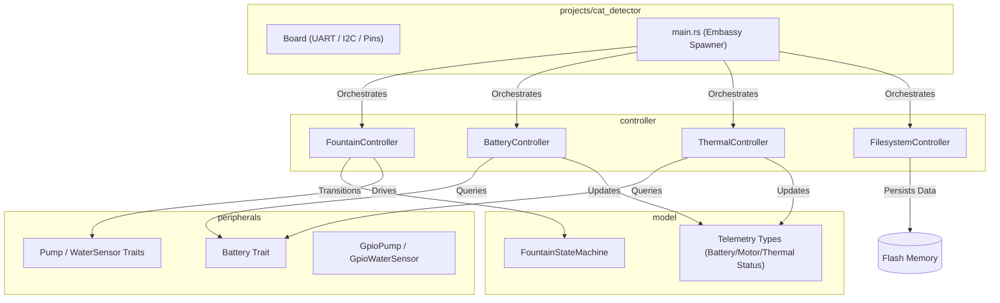
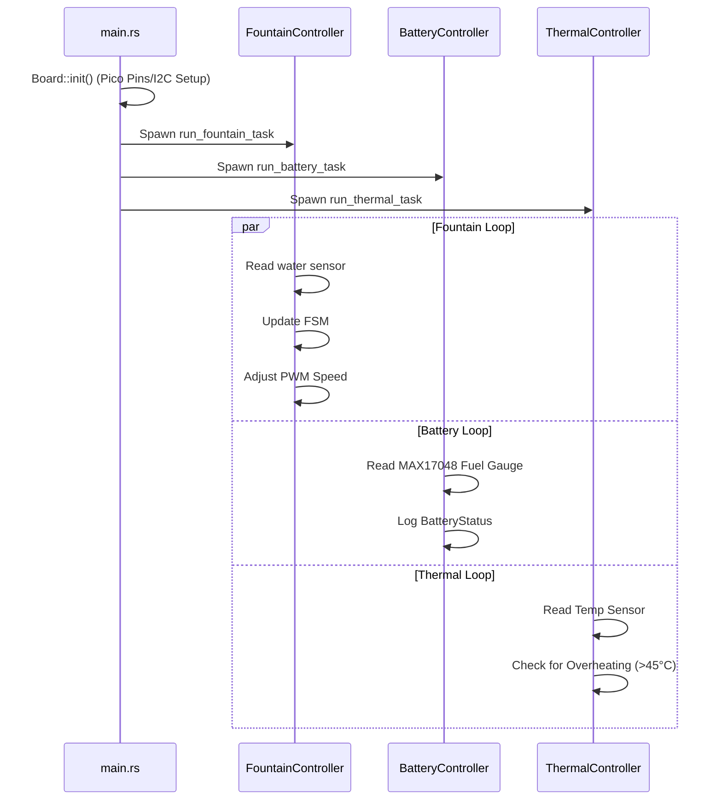

# Cat Detector Firmware Design Document

This document outlines the firmware design, modular architecture, and hardware integration maps for the **Cat Detector** water fountain system, deployed on the Raspberry Pi Pico (RP2040) using a target-agnostic, async-enabled Rust architecture.

---

## 1. System Overview

The Cat Detector firmware is a `no_std` embedded application built on the **Embassy** asynchronous framework. The design separates domain models, platform-independent drivers, and high-level controllers to enable testability on host architectures and efficient execution on the target hardware.

---

## 2. Crate Architecture & Module Roles

### 2.1. Model Crate (`model`)
The `model` crate contains pure, target-agnostic domain models, state machines, and status telemetry types. It has **no dependency** on hardware, Embassy, or I/O.

*   **`FountainState` (Enum)**: Represents the operating modes of the fountain:
    *   `Idle`: The pump is inactive.
    *   `Pumping`: Water is actively flowing.
    *   `LowWaterWarning`: Insufficient water detected; the pump is stopped for safety.
*   **`FountainEvent` (Enum)**: External triggers that drive state transitions (`PowerOn`, `WaterDetected`, `WaterMissing`, `TimerExpired`, `PowerOff`).
*   **`FountainStateMachine` (Struct)**: A deterministic state machine managing the transitions of `FountainState` when updated with a `FountainEvent`.
*   **Telemetry Models**:
    *   `BatteryStatus`: Struct tracking voltage (mV), temperature (mC), and status state.
    *   `MotorStatus`: Struct tracking speed percent, run status, and motor temperature.
    *   `ThermalStatus`: Struct tracking ambient system temperature and overheating flags.

---

### 2.2. Peripherals Crate (`peripherals`)
The `peripherals` crate defines platform-independent traits and generic implementations for low-level components. This abstraction allows easy mocking of peripherals for host-based testing.

*   **`Pump` (Trait)**: Defines interfaces for control (`set_speed`, `stop`).
    *   `GpioPump`: A concrete implementation of `Pump` that toggles a digital output pin (`OutputPin`) high/low.
*   **`WaterSensor` (Trait)**: Defines interfaces for reading fluid levels (`is_water_detected`).
    *   `GpioWaterSensor`: A concrete implementation of `WaterSensor` that reads a digital input pin (`InputPin`) state.
*   **`Battery` (Trait)**: Defines transactions for power monitoring (`read_voltage_mv`, `read_temperature_milli_c`).

---

### 2.3. Controller Crate (`controller`)
The `controller` crate houses the active orchestrators and asynchronous loop runners. It consumes peripheral traits and updates domain models.

*   **`FountainController`**: Ticks the fountain FSM, reads water sensor inputs, and drives motor outputs. Includes a run loop (`run`) to process command notifications.
*   **`BatteryController`**: Coordinates periodic voltage queries from the power system.
*   **`ThermalController`**: Periodically updates and monitors safety thresholds for thermal limits.
*   **`FilesystemController`**: Implements flat file storage on the persistent flash partition. Uses `sequential-storage` to execute read/write/delete operations with zero heap allocation.
    *   *Profiling Wrapper (`ProfilingFlash`)*: Intercepts lower-level erase instructions to log execution durations and erase counts to prevent flash wear.

---

## 3. Hardware Peripheral Mapping & I2C Address Space

The Cat Detector firmware integrates with the following hardware nodes connected via the RP2040's I2C and GPIO banks:

| Component | I2C Address | Pico Connection | Software Binding | Role |
| :--- | :--- | :--- | :--- | :--- |
| **MAX17048 Fuel Gauge** | `0x36` | SDA (GP4) / SCL (GP5) Alert (GP10) | `Battery` Trait / `BatteryController` | Monitored by the battery loop to update state of charge and dispatch alerts. |
| **BQ25185 Charger & Boost** | `0x6B` | SDA (GP4) / SCL (GP5) | `BatteryController` / I2C Bus | Tracks battery charging state and configures input current limits. |
| **INA219 Current Sensor** | `0x40` | SDA (GP4) / SCL (GP5) | `Pump` / I2C Bus | Monitors N20 pump motor current to detect dry running (torque drop) or stall conditions. |
| **VL53L0X Time-of-Flight Sensors** | `0x29` (boot) *Dynamic re-addressing to `0x30`, `0x31`, `0x32`* | SDA (GP4) / SCL (GP5) XSHUT Pins (GP2, GP3, GP4) Interrupts (GP5, GP6, GP7) | `WaterSensor` / Proximity Driver | Used to calculate target approach and activate water flow. |
| **ATtiny816 LED Driver** | `0x60` | SDA (GP4) / SCL (GP5) | NeoPixel Driver | Drives visual state-of-charge and error alerts on the RGB indicator. |
| **L9110S Motor Driver** | *Analog* | GP14, GP15 (PWM) | `GpioPump` / `Pump` Driver | Toggled by the fountain controller loop to regulate the N20 motor impeller speed. |

---

## 4. Flash Layout & Persistence

Persistent files (such as calibration variables or telemetry logs) are stored in the final block partition of the RP2040's built-in 2MB flash memory:

*   **Firmware Image Space**: `0x10000000` to `0x101C0000` (1.75 MB - bounded by `memory.x` to prevent code overwrite).
*   **Filesystem Partition**: `0x1C0000` to `0x200000` (256 KB - starting at 1.75 MB offset, defined via Rust compile-time constants).

> [!IMPORTANT]
> The `FilesystemController` wraps the underlying raw flash in `ProfilingFlash`. This interceptor automatically monitors flash write health and logs exact erase telemetry.

---

## 5. Control Flow & Tasks Execution

At start, the Embassy executor initializes the board and spawns the controller tasks:

