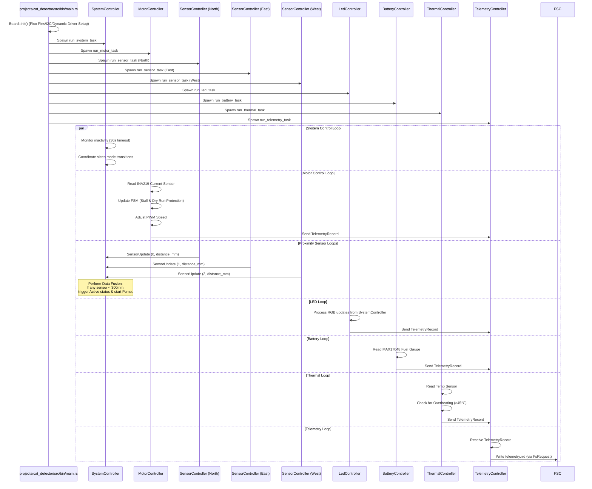

# Cat Detector Firmware Design Document

This document outlines the firmware design, modular architecture, and hardware integration maps for the **Cat Detector** water fountain system, deployed on the Raspberry Pi Pico (RP2040) using a target-agnostic, async-enabled Rust architecture.

---

## 1. System Overview

The Cat Detector firmware is a `no_std` embedded application built on the **Embassy** asynchronous framework. The design separates domain models, platform-independent drivers, and high-level controllers to enable testability on host architectures and efficient execution on the target hardware.


---

## 2. Control Flow & Tasks Execution

At start, the Embassy executor initializes the board and spawns the controller tasks:



---

## 3. System Bringup & Verification Checklist (Issue #17)

To ensure the hardware and firmware designs are fully validated and operating correctly, follow this ordered checklist of functional and system-level test procedures.

You can also run the interactive bringup helper script [bringup.py](file:///Users/daparker/gh/firmware/scripts/bringup.py) to guide you through this checklist, execute host commands automatically, and generate a markdown verification report:
```bash
python3 scripts/bringup.py --config projects/cat_detector_bringup.yaml --port /dev/tty.usbmodem101
```

### 3.1. Verification Prerequisites
1. Connect a debug probe (e.g. Raspberry Pi Debug Probe) to the RP2040 SWD header.
2. Establish a UART serial connection via terminal (e.g. `minicom`, `screen`, or `picocom`) at **115200 baud (8N1)** using the board's serial pins (GP0 TX / GP1 RX).
3. Ensure the target MCU build is flashed with debug/dwarf symbols intact:
   ```bash
   cargo run --package cat_detector --bin shell
   ```

---

### 3.2. Ordered Functional Test Commands (Via Bringup Shell)
Execute the following commands sequentially inside the interactive serial shell (`shell> `) to verify individual components. Every command execution concludes with a catch-all result code message: `Command succeeded` on success, or `Command failed: <reason>` on failure.

0. **Verify UART Log Communication**:
   ```bash
   uart
   ```
   * *Expected Output*: The text "UART log transmission OK" should be output on a line over UART0.

0.5. **Format Filesystem Partition**:
   ```bash
   format
   ```
   * *Expected Output*: Erases the filesystem partition, writes a fresh empty directory structure, and automatically restarts the microcontroller (e.g. `Formatting successful! Rebooting target system...`).

1. **Verify Fuel Gauge Communication**:
   ```bash
   battery
   ```
   * *Expected Output*: Directly queries the `BatteryController` using the blocking trait `read_battery_blocking()`, showing the battery voltage and state-of-charge percentage (e.g. `Direct battery reading: 3820 mV, 85% state of charge`).

2. **Verify Thermal Monitoring**:
   ```bash
   thermal
   ```
   * *Expected Output*: Directly queries the `ThermalController` using the blocking trait `read_temperature_blocking()`, showing the current ambient temperature in Celsius (e.g. `Direct thermal reading (ThermalController): 24.500 C`).

3. **Verify Time-of-Flight (Proximity) Sensors**:
   ```bash
   proximity
   ```
   * *Expected Output*: Directly queries each of the three `SensorController` instances sequentially using the blocking trait `read_distance_blocking()`, reporting distances in millimeters (e.g. `Direct proximity readings: North = 100 mm, East = 200 mm, West = 300 mm`).

4. **Verify RP2040 Microcontroller Temperature**:
   ```bash
   mcu_temp
   ```
   * *Expected Output*: Queries the RP2040 internal ADC temperature sensor directly on the board support level, reporting the core temperature in Celsius (e.g. `Direct system temperature reading (RP2040): 22.000 C`).

5. **Calibrate Time-of-Flight Offset**:
   * *Procedure*: During bringup, place the unit in a dark room. 
     - Place a white target directly over the cover of a sensor (e.g. `north`) and run:
       ```bash
       cal_near north
       ```
     - Move the target out to approximately 100mm and run:
       ```bash
       cal_far north
       ```
     - Repeat for `east` and `west`.
   * *Expected Output*: Records the raw sensor reading, performs two-point linear distance mapping, and saves the calibrated offsets to `vl53l0x_cal.cbor` in flash.

6. **Verify Actuator (Pump Motor) Control**:
   ```bash
   motor 50
   ```
   * *Expected Output*: Commands the motor driver to start the pump impeller at 50% PWM speed, and reads/reports the active current draw from `MotorController` using `read_current_ma_blocking()` (e.g. `Motor current: 120 mA`). Verify the motor runs smoothly.
   ```bash
   stop
   ```
   * *Expected Output*: Stops the pump impeller motor. Verify the motor halts immediately.

7. **Calibrate Motor Current (Water & Overload Detection)**:
   * *Procedure*:
     - Empty the water bowl, and run (optionally specifying the physical maximum RPM at 100% duty cycle, and the safety RPM limit):
       ```bash
       cal_motor empty [max_rpm] [rpm_limit]
       ```
       For example, to configure a physical max of 3000 RPM and a safety limit of 2500 RPM:
       ```bash
       cal_motor empty 3000 2500
       ```
     - Fill the water bowl with 100ml of water, and run:
       ```bash
       cal_motor 100ml
       ```
     - Fill the water bowl completely, and run:
       ```bash
       cal_motor full
       ```
     - Simulate an overload/stall condition by holding the impeller in place with a finger, and run:
       ```bash
       cal_motor overload
       ```
   * *Expected Output*: Starts the motor, waits 1 second for it to ramp up, measures/records average current draw (e.g., simulating empty = 50mA, 100ml = 150mA, full = 300mA, overload = 950mA), stops the motor, and saves the calibration (along with any configured RPM limits) to `motor_cal.cbor` in flash. These values are used to gate/ungate the motor, convert RPM inputs to speed percentages, detect dry-run/empty water states, and dynamically set the safety maximum current threshold (motor stall limit) at runtime.

8. **Verify System Power States**:
   * *Procedure*:
     - Let the system sit idle for 30 seconds.
     - *Expected Output*: The system automatically transitions to the low-power `Sleep` state.
     - Run the activity simulation command:
       ```bash
       activity
       ```
     - *Expected Output*: Simulates a wake-up event to verify automatic wakeup logic, returning the system to `Active` state.

9. **Verify ToF Proximity Interrupts (GP7, GP8, GP9)**:
   * *Procedure*: Let the system enter `Sleep` mode automatically (after 30 seconds of inactivity). Temporarily pull one of the ToF interrupt lines (GP7, GP8, or GP9) to ground (since interrupts are active-low).
   * *Expected Output*: The hardware interrupt triggers the RP2040 wake-up path, causing the system to transition to `Active` state, reset the inactivity timer, and wake up the motor and LED controllers.

10. **Verify Fuel Gauge Alert Interrupt (GP10)**:
   * *Procedure*: Pull the fuel gauge Alert line (GP10) to ground to trigger an active-low alert event.
   * *Expected Output*: The RP2040 wakes up if sleeping, detects the low-voltage/charge alert interrupt, dispatches a battery alert, and triggers the `BlinksRedOncePerThirtySeconds` NeoPixel error indicator.

11. **Verify Panic and Crash Log Capture**:
   ```bash
   crash
   ```
   * *Expected Output*: Forces a CPU panic handler test execution. The console should dump panic metadata, registers, and backtrace addresses, save a crash log to flash, and halt the system.

---

### 3.3. System-Level Testing & Validation Commands (Offline Host Analysis)
After triggering a panic/crash or running telemetry operations, verify data persistence and code correctness from your host system.

> [!TIP]
> By default, if the `--dump` option is omitted, `host_fs` will connect directly to the attached device via `probe-rs` using project autodetection. It dynamically resolves the target chip and partition offset from that project's ELF binary metadata.

1. **Pull raw flash filesystem partition**:
   Dump the 256KB sequential-storage partition from the target flash memory:
   ```bash
   probe-rs read-mem --chip RP2040 0x101C0000 262144 flash_dump.bin
   ```

2. **Verify directory structure**:
   Query the filesystem to ensure directory references and files exist:
   ```bash
   cargo run --bin host_fs -- --dump flash_dump.bin ls
   ```

3. **Decode and export telemetry stream**:
   Verify periodic CBOR updates have been stored in the circular RRD file, and export them:
   ```bash
   cargo run --bin host_fs -- --dump flash_dump.bin export-telemetry telemetry.csv
   ```
   * Inspect `telemetry.csv` to confirm battery voltages, motor states, thermal readings, and flash erase metrics are logged sequentially.

4. **Decode and symbolicate crash dumps**:
   Convert raw memory addresses in the crash log into a human-readable backtrace using the compiled debug ELF binary symbols:
   ```bash
   cargo run --bin host_fs -- --dump flash_dump.bin crash-log --elf target/thumbv6m-none-eabi/release/cat_detector/app
   ```
   * Verify that the crash address points directly to the function name, source file, and line number where the panic was triggered.

5. **Copy files to or from the flash partition**:
   Use the `cp` command with the `dev:` prefix to denote device-side files:
   - Extract/copy a file from the flash partition dump to a host file path:
     ```bash
     cargo run --bin host_fs -- --dump flash_dump.bin cp dev:vl53l0x_cal.cbor local_cal.cbor
     ```
   - Inject/copy a local host file into the flash partition dump (and automatically update the directory index `.dir`):
     ```bash
     cargo run --bin host_fs -- --dump flash_dump.bin cp local_cal.cbor dev:vl53l0x_cal.cbor
     ```
