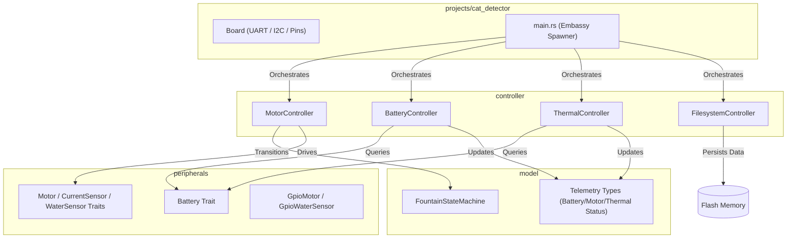
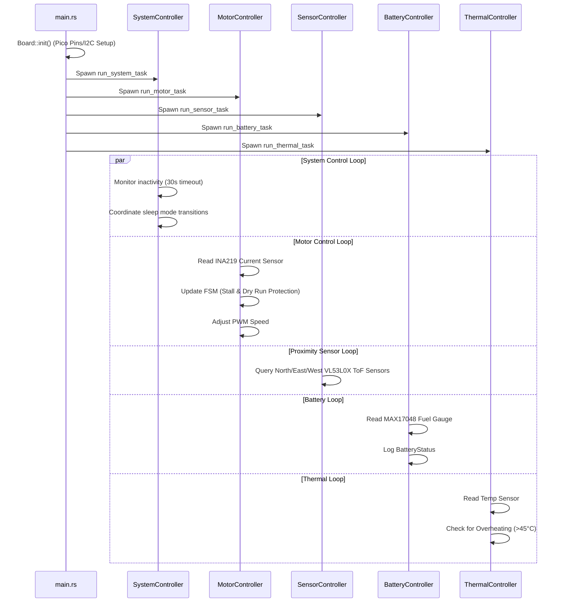

# Cat Detector Firmware Design Document

This document outlines the firmware design, modular architecture, and hardware integration maps for the **Cat Detector** water fountain system, deployed on the Raspberry Pi Pico (RP2040) using a target-agnostic, async-enabled Rust architecture.

---

## 1. System Overview

The Cat Detector firmware is a `no_std` embedded application built on the **Embassy** asynchronous framework. The design separates domain models, platform-independent drivers, and high-level controllers to enable testability on host architectures and efficient execution on the target hardware.

---

## 2. Crate Architecture & Module Roles

### 2.1. Model Crate (`model`)
The `model` crate contains pure, target-agnostic domain models, status telemetry types, and hardware peripheral interfaces (traits). It has **no dependency** on hardware, Embassy, or I/O.

*   **Telemetry Models**:
    *   `BatteryStatus`: Struct tracking voltage (mV), temperature (mC), and status state.
    *   `MotorStatus`: Struct tracking speed percent, run status, and motor temperature.
    *   `ThermalStatus`: Struct tracking ambient system temperature and overheating flags.
    *   `SystemStatus`: Enum representing the operating mode of the system (`Active` or `Sleep`).
    *   `FuelGaugeTelemetry`: Struct representing cell `voltage_mv` and `state_of_charge` percentage.
    *   `ProximityTelemetry`: Struct containing North, East, and West distance range values (in mm).
    *   `SystemLedState`: Struct holding active NeoPixel color values (`r`, `g`, `b`).

*   **Hardware Interfaces (Traits)**:
    *   `Motor`: Defines interfaces for motor driver control (`set_speed`, `stop`).
    *   `CurrentSensor`: Defines interfaces for reading current draw (`read_current_ma`). Used to monitor load torque for dry run and stall protection.
    *   `FuelGauge`: Defines interfaces for cell voltage (`read_voltage_mv`) and charge capacity percentage (`read_state_of_charge`).
    *   `PowerSensor`: Defines interfaces for current monitoring and voltage measurements (`read_voltage_mv` / `read_current_ma`), and allows controllers (e.g. `BatteryController`) to subscribe to power alerts via callbacks.
    *   `ProximitySensor`: Defines interfaces for range measurements (`read_distance_mm`) and exposes proximity events (detection/non-detection) to controllers via callbacks.
    *   `TemperatureSensor`: Defines transactions for thermal monitoring (`read_temperature_milli_c`).
    *   `Charger`: Defines interfaces for controlling battery charging (`set_charging_enabled`) and checking charging status (`is_charging_input_present`).

---

### 2.2. Peripherals Crate (`peripherals`)
The `peripherals` crate implements the concrete, platform-independent drivers and wrappers using `embedded-hal` primitives. This abstraction allows easy mocking of peripherals for host-based testing.

*   **`GpioMotor`**: A concrete wrapper that implements `Motor` by toggles a digital output pin (`OutputPin`) high/low.

**Concrete Driver Implementations**:
*   `max17048::Max17048`: Implements `TemperatureSensor` and `FuelGauge` traits, scaling registers to VCELL mV and SOC %. [MAX17048 Datasheet](https://www.analog.com/media/en/technical-documentation/data-sheets/MAX17048-MAX17049.pdf)
*   `bq25185::Bq25185`: Implements `Charger` trait for linear charger and power path management. [BQ25185 Datasheet](https://www.ti.com/lit/ds/symlink/bq25185.pdf)
*   `ina219::Ina219`: Implements `CurrentSensor` and `PowerSensor` traits, calibrating shunt voltage calculations for current monitoring. [INA219 Datasheet](https://www.ti.com/lit/ds/symlink/ina219.pdf)
*   `vl53l0x::Vl53l0x`: Implements `ProximitySensor` trait, driving ranges and supporting dynamic address assignment at register `0x8A`. [VL53L0X Datasheet](https://www.st.com/resource/en/datasheet/vl53l0x.pdf)
*   `l9110s::L9110s`: Implements `Motor` trait for h-bridge motor driver control using two `OutputPin` channels. [L9110S Datasheet](https://www.elecrow.com/download/datasheet-l9110.pdf)
*   `attiny816::Attiny816`: Manages indicator NeoPixel outputs by writing RGB color packets over I2C. [ATtiny816 Datasheet](https://cdn-learn.adafruit.com/downloads/pdf/adafruit-neodriver-i2c-to-neopixel-driver.pdf)

---

### 2.3. Controller Crate (`controller`)
The `controller` crate houses the active orchestrators and asynchronous loop runners. It consumes peripheral traits and updates domain models.

*   **`MotorController`**: Generalizes motor driver control and current sensor monitoring. Directly exposes the `read_torque_ma` method to read motor load torque (current draw in mA) from the current sensor, and shuts down the motor if safety thresholds are exceeded.
*   **`MotorStateMachine` (Struct)**: A deterministic state machine managed by `MotorController` handling states:
    *   `Off`: Motor is inactive.
    *   `Ramping`: Motor is starting up and ramping speed.
    *   `On`: Motor is running continuously at target speed.
    *   Transitions are driven by `MotorEvent` triggers (`PowerOn`, `PowerOff`, `RampComplete`).
*   **`BatteryController`**: Coordinates periodic voltage queries from the power system.
*   **`ThermalController`**: Periodically updates and monitors safety thresholds for thermal limits, and shuts down the system (sending a sleep signal to `SystemController`) if critical thresholds (>60°C) are reached.
*   **`SensorController`**: Gathers spatial telemetry across multiple distance sensors, supporting either one-shot or periodic readings.
*   **`FilesystemController`**: Implements flat file storage on the persistent flash partition. Uses `sequential-storage` to execute read/write/delete operations with zero heap allocation.
    *   *Profiling Wrapper (`ProfilingFlash`)*: Intercepts lower-level erase instructions to log execution durations and erase counts to prevent flash wear.

---

### 2.4. Application & BSP Crate (`projects/cat_detector`)
The top-level application and Board Support Package (BSP) defines pin configurations, spawns the controller tasks, and hosts the application-specific orchestrator:

*   **`SystemController`**: Coordinates low-power mode transitions (`Active` vs `Sleep`) by disabling/enabling/polling the other peripheral controllers and handling inactivity timeouts. Integrates sensor proximity events, thermal/motor safety alerts, and battery state-of-charge updates to drive the hardware system states and notify the user via the `ATtiny816` LED controller.

---

## 3. Hardware Peripheral Mapping & I2C Address Space

The Cat Detector firmware integrates with the following hardware nodes connected via the RP2040's I2C and GPIO banks:

| Component | I2C Address | Pico Connection | Software Binding | Role |
| :--- | :--- | :--- | :--- | :--- |
| **MAX17048 Fuel Gauge** | `0x36` | SDA (GP4) / SCL (GP5) Alert (GP10) | `FuelGauge` & `TemperatureSensor` Traits / `BatteryController` | Monitored by the battery loop to update state of charge and dispatch alerts. |
| **BQ25185 Charger & Boost** | `0x6B` | SDA (GP4) / SCL (GP5) | `Bq25185` / `Charger` Trait | Tracks battery charging state and configures input current limits. |
| **INA219 Current Sensor** | `0x40` | SDA (GP4) / SCL (GP5) | `CurrentSensor` / I2C Bus | Monitors N20 motor current to detect dry running (torque drop) or stall conditions. |
| **VL53L0X Time-of-Flight Sensors** | `0x29` (boot) *Dynamic re-addressing to `0x30`, `0x31`, `0x32`* | SDA (GP4) / SCL (GP5) XSHUT Pins (GP2, GP3, GP4) Interrupts (GP5, GP6, GP7) | `ProximitySensor` / Proximity Driver | Used to calculate target approach and activate water flow. |
| **ATtiny816 LED Driver** | `0x60` | SDA (GP4) / SCL (GP5) | NeoPixel Driver | Drives visual state-of-charge and error alerts on the RGB indicator. |
| **L9110S Motor Driver** | *Analog* | GP14, GP15 (PWM) | `GpioMotor` / `Motor` Driver | Toggled by the motor controller loop to regulate the N20 motor impeller speed. |

---

## 4. Flash Layout & Persistence

Persistent files (such as calibration variables or telemetry logs) are stored in the final block partition of the RP2040's built-in 2MB flash memory:

*   **Firmware Image Space**: `0x10000000` to `0x101C0000` (1.75 MB - bounded by `memory.x` to prevent code overwrite).
*   **Filesystem Partition**: `0x1C0000` to `0x200000` (256 KB - starting at 1.75 MB offset, defined via Rust compile-time constants).

> [!IMPORTANT]
> The `FilesystemController` wraps the underlying raw flash in `ProfilingFlash`. This interceptor automatically monitors flash write health and logs exact erase telemetry.

---

## 5. Control Flow & Tasks Execution

At start, the Embassy executor initializes the board and spawns the controller tasks:

