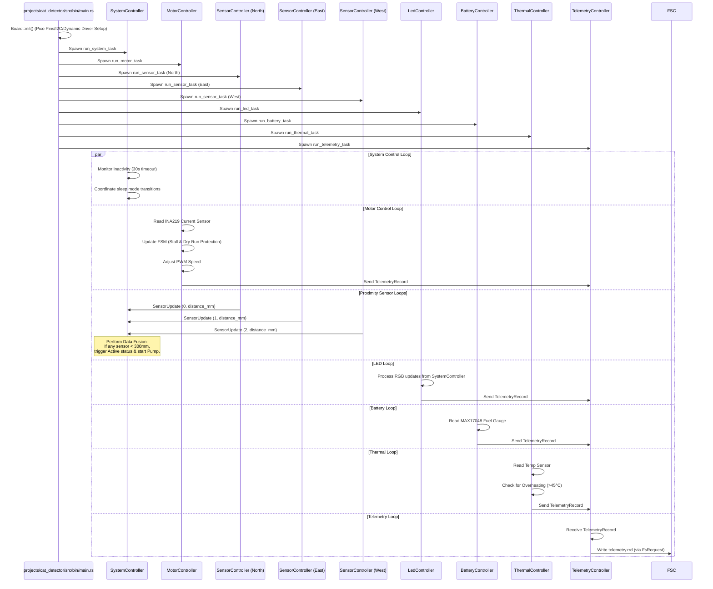

# Cat Detector Firmware Design Document

This document outlines the firmware design, modular architecture, and hardware integration maps for the **Cat Detector** water fountain system, deployed on the Raspberry Pi Pico (RP2040) using a target-agnostic, async-enabled Rust architecture.

---

## 1. System Overview

The Cat Detector firmware is a `no_std` embedded application built on the **Embassy** asynchronous framework. The design separates domain models, platform-independent drivers, and high-level controllers to enable testability on host architectures and efficient execution on the target hardware.


---

## 2. Control Flow & Tasks Execution

At start, the Embassy executor initializes the board and spawns the controller tasks:



---

## 3. System Bringup & Verification Checklist (Issue #17)

To ensure the hardware and firmware designs are fully validated and operating correctly, follow this ordered checklist of functional and system-level test procedures.

The official, executable source of truth for these bringup steps is defined in [projects/cat_detector_bringup.yaml](file:///Users/daparker/gh/firmware/projects/cat_detector_bringup.yaml). You should run the interactive bringup helper script [bringup.py](file:///Users/daparker/gh/firmware/scripts/bringup.py) to guide you through this checklist, compile/flash the correct target binaries automatically, and generate a markdown verification report:

```bash
conda run -n firmware-env python scripts/bringup.py --config projects/cat_detector_bringup.yaml
```

### 3.1. Verification Prerequisites
1. Connect a debug probe (e.g. Raspberry Pi Debug Probe) to the RP2040 SWD header.
2. Establish a UART/RTT serial connection. The bringup script automatically manages RTT connections during target-side shell commands.
3. Ensure you have the `conda` environment configured:
   ```bash
   conda activate firmware-env
   ```

---

### 3.2. Ordered Functional Test Checklist

Below is the sequence of bringup steps defined in [projects/cat_detector_bringup.yaml](file:///Users/daparker/gh/firmware/projects/cat_detector_bringup.yaml). The bringup script compiles and downloads the required firmware automatically as indicated by `flash_before` directives.

#### Phase 1: Diagnostic Shell (`shell` binary)
The checklist starts by flashing the diagnostic shell to run low-level hardware verification and calibration commands.

*   **Step 0.5: Format Filesystem Partition**
    *   *Type*: Target Shell Command
    *   *Command*: `fs format`
    *   *Expected Output*: Erases the filesystem partition, writes a fresh directory structure, and reboots target.
*   **Step 1: Verify Fuel Gauge Communication**
    *   *Type*: Target Shell Command
    *   *Command*: `battery status`
    *   *Expected Output*: Reports battery voltage and state-of-charge (e.g., `Direct battery reading: 3820 mV, 85% state of charge`).
*   **Step 2: Verify Thermal Monitoring**
    *   *Type*: Target Shell Command
    *   *Command*: `thermal status`
    *   *Expected Output*: Reports ambient temperature in Celsius (e.g., `Direct thermal reading (ThermalController): 24.500 C`).
*   **Step 3: Verify Time-of-Flight (Proximity) Sensors**
    *   *Type*: Target Shell Command
    *   *Command*: `sensor status`
    *   *Expected Output*: Reports distance readings from North, East, and West sensors (e.g., `Direct proximity readings: North = 100 mm, East = 200 mm, West = 300 mm`).
*   **Step 4: Verify RP2040 Microcontroller Temperature**
    *   *Type*: Target Shell Command
    *   *Command*: `thermal mcu`
    *   *Expected Output*: Reports RP2040 core temperature (e.g., `Direct system temperature reading (RP2040): 22.000 C`).
*   **Step 5a - 5i: Proximity Calibrations**
    *   *Type*: Target Shell Commands
    *   *Commands*: `sensor cal_near <sensor>` and `sensor cal_far <sensor>` (for `north`, `east`, `west`).
    *   *Expected Output*: Performs two-point linear distance mapping and saves calibrated offsets to `vl53l0x_cal.cbor` in flash.
*   **Step 6a - 6b: Verify Pump Motor Control**
    *   *Type*: Target Shell Commands
    *   *Commands*: `motor speed 50` and `motor stop`
    *   *Expected Output*: Spins pump motor at 50% speed, reports active current draw in mA (e.g., `Motor current: 120 mA`), and halts motor.
*   **Step 7a - 7b: Calibrate Motor Current**
    *   *Type*: Target Shell Commands
    *   *Commands*: `motor calibrate <empty|low|high|overload>`
    *   *Expected Output*: Measures and records average current draw under various load conditions, saving calibration limits to `motor_cal.cbor` in flash.
*   **Step 11: Verify Panic and Crash Log Capture**
    *   *Type*: Target Shell Command
    *   *Command*: `system crash`
    *   *Expected Output*: Forces a CPU panic handler execution, dumps panic backtrace, writes a crash log to flash, and reboots target back into the shell.

#### Phase 2: Production Application (`app` binary)
The bringup script compiles and downloads the production `app` binary to verify low-power transitions and hardware interrupts.

*   **Step 8: Verify System Power States**
    *   *Type*: Interactive
    *   *Flash Before*: `app`
    *   *Procedure*:
        1. Let the system sit idle for 30 seconds until it automatically enters low-power `Sleep` state.
        2. Place an object close to any proximity sensor and verify the system wakes back up to `Active` state.
*   **Step 10: Verify Fuel Gauge Alert Interrupt**
    *   *Type*: Manual
    *   *Flash Before*: `app`
    *   *Procedure*: Pull fuel gauge Alert line (GP10) to ground.
    *   *Expected Output*: System wakes up, dispatches battery alert, and blinks NeoPixel red.

#### Phase 3: Filesystem & Telemetry Verification (`shell` binary)
The bringup script compiles and downloads the `shell` binary back to verify filesystem contents, exports, and crash logs without sleep mode interference.

*   **Step 13: Verify Directory Structure**
    *   *Type*: Target Shell Command
    *   *Flash Before*: `shell`
    *   *Command*: `fs ls`
    *   *Expected Output*: Lists directory contents (`vl53l0x_cal.cbor`, `crash_0.cbor`, `telemetry.rrd`).
*   **Step 14: Decode and Export Telemetry Stream**
    *   *Type*: Host Command
    *   *Command*: `cargo run --package host_fs --bin host_fs -- --elf {shell_elf} export-telemetry telemetry.csv`
    *   *Expected Output*: Decodes CBOR updates in `telemetry.rrd` to `telemetry.csv`.
*   **Step 15: Decode and Symbolicate Crash Dumps**
    *   *Type*: Host Command
    *   *Command*: `cargo run --package host_fs --bin host_fs -- --elf {shell_elf} crash-log`
    *   *Expected Output*: Parses and symbolicates the panic stack trace using debug ELF symbols (showing function names and line numbers).

#### Phase 4: Final Production Flash
*   **Step 16: Flash Production App**
    *   *Type*: Manual
    *   *Flash Before*: `app`
    *   *Description*: Compiles and downloads the production application binary back onto the target device, leaving it ready for deployment.
    *   *Expected Output*: Production app binary is flashed and running on target.
